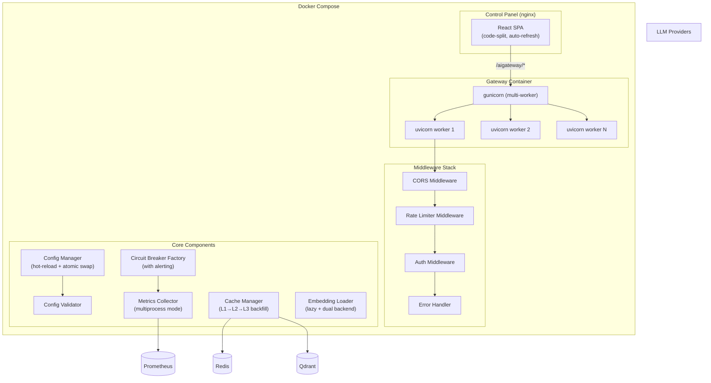
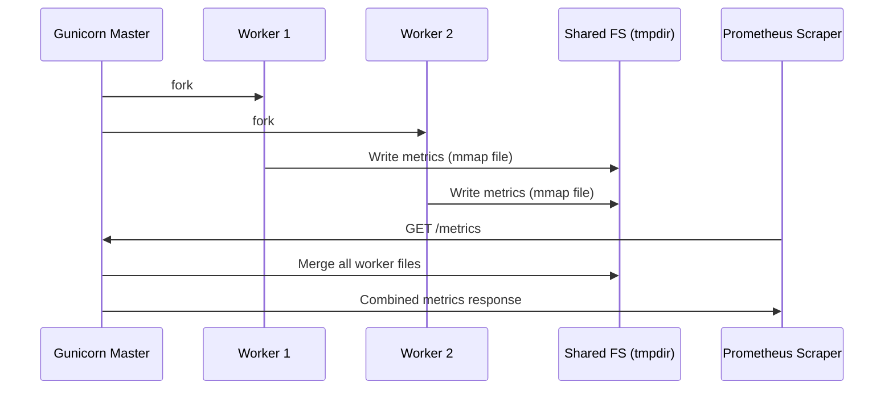

# Design Document: AI Gateway Optimization

## Overview

This design addresses 14 requirements covering architecture, security, frontend UX, and caching/metrics reliability for the AI Gateway. The changes span across `aigateway-core` (shared library), `aigateway-api` (FastAPI application), and `control-panel` (React SPA).

Key design goals:
- **Production-readiness**: Multi-worker deployment, rate limiting, environment-aware configuration
- **Security hardening**: API key encryption via env vars, config validation, standardized error masking
- **Frontend UX**: Persistent auth, auto-refresh with visibility-aware polling, code splitting
- **Reliability**: Complete cache backfill, lazy embedding loading, circuit breaker observability, hot-reload safety

## Architecture



### Multi-Worker Prometheus Architecture



## Components and Interfaces

### 1. Multi-Worker Process Manager (`aigateway-api/entrypoint.sh`)

**Responsibility**: Conditionally start gunicorn (multi-worker) or uvicorn (single-worker) based on `server.workers` config.

```python
# Pseudocode for entrypoint logic
if config.server.workers > 1:
    exec gunicorn "aigateway_api.main:app"
        --workers {config.server.workers}
        --worker-class uvicorn.workers.UvicornWorker
        --bind {config.server.host}:{config.server.port}
else:
    exec uvicorn "aigateway_api.main:app"
        --host {config.server.host}
        --port {config.server.port}
```

**Interface changes to `MetricsCollector`**:
```python
class MetricsCollector:
    def initialize(self, multiprocess_dir: Optional[str] = None) -> None:
        """Initialize with prometheus_client multiprocess mode if dir is set."""
        if multiprocess_dir:
            os.environ["PROMETHEUS_MULTIPROC_DIR"] = multiprocess_dir
            from prometheus_client import CollectorRegistry, multiprocess
            registry = CollectorRegistry()
            multiprocess.MultiProcessCollector(registry)
            self._registry = registry
```

### 2. CORS Middleware Configuration (`aigateway-api/main.py`)

**Responsibility**: Configure FastAPI CORSMiddleware with environment-driven allowed origins.

```python
def _configure_cors(app: FastAPI) -> None:
    origins_env = os.environ.get("AI_GATEWAY_CORS_ORIGINS", "")
    if origins_env:
        origins = [o.strip() for o in origins_env.split(",")]
    else:
        origins = ["http://localhost:3000", "http://localhost:5173"]
    
    app.add_middleware(
        CORSMiddleware,
        allow_origins=origins,
        allow_methods=["GET", "POST", "PUT", "DELETE", "OPTIONS"],
        allow_headers=["Authorization", "Content-Type", "X-API-Key"],
        allow_credentials=True,
    )
```

### 3. Rate Limiter (`aigateway-core/rate_limiter.py`)

**Responsibility**: Global IP-based rate limiting for `/admin/*` endpoints with Redis-backed sliding window and in-process fallback.

```python
class RateLimiter:
    def __init__(
        self,
        redis_client: Optional[RedisClientManager],
        max_requests: int = 30,
        window_seconds: int = 60,
        exempt_paths: Set[str] = {"/health", "/metrics"},
    ): ...

    async def check_rate_limit(self, client_ip: str, path: str) -> RateLimitResult:
        """Returns (allowed: bool, retry_after: int)"""
        if path in self.exempt_paths:
            return RateLimitResult(allowed=True, retry_after=0)
        
        if self._redis_client:
            return await self._check_redis(client_ip, path)
        return self._check_in_memory(client_ip, path)
    
    async def _check_redis(self, client_ip: str, path: str) -> RateLimitResult:
        """Sliding window counter using Redis INCR + EXPIRE"""
        ...
    
    def _check_in_memory(self, client_ip: str, path: str) -> RateLimitResult:
        """Fallback: per-process dict with timestamp-based window"""
        ...
```

**Data class**:
```python
@dataclass
class RateLimitResult:
    allowed: bool
    retry_after: int  # seconds remaining in window
```

### 4. Config Validator (`aigateway-core/config_validator.py`)

**Responsibility**: Validate config.yaml structure and semantics, logging warnings/errors without blocking startup.

```python
class ConfigValidator:
    ALLOWED_TOP_LEVEL = {
        "server", "auth", "plugins", "providers",
        "embedding", "observability", "hot_reload", "debug_mode"
    }
    
    def validate(self, config: Dict[str, Any]) -> ValidationResult:
        """Run all validation checks, return collected issues."""
        issues: List[ValidationIssue] = []
        self._check_top_level_fields(config, issues)
        self._check_server_port(config, issues)
        self._check_provider_api_keys(config, issues)
        self._check_plugin_dependencies(config, issues)
        self._check_plaintext_secrets(config, issues)
        return ValidationResult(issues=issues, valid=not any(i.level == "ERROR" for i in issues))
    
    def _check_server_port(self, config, issues):
        port = config.get("server", {}).get("port")
        if port is not None and not (1024 <= port <= 65535):
            issues.append(ValidationIssue("ERROR", f"server.port must be 1024-65535, got {port}"))
    
    def _check_plaintext_secrets(self, config, issues):
        for provider, cfg in config.get("providers", {}).items():
            api_key = cfg.get("api_key", "")
            if isinstance(api_key, str) and api_key.startswith("sk-") and len(api_key) > 10:
                issues.append(ValidationIssue(
                    "WARNING",
                    f"providers.{provider}.api_key appears to be plaintext. Use ${{ENV_VAR}} syntax."
                ))
```

### 5. Environment-Aware Configuration (`aigateway-core/config.py` enhancement)

**Responsibility**: Override config based on `AI_GATEWAY_ENV` environment variable.

```python
def _apply_environment_overrides(self, config: Dict[str, Any]) -> Dict[str, Any]:
    env = os.environ.get("AI_GATEWAY_ENV", "development")
    
    if env == "production":
        config["debug_mode"] = False
        obs = config.setdefault("observability", {})
        if obs.get("log_level", "info").lower() == "debug":
            obs["log_level"] = "info"
    elif env == "development":
        config["hot_reload"] = True
        config["debug_mode"] = True
    
    logger.info("Running in %s environment", env)
    return config
```

### 6. Error Response Standardizer (`aigateway-api/error_handler.py`)

**Responsibility**: Map all errors to `{"error": {"code": "...", "message": "..."}}` format with conditional debug info.

```python
class ErrorResponseBuilder:
    PROVIDER_ERROR_MAP = {
        "AuthenticationError": "provider_error",
        "RateLimitError": "rate_limited", 
        "NotFoundError": "model_not_found",
    }
    
    def build_error_response(
        self,
        exc: Exception,
        request_id: str,
        debug_mode: bool,
    ) -> Tuple[int, Dict[str, Any], Dict[str, str]]:
        """Returns (status_code, body, extra_headers)"""
        code, message, status = self._classify_error(exc)
        
        body = {"error": {"code": code, "message": message}}
        if debug_mode and status >= 500:
            body["error"]["detail"] = f"{type(exc).__name__}: {str(exc)}"
        
        headers = {"X-Request-ID": request_id}
        return status, body, headers
```

### 7. Frontend Auth Persistence (`control-panel/src/hooks/useAuth.ts`)

**Responsibility**: Manage API key persistence in localStorage with auto-401 handling.

```typescript
interface AuthState {
  apiKey: string | null
  isAuthenticated: boolean
  keyPrefix: string | null  // first 8 chars
}

function useAuth(): {
  state: AuthState
  login: (key: string) => void
  logout: () => void
}
```

### 8. Visibility-Aware Polling (`control-panel/src/hooks/usePoll.ts` enhancement)

**Responsibility**: Auto-refresh with Page Visibility API integration and exponential backoff on errors.

```typescript
interface PollOptions {
  intervalMs: number          // default 10000
  backoffIntervalMs: number   // default 30000
  maxConsecutiveErrors: number // default 3
  pauseOnHidden: boolean      // default true
}

function usePoll<T>(
  fn: () => Promise<T>,
  options: PollOptions,
): {
  data: T | null
  loading: boolean
  error: Error | null
  lastUpdated: Date | null
  consecutiveErrors: number
  refetch: () => Promise<void>
}
```

### 9. Cache Backfill Manager (`aigateway-core/caching.py` enhancement)

**Responsibility**: Complete cross-tier cache backfill with async L3 population.

```python
async def backfill_on_l3_hit(
    self,
    key: str,
    response_json: str,
    ttl: Optional[int] = None,
) -> None:
    """When L3 hits, backfill L1 (sync) and L2 (async)."""
    self.l1_set(key, response_json)
    await self.l2_set(key, response_json, ttl=ttl)

async def backfill_on_miss(
    self,
    key: str,
    response_json: str,
    normalized_prompt: str,
    model: str,
    user_id: str,
    token_count: int,
    compute_embedding_fn: Callable[[str], Awaitable[List[float]]],
) -> None:
    """On full miss: backfill L1+L2 sync, L3 async via create_task."""
    self.l1_set(key, response_json)
    await self.l2_set(key, response_json)
    
    # L3 backfill is fire-and-forget
    asyncio.create_task(
        self._safe_l3_backfill(key, response_json, normalized_prompt, model, user_id, token_count, compute_embedding_fn)
    )

async def _safe_l3_backfill(self, ...):
    try:
        vector = await compute_embedding_fn(normalized_prompt)
        await self.l3_store(...)
    except Exception as exc:
        logger.warning("L3 backfill failed (embedding error): %s", exc)
```

### 10. Hot-Reload Safety Mechanism (`aigateway-core/config.py` enhancement)

**Responsibility**: Validate-before-swap with metrics tracking and Redis Pub/Sub broadcast.

```python
async def safe_reload(self, key_store: Optional[KeyStore] = None) -> bool:
    """Reload config with validation gate and metrics tracking."""
    new_config = self._load_yaml(self.config_path)
    new_config = self._apply_env_overrides(new_config)
    new_config = self._resolve_env_vars_in_values(new_config)
    
    validator = ConfigValidator()
    result = validator.validate(new_config)
    
    if not result.valid:
        logger.error("Config reload failed validation: %s", result.issues)
        metrics.inc_config_reload_failures()
        return False
    
    # Atomic swap
    self.atomic_swap(new_config)
    metrics.inc_config_reload_success()
    
    # Broadcast to other instances
    if key_store:
        await key_store.broadcast_config_reload(config_version=str(time.time()))
    
    return True
```

### 11. Circuit Breaker Alerting (`aigateway-core/circuit_breaker.py` enhancement)

**Responsibility**: Emit metrics and logs on state transitions, track long-open breakers.

```python
class CircuitBreaker:
    def _transition_state(self, from_state: CircuitState, to_state: CircuitState) -> None:
        """Handle state transitions with logging and metrics."""
        self.state = to_state
        self._last_transition_time = time.time()
        
        metrics = get_metrics_collector()
        metrics.set_circuit_breaker_state(self.provider, int(to_state))
        
        if to_state == CircuitState.OPEN:
            logger.error("Circuit breaker %s: %s -> OPEN", self.provider, from_state.name)
        elif to_state == CircuitState.HALF_OPEN:
            logger.info("Circuit breaker %s: %s -> HALF_OPEN", self.provider, from_state.name)
        elif to_state == CircuitState.CLOSED:
            logger.info("Circuit breaker %s: %s -> CLOSED", self.provider, from_state.name)
    
    def check_long_open(self, threshold_seconds: int = 300) -> bool:
        """Check if breaker has been OPEN for longer than threshold."""
        if self.state == CircuitState.OPEN:
            duration = time.time() - self._last_transition_time
            if duration >= threshold_seconds:
                metrics.inc_long_open_counter(self.provider)
                return True
        return False
```

### 12. Code Splitting Strategy (`control-panel/vite.config.ts` + lazy routes)

**Responsibility**: Route-level code splitting and vendor chunk optimization.

```typescript
// vite.config.ts - build.rollupOptions
rollupOptions: {
  output: {
    manualChunks: {
      vendor: ['react', 'react-dom'],
      router: ['react-router-dom'],
      charts: ['recharts'],
    }
  }
}

// App.tsx - lazy loaded routes
const Overview = lazy(() => import('@/pages/Overview'))
const Plugins = lazy(() => import('@/pages/Plugins'))
const Costs = lazy(() => import('@/pages/Costs'))
// ...
```

## Data Models

### ConfigValidationIssue

```python
@dataclass
class ValidationIssue:
    level: str    # "WARNING" | "ERROR"
    message: str
    field: Optional[str] = None

@dataclass
class ValidationResult:
    issues: List[ValidationIssue]
    valid: bool  # True if no ERROR-level issues
```

### RateLimitEntry (Redis)

```
Key: aigateway:ratelimit:{ip}:{path_prefix}
Type: String (counter)
TTL: 60 seconds (window)
Value: request count in current window
```

### Circuit Breaker Enhanced State

```python
@dataclass
class CircuitBreakerStatus:
    provider: str
    state: CircuitState
    state_value: int
    failure_count: int
    failure_threshold: int
    last_failure_time: float
    last_success_time: float
    last_transition_time: float  # NEW: for long-open detection
    open_duration_seconds: Optional[float]  # NEW: if currently OPEN
```

### Metrics (New Counters)

| Metric Name | Type | Labels | Description |
|---|---|---|---|
| `gateway_config_reload_success_total` | Counter | — | Successful config reloads |
| `gateway_config_reload_failures_total` | Counter | — | Failed config reload attempts |
| `gateway_circuit_breaker_long_open_total` | Counter | provider | Times a breaker was OPEN > 5min |
| `gateway_rate_limit_rejected_total` | Counter | endpoint | Rate-limited request count |

### Frontend Auth State (localStorage)

```
Key: aigateway_api_key
Value: full API key string (existing behavior)
```

## Correctness Properties

*A property is a characteristic or behavior that should hold true across all valid executions of a system — essentially, a formal statement about what the system should do. Properties serve as the bridge between human-readable specifications and machine-verifiable correctness guarantees.*

### Property 1: Process mode selection is determined by worker count

*For any* integer workers value in config, if workers > 1 the process manager selection function should return "gunicorn" mode; if workers == 1 or workers is None, it should return "uvicorn" mode.

**Validates: Requirements 1.2, 1.3**

### Property 2: CORS origins parsing

*For any* comma-separated string of valid HTTP/HTTPS origins set in AI_GATEWAY_CORS_ORIGINS, the parsing function should produce a list containing exactly those origins (trimmed of whitespace), in order.

**Validates: Requirements 2.2**

### Property 3: Disallowed origins receive no CORS header

*For any* HTTP origin string that is not present in the allowed origins list, the CORS middleware should not include an Access-Control-Allow-Origin header in the response.

**Validates: Requirements 2.5**

### Property 4: Rate limiter enforces window-based rejection

*For any* IP address and any sequence of N > 30 requests to /admin/* endpoints within a 60-second window, requests beyond the 30th should be rejected with HTTP 429 and a Retry-After header equal to the remaining seconds in the window.

**Validates: Requirements 3.2, 3.3**

### Property 5: Rate limiter exempts infrastructure endpoints

*For any* number of requests to /health or /metrics endpoints from any IP, the rate limiter should always allow the request regardless of request count.

**Validates: Requirements 3.4**

### Property 6: Config validator detects unrecognized top-level fields

*For any* config dictionary containing top-level keys not in the allowed set {server, auth, plugins, providers, embedding, observability, hot_reload, debug_mode}, the validator should produce a WARNING-level issue listing each unrecognized field name.

**Validates: Requirements 4.1, 4.2**

### Property 7: Config validator rejects invalid port range

*For any* integer port value in server.port, the validator should produce an ERROR-level issue if and only if port < 1024 or port > 65535.

**Validates: Requirements 4.5**

### Property 8: Config validator detects missing provider api_key

*For any* provider configuration entry missing the api_key field, the validator should produce an ERROR-level issue that includes the provider name.

**Validates: Requirements 4.3**

### Property 9: Config validator detects invalid plugin dependencies

*For any* plugin configuration where depends_on references a plugin name not present in the plugins list, the validator should produce a WARNING-level issue.

**Validates: Requirements 4.4**

### Property 10: Config validation never blocks loading

*For any* config dictionary (valid or invalid), the config loading process should always succeed — validation issues are logged but never prevent the config from being used.

**Validates: Requirements 4.6**

### Property 11: Environment variable resolution in config values

*For any* config string value containing ${ENV_VAR_NAME} where ENV_VAR_NAME is a set environment variable, the resolved config value should contain the environment variable's actual value in place of the ${...} placeholder.

**Validates: Requirements 5.1**

### Property 12: Plaintext secret detection

*For any* provider api_key value that starts with "sk-" and has length > 10, the config validator should produce a WARNING-level issue advising use of environment variable syntax.

**Validates: Requirements 5.3**

### Property 13: Error response format consistency

*For any* exception processed by the error handler, the response body should conform to {"error": {"code": string, "message": string}} and include an X-Request-ID response header with a non-empty value.

**Validates: Requirements 6.1, 6.5**

### Property 14: Error detail visibility controlled by debug_mode

*For any* 5xx exception, when debug_mode is false the response message should be "Internal server error" with no "detail" field; when debug_mode is true the response should include a "detail" field containing the exception class name.

**Validates: Requirements 6.2, 6.3**

### Property 15: Downstream error code mapping

*For any* known downstream LLM provider error type, the error handler should map it to one of the gateway standard error codes: "provider_error", "rate_limited", or "model_not_found".

**Validates: Requirements 6.4**

### Property 16: API key prefix display

*For any* API key string of length >= 8, the displayed login indicator should show exactly the first 8 characters of that key.

**Validates: Requirements 7.5**

### Property 17: Polling backoff on consecutive failures

*For any* sequence of N >= 3 consecutive poll failures, the polling hook should switch its interval from 10 seconds to 30 seconds and report a connection error state.

**Validates: Requirements 8.5**

### Property 18: Cache backfill completeness on hit

*For any* cache key and value, when a lower tier (L2 or L3) returns a hit, all higher-priority tiers (L1, and L2 if L3 hit) should contain that value after the backfill operation completes.

**Validates: Requirements 10.1, 10.2**

### Property 19: Full-miss backfill populates all tiers

*For any* new LLM response on a full cache miss, after backfill completes: L1 should contain the value, L2 should contain the value, and L3 backfill should be initiated asynchronously without blocking the response.

**Validates: Requirements 10.3, 10.4**

### Property 20: L3 backfill failure isolation

*For any* embedding computation that raises an exception during L3 backfill, the exception should not propagate to the caller, L1 and L2 should remain populated, and a WARNING log should be emitted.

**Validates: Requirements 10.5**

### Property 21: Circuit breaker metric reflects state

*For any* circuit breaker state transition (CLOSED→OPEN, OPEN→HALF_OPEN, *→CLOSED), the gateway_circuit_breaker_state metric for that provider should equal the integer value of the new state (0=CLOSED, 1=OPEN, 2=HALF_OPEN).

**Validates: Requirements 12.1, 12.2, 12.3**

### Property 22: Long-open circuit breaker detection

*For any* circuit breaker that has been in OPEN state for duration D > 300 seconds, the gateway_circuit_breaker_long_open_total counter for that provider should be incremented.

**Validates: Requirements 12.5**

### Property 23: Production environment enforces security defaults

*For any* config dictionary, when AI_GATEWAY_ENV is "production", the resulting config should have debug_mode=false and observability.log_level at INFO or higher, regardless of the values in config.yaml.

**Validates: Requirements 13.2, 13.3**

### Property 24: Development environment enables developer tooling

*For any* config dictionary, when AI_GATEWAY_ENV is "development", the resulting config should have hot_reload=true and debug_mode=true, regardless of the values in config.yaml.

**Validates: Requirements 13.4**

### Property 25: Config reload preserves current config on validation failure

*For any* new config that fails validation, after the reload attempt the active config should be identical to the config before the reload was attempted, and the gateway_config_reload_failures_total metric should increment by 1.

**Validates: Requirements 14.2**

### Property 26: Config reload atomically swaps on validation success

*For any* new valid config, after successful reload the active config should equal the new config, and the gateway_config_reload_success_total metric should increment by 1.

**Validates: Requirements 14.3**

### Property 27: In-flight requests use config snapshot

*For any* request that begins processing before a config reload, that request should complete using the config values captured at request start, even if a reload occurs mid-processing.

**Validates: Requirements 14.5**


## Error Handling

### Error Classification and Response

| Error Source | HTTP Status | Error Code | Behavior |
|---|---|---|---|
| Invalid API key | 401 | `unauthorized` | Reject immediately |
| Quota exceeded (RPM/TPM/daily/monthly) | 429 | `quota_exceeded` | Include Retry-After header |
| Rate limit (global IP-based) | 429 | `rate_limited` | Include Retry-After header |
| Config validation failure | N/A (internal) | — | Log WARNING/ERROR, continue with current config |
| Downstream LLM auth error | 502 | `provider_error` | Map to generic provider error |
| Downstream LLM rate limit | 429 | `rate_limited` | Trigger circuit breaker count |
| Downstream model not found | 404 | `model_not_found` | Return immediately |
| Circuit breaker open | 503 | `service_unavailable` | Try fallback model |
| Redis unavailable | N/A (internal) | — | Degrade gracefully (in-memory fallback) |
| Qdrant unavailable | N/A (internal) | — | Skip L3 cache, log warning |
| Embedding computation failure | N/A (internal) | — | Skip L3 backfill, log warning |
| Config hot-reload failure | N/A (internal) | — | Keep old config, increment failure metric |

### Graceful Degradation Strategy

1. **Redis down**: Rate limiter falls back to in-process counter; cache skips L2; metrics still work (process-local)
2. **Qdrant down**: Semantic cache (L3) is skipped; L1+L2 still function
3. **Embedding model failure**: L3 backfill is skipped; request still succeeds with L1+L2 cache
4. **Config validation failure**: Current config persists; error logged; service continues operating
5. **Single worker crash (multi-worker)**: Gunicorn respawns; other workers continue serving

### Debug Mode Behavior

| Condition | debug_mode=false | debug_mode=true |
|---|---|---|
| 5xx error response | `{"error": {"code": "internal_error", "message": "Internal server error"}}` | `{"error": {"code": "internal_error", "message": "Internal server error", "detail": "ValueError: ..."}}` |
| Logs | INFO level minimum | DEBUG level allowed |
| Config warnings | Logged only | Logged + visible in control panel |

### X-Request-ID Propagation

Every incoming request receives a UUID `request_id` at the middleware layer. This ID:
- Is included in all log entries for the request
- Is returned in the `X-Request-ID` response header (success and error)
- Is passed to downstream LLM calls as metadata for end-to-end tracing
- Is stored in the request log for control panel visibility

## Testing Strategy

### Testing Approach

This feature uses a dual testing approach:

1. **Property-based tests** (using `hypothesis` for Python, `fast-check` for TypeScript): Verify universal correctness properties across randomized inputs
2. **Unit tests** (using `pytest` for Python, `vitest` for TypeScript): Cover specific examples, edge cases, and integration points
3. **Integration tests**: Verify component interactions (Redis, multiprocess metrics, Pub/Sub)

### Property-Based Testing Configuration

- **Python library**: `hypothesis` (>= 6.0)
- **TypeScript library**: `fast-check` (>= 3.0)
- **Minimum iterations**: 100 per property test
- **Tag format**: `# Feature: ai-gateway-optimization, Property {N}: {title}`

Each correctness property maps to exactly one property-based test. Properties are tagged with their design document reference.

### Test Coverage by Component

| Component | Property Tests | Unit Tests | Integration Tests |
|---|---|---|---|
| Config Validator | P6, P7, P8, P9, P10, P12 | Field name edge cases | — |
| Rate Limiter | P4, P5 | Redis fallback | Redis sliding window |
| Error Handler | P13, P14, P15 | Specific error scenarios | — |
| CORS Config | P2, P3 | Default values | — |
| Process Mode Selection | P1 | workers=0 edge case | Multi-worker startup |
| Cache Backfill | P18, P19, P20 | TTL handling | Redis+Qdrant integration |
| Environment Overrides | P23, P24 | Staging env | — |
| Config Hot-Reload | P25, P26, P27 | File watcher trigger | Pub/Sub broadcast |
| Circuit Breaker Alerting | P21, P22 | State machine transitions | Prometheus metrics |
| Frontend Polling | P17 | Timer behavior | — |
| Frontend Auth | P16 | localStorage mock | — |
| Env Var Resolution | P11 | Nested ${} | — |
| Code Splitting | — | — | Build size verification (smoke) |

### Key Testing Decisions

1. **Config validation is pure logic** — ideal for PBT with generated config dicts
2. **Rate limiter core logic** — pure function over (request_count, window_time) — ideal for PBT
3. **Cache backfill** — use mock Redis/Qdrant clients; verify tier population as property
4. **Error handler** — pure function mapping (exception, debug_mode, request_id) → response — ideal for PBT
5. **Frontend polling backoff** — test state machine logic with fast-check; mock timers
6. **Build size** — smoke test only (run `vite build`, check output size)
7. **Multi-worker metrics** — integration test with actual gunicorn + prometheus_client multiprocess dir
