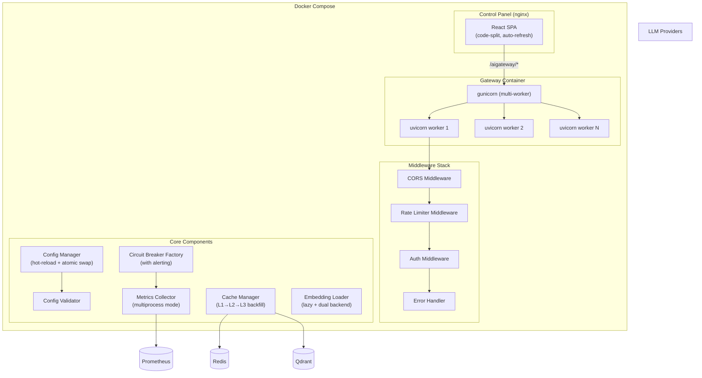
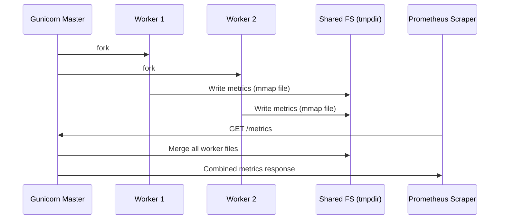

# Design Document: AI Gateway Optimization

## Overview

This design addresses 14 requirements covering architecture, security, frontend UX, and caching/metrics reliability for the AI Gateway. The changes span across `aigateway-core` (shared library), `aigateway-api` (FastAPI application), and `control-panel` (React SPA).

Key design goals:
- **Production-readiness**: Multi-worker deployment, rate limiting, environment-aware configuration
- **Security hardening**: API key encryption via env vars, config validation, standardized error masking
- **Frontend UX**: Persistent auth, auto-refresh with visibility-aware polling, code splitting
- **Reliability**: Complete cache backfill, lazy embedding loading, circuit breaker observability, hot-reload safety

## Architecture



### Multi-Worker Prometheus Architecture



## Components and Interfaces

### 1. Multi-Worker Process Manager (`aigateway-api/entrypoint.sh`)

**Responsibility**: Conditionally start gunicorn (multi-worker) or uvicorn (single-worker) based on `server.workers` config.

```python
# Pseudocode for entrypoint logic
if config.server.workers > 1:
    exec gunicorn "aigateway_api.main:app"
        --workers {config.server.workers}
        --worker-class uvicorn.workers.UvicornWorker
        --bind {config.server.host}:{config.server.port}
else:
    exec uvicorn "aigateway_api.main:app"
        --host {config.server.host}
        --port {config.server.port}
```

**Interface changes to `MetricsCollector`**:
```python
class MetricsCollector:
    def initialize(self, multiprocess_dir: Optional[str] = None) -> None:
        """Initialize with prometheus_client multiprocess mode if dir is set."""
        if multiprocess_dir:
            os.environ["PROMETHEUS_MULTIPROC_DIR"] = multiprocess_dir
            from prometheus_client import CollectorRegistry, multiprocess
            registry = CollectorRegistry()
            multiprocess.MultiProcessCollector(registry)
            self._registry = registry
```

### 2. CORS Middleware Configuration (`aigateway-api/main.py`)

**Responsibility**: Configure FastAPI CORSMiddleware with environment-driven allowed origins.

```python
def _configure_cors(app: FastAPI) -> None:
    origins_env = os.environ.get("AI_GATEWAY_CORS_ORIGINS", "")
    if origins_env:
        origins = [o.strip() for o in origins_env.split(",")]
    else:
        origins = ["http://localhost:3000", "http://localhost:5173"]
    
    app.add_middleware(
        CORSMiddleware,
        allow_origins=origins,
        allow_methods=["GET", "POST", "PUT", "DELETE", "OPTIONS"],
        allow_headers=["Authorization", "Content-Type", "X-API-Key"],
        allow_credentials=True,
    )
```

### 3. Rate Limiter (`aigateway-core/rate_limiter.py`)

**Responsibility**: Global IP-based rate limiting for `/admin/*` endpoints with Redis-backed sliding window and in-process fallback.

```python
class RateLimiter:
    def __init__(
        self,
        redis_client: Optional[RedisClientManager],
        max_requests: int = 30,
        window_seconds: int = 60,
        exempt_paths: Set[str] = {"/health", "/metrics"},
    ): ...

    async def check_rate_limit(self, client_ip: str, path: str) -> RateLimitResult:
        """Returns (allowed: bool, retry_after: int)"""
        if path in self.exempt_paths:
            return RateLimitResult(allowed=True, retry_after=0)
        
        if self._redis_client:
            return await self._check_redis(client_ip, path)
        return self._check_in_memory(client_ip, path)
    
    async def _check_redis(self, client_ip: str, path: str) -> RateLimitResult:
        """Sliding window counter using Redis INCR + EXPIRE"""
        ...
    
    def _check_in_memory(self, client_ip: str, path: str) -> RateLimitResult:
        """Fallback: per-process dict with timestamp-based window"""
        ...
```

**Data class**:
```python
@dataclass
class RateLimitResult:
    allowed: bool
    retry_after: int  # seconds remaining in window
```

### 4. Config Validator (`aigateway-core/config_validator.py`)

**Responsibility**: Validate config.yaml structure and semantics, logging warnings/errors without blocking startup.

```python
class ConfigValidator:
    ALLOWED_TOP_LEVEL = {
        "server", "auth", "plugins", "providers",
        "embedding", "observability", "hot_reload", "debug_mode"
    }
    
    def validate(self, config: Dict[str, Any]) -> ValidationResult:
        """Run all validation checks, return collected issues."""
        issues: List[ValidationIssue] = []
        self._check_top_level_fields(config, issues)
        self._check_server_port(config, issues)
        self._check_provider_api_keys(config, issues)
        self._check_plugin_dependencies(config, issues)
        self._check_plaintext_secrets(config, issues)
        return ValidationResult(issues=issues, valid=not any(i.level == "ERROR" for i in issues))
    
    def _check_server_port(self, config, issues):
        port = config.get("server", {}).get("port")
        if port is not None and not (1024 <= port <= 65535):
            issues.append(ValidationIssue("ERROR", f"server.port must be 1024-65535, got {port}"))
    
    def _check_plaintext_secrets(self, config, issues):
        for provider, cfg in config.get("providers", {}).items():
            api_key = cfg.get("api_key", "")
            if isinstance(api_key, str) and api_key.startswith("sk-") and len(api_key) > 10:
                issues.append(ValidationIssue(
                    "WARNING",
                    f"providers.{provider}.api_key appears to be plaintext. Use ${{ENV_VAR}} syntax."
                ))
```

### 5. Environment-Aware Configuration (`aigateway-core/config.py` enhancement)

**Responsibility**: Override config based on `AI_GATEWAY_ENV` environment variable.

```python
def _apply_environment_overrides(self, config: Dict[str, Any]) -> Dict[str, Any]:
    env = os.environ.get("AI_GATEWAY_ENV", "development")
    
    if env == "production":
        config["debug_mode"] = False
        obs = config.setdefault("observability", {})
        if obs.get("log_level", "info").lower() == "debug":
            obs["log_level"] = "info"
    elif env == "development":
        config["hot_reload"] = True
        config["debug_mode"] = True
    
    logger.info("Running in %s environment", env)
    return config
```

### 6. Error Response Standardizer (`aigateway-api/error_handler.py`)

**Responsibility**: Map all errors to `{"error": {"code": "...", "message": "..."}}` format with conditional debug info.

```python
class ErrorResponseBuilder:
    PROVIDER_ERROR_MAP = {
        "AuthenticationError": "provider_error",
        "RateLimitError": "rate_limited", 
        "NotFoundError": "model_not_found",
    }
    
    def build_error_response(
        self,
        exc: Exception,
        request_id: str,
        debug_mode: bool,
    ) -> Tuple[int, Dict[str, Any], Dict[str, str]]:
        """Returns (status_code, body, extra_headers)"""
        code, message, status = self._classify_error(exc)
        
        body = {"error": {"code": code, "message": message}}
        if debug_mode and status >= 500:
            body["error"]["detail"] = f"{type(exc).__name__}: {str(exc)}"
        
        headers = {"X-Request-ID": request_id}
        return status, body, headers
```

### 7. Frontend Auth Persistence (`control-panel/src/hooks/useAuth.ts`)

**Responsibility**: Manage API key persistence in localStorage with auto-401 handling.

```typescript
interface AuthState {
  apiKey: string | null
  isAuthenticated: boolean
  keyPrefix: string | null  // first 8 chars
}

function useAuth(): {
  state: AuthState
  login: (key: string) => void
  logout: () => void
}
```

### 8. Visibility-Aware Polling (`control-panel/src/hooks/usePoll.ts` enhancement)

**Responsibility**: Auto-refresh with Page Visibility API integration and exponential backoff on errors.

```typescript
interface PollOptions {
  intervalMs: number          // default 10000
  backoffIntervalMs: number   // default 30000
  maxConsecutiveErrors: number // default 3
  pauseOnHidden: boolean      // default true
}

function usePoll<T>(
  fn: () => Promise<T>,
  options: PollOptions,
): {
  data: T | null
  loading: boolean
  error: Error | null
  lastUpdated: Date | null
  consecutiveErrors: number
  refetch: () => Promise<void>
}
```

### 9. Cache Backfill & Capacity Management (`aigateway-core/caching.py` enhancement)

**Responsibility**: Selective cross-tier cache backfill with capacity protection.

#### Backfill Strategy（回填策略）

| 命中层 | 回填目标 | 是否执行 | 理由 |
|--------|---------|---------|------|
| L2 命中 | → L1 | ✅ 执行 | L1 延迟 <1ms vs L2 <5ms，热点请求回填后直接 L1 命中 |
| L3 命中 | → L1 | ✅ 执行 | 避免后续相同请求重复计算 embedding + 查 Qdrant |
| L3 命中 | → L2 | ❌ 不执行 | L3 是语义匹配（近似），L2 是精确 hash 匹配。L3 命中的响应对应的 cache_key 与当前请求不同，回填 L2 会导致错误的 key 映射到近似响应 |
| MISS | → L1 + L2 | ✅ 执行 | 新响应进入热缓存是核心功能 |
| MISS | → L3 | ⚠️ 有条件 | 仅当 token_count > min_l3_tokens 时回填（省 embedding 计算开销） |

#### Capacity Protection（容量保护）

**L1 容量保护**：LRU 自动淘汰 + 大对象过滤
```python
# L1 配置
L1_MAX_SIZE = 1000           # 最大条目数（LRU 自动淘汰冷数据）
L1_MAX_VALUE_BYTES = 102400  # 单条最大 100KB，超过不进 L1

def l1_set(self, key: str, value: str, ttl: Optional[int] = None) -> None:
    """写入 L1 缓存，带大对象过滤。"""
    if len(value.encode("utf-8")) > self.l1_max_value_bytes:
        logger.debug("L1 跳过: value 过大 (%d bytes)", len(value))
        return
    with self._l1_lock:
        self._l1[key] = value
```

**L2 容量保护**：Redis maxmemory + TTL + 大对象过滤
```python
# L2 配置
L2_MAX_VALUE_BYTES = 512000  # 单条最大 500KB，超过不进 L2
L2_DEFAULT_TTL = 3600        # 默认 1 小时过期

async def l2_set(self, key: str, value: str, ttl: Optional[int] = None) -> None:
    """写入 L2 缓存，带大对象过滤。"""
    if len(value.encode("utf-8")) > self.l2_max_value_bytes:
        logger.debug("L2 跳过: value 过大 (%d bytes)", len(value))
        return
    # ... LZ4 压缩后写入 Redis with TTL
```

Redis 侧配置（防止 OOM）：
```
# redis.conf
maxmemory 256mb
maxmemory-policy allkeys-lru
```

**L3 容量保护**：定期清理过期向量
```python
# L3 配置
L3_MIN_TOKEN_COUNT = 100     # 仅 token_count > 100 的请求才写入 L3（过滤短请求）
L3_DEFAULT_TTL = 86400       # 24 小时过期
L3_CLEANUP_INTERVAL = 3600   # 每小时清理一次过期向量

async def cleanup_expired_l3(self) -> int:
    """定期清理 Qdrant 中已过期的缓存向量。"""
    if self._qdrant_client is None:
        return 0
    now = int(time.time())
    deleted = await self._qdrant_client.delete_by_filter(
        collection="semantic_cache",
        filter={"must": [{"key": "ttl", "range": {"lt": now}}]},
    )
    logger.info("L3 清理完成: 删除 %d 条过期向量", deleted)
    return deleted
```

#### 修正后的回填实现

```python
async def backfill_on_l2_hit(self, key: str, response_json: str) -> None:
    """L2 命中时回填 L1。"""
    self.l1_set(key, response_json)

async def backfill_on_l3_hit(self, key: str, response_json: str) -> None:
    """L3 命中时仅回填 L1，不回填 L2。
    
    原因：L3 是语义近似匹配，其响应的 cache_key 与当前请求的精确 key 不同。
    将近似响应写入 L2 会导致后续精确匹配时返回错误结果。
    """
    self.l1_set(key, response_json)

async def backfill_on_miss(
    self,
    key: str,
    response_json: str,
    normalized_prompt: str,
    model: str,
    user_id: str,
    token_count: int,
    compute_embedding_fn: Callable[[str], Awaitable[List[float]]],
) -> None:
    """全部未命中时回填：L1 + L2 同步，L3 有条件异步。"""
    # L1 回填（带大对象过滤）
    self.l1_set(key, response_json)
    # L2 回填（带大对象过滤 + TTL）
    await self.l2_set(key, response_json)
    
    # L3 回填：仅对 token 消耗较高的请求执行（节省 embedding 计算）
    if token_count >= self.l3_min_token_count:
        asyncio.create_task(
            self._safe_l3_backfill(
                key, response_json, normalized_prompt,
                model, user_id, token_count, compute_embedding_fn,
            )
        )
    else:
        logger.debug("L3 跳过回填: token_count=%d < 阈值 %d", token_count, self.l3_min_token_count)

async def _safe_l3_backfill(self, key, response_json, normalized_prompt, model, user_id, token_count, compute_embedding_fn):
    """L3 异步回填，失败不影响主流程。"""
    try:
        vector = await compute_embedding_fn(normalized_prompt)
        await self.l3_store(
            prompt_hash=key,
            prompt_normalized=normalized_prompt,
            model=model,
            response_json=response_json,
            user_id=user_id,
            token_count=token_count,
            vector=vector,
        )
    except Exception as exc:
        logger.warning("L3 backfill failed: %s", exc)
```

#### 容量预估

| 层级 | 条目上限 | 单条大小 | 总内存占用 | 淘汰策略 |
|------|---------|---------|-----------|---------|
| L1 | 1,000 | ≤ 100KB | ≤ 100MB | LRU（cachetools 自动淘汰） |
| L2 | ~100K（由 Redis maxmemory 决定） | ≤ 500KB（LZ4压缩后更小） | ≤ 256MB | allkeys-lru + TTL 过期 |
| L3 | 无硬上限 | ~1.5KB payload + 1024D vector | 磁盘存储 | TTL 过期 + 定时清理任务 + 手动管理 |

### 9b. L3 Cache Lifecycle Management（语义缓存生命周期管理）

**Responsibility**: 提供前端可配置的 L3 缓存清理策略，支持自动过期和手动管理两种模式。

#### 管理模式

每个缓存条目可以独立选择管理模式：

| 模式 | 行为 | 适用场景 |
|------|------|---------|
| `auto` | 按控制台配置的 TTL 自动过期，定时任务清理 | 普通缓存，无需人工干预 |
| `manual` | 不自动过期，只有用户手动删除才移除 | 重要的参考文档、常用问答、知识库条目 |

#### 前端配置界面

控制面板新增 **Cache Management** 页面：

```typescript
// 全局 L3 缓存配置
interface L3CacheConfig {
  defaultMode: "auto" | "manual"         // 新条目默认模式
  autoCleanupIntervalMinutes: number     // 自动清理间隔（分钟），默认 60
  defaultTtlHours: number                // 默认 TTL（小时），默认 24
  minTtlHours: number                    // 最小 TTL，默认 1
  maxTtlHours: number                    // 最大 TTL，默认 720 (30天)
}

// 单条缓存条目的管理视图
interface L3CacheEntry {
  id: string                             // Qdrant point ID
  promptPreview: string                  // prompt 前 100 字符预览
  model: string
  userId: string
  createdAt: string                      // ISO 时间
  expiresAt: string | null               // auto 模式有值，manual 模式为 null
  mode: "auto" | "manual"               // 当前管理模式
  hitCount: number                       // 命中次数
  tokenCount: number                     // 原始请求 token 数
  similarityScore: number                // 最后一次命中时的相似度
}
```

#### Admin API 接口

```python
# GET /admin/cache/l3/config — 获取 L3 缓存配置
@router.get("/cache/l3/config")
async def get_l3_cache_config(...) -> dict:
    """返回当前 L3 缓存管理配置。"""
    return {
        "data": {
            "default_mode": "auto",
            "auto_cleanup_interval_minutes": 60,
            "default_ttl_hours": 24,
            "min_ttl_hours": 1,
            "max_ttl_hours": 720,
        }
    }

# PUT /admin/cache/l3/config — 更新 L3 缓存配置
@router.put("/cache/l3/config")
async def update_l3_cache_config(body: L3CacheConfigRequest, ...) -> dict:
    """更新 L3 缓存配置并持久化到 config.yaml。
    
    修改 auto_cleanup_interval_minutes 后重新调度定时清理任务。
    """
    ...

# GET /admin/cache/l3/entries — 列出 L3 缓存条目（分页）
@router.get("/cache/l3/entries")
async def list_l3_entries(
    page: int = 1,
    page_size: int = 20,
    mode: Optional[str] = None,      # "auto" | "manual" 过滤
    user_id: Optional[str] = None,
    sort_by: str = "created_at",     # "created_at" | "hit_count" | "expires_at"
) -> dict:
    """列出 L3 缓存条目，支持按模式和用户过滤。"""
    ...

# PUT /admin/cache/l3/entries/{point_id}/mode — 切换单条条目的管理模式
@router.put("/cache/l3/entries/{point_id}/mode")
async def update_entry_mode(
    point_id: str,
    body: {"mode": "auto" | "manual", "ttl_hours": Optional[int]},
) -> dict:
    """切换缓存条目的管理模式。
    
    auto → manual: 清除 TTL（设为 0，表示永不过期）
    manual → auto: 按 ttl_hours（或全局默认值）设置过期时间
    """
    ...

# DELETE /admin/cache/l3/entries/{point_id} — 手动删除单条条目
@router.delete("/cache/l3/entries/{point_id}")
async def delete_l3_entry(point_id: str) -> dict:
    """手动删除指定的 L3 缓存条目（任何模式均可删除）。"""
    ...

# POST /admin/cache/l3/cleanup — 立即触发一次清理
@router.post("/cache/l3/cleanup")
async def trigger_l3_cleanup() -> dict:
    """手动触发一次 L3 过期清理（只清理 mode=auto 且已过期的条目）。"""
    ...
```

#### Qdrant Payload 扩展

```python
# L3 存储时增加 management_mode 字段
payload = {
    # ...existing fields...
    "management_mode": "auto",       # "auto" | "manual"
    "ttl": now + ttl_seconds,        # auto 模式: 过期时间戳; manual 模式: 0
}
```

#### 定时清理任务

```python
class L3CleanupScheduler:
    """L3 缓存定时清理调度器。"""

    def __init__(self, cache_manager: CacheManager, interval_minutes: int = 60):
        self._cache_manager = cache_manager
        self._interval_minutes = interval_minutes
        self._task: Optional[asyncio.Task] = None

    async def start(self) -> None:
        """启动定时清理任务。"""
        self._task = asyncio.create_task(self._cleanup_loop())

    async def stop(self) -> None:
        """停止定时清理任务。"""
        if self._task:
            self._task.cancel()

    def update_interval(self, interval_minutes: int) -> None:
        """动态更新清理间隔（前端配置变更时调用）。"""
        self._interval_minutes = interval_minutes

    async def _cleanup_loop(self) -> None:
        while True:
            await asyncio.sleep(self._interval_minutes * 60)
            await self._do_cleanup()

    async def _do_cleanup(self) -> int:
        """执行清理：只删除 mode=auto 且 ttl < now 的条目。"""
        now = int(time.time())
        deleted = await self._cache_manager._qdrant_client.delete_by_filter(
            collection="semantic_cache",
            filter={
                "must": [
                    {"key": "management_mode", "match": {"value": "auto"}},
                    {"key": "ttl", "range": {"lt": now, "gt": 0}},
                ]
            },
        )
        logger.info("L3 自动清理完成: 删除 %d 条过期条目", deleted)
        return deleted
```

#### config.yaml 配置

```yaml
# config.yaml 新增节
cache:
  l3:
    default_mode: auto              # 新条目默认管理模式
    auto_cleanup_interval_minutes: 60
    default_ttl_hours: 24
    min_ttl_hours: 1
    max_ttl_hours: 720
```

### 9c. Semantic Cache Reranking Optimization（语义缓存重排序优化）

**Responsibility**: 通过 rerank 对语义缓存的候选结果进行精排，减少低质量匹配导致的 token 浪费。

#### 问题背景

当前 L3 语义缓存查询 `limit=1, score_threshold=0.95`：
- 只取 top-1 结果，如果该结果质量不够好（虽然向量相似度 > 0.95 但语义不完全对应），会返回一个"差不多但不对"的缓存响应
- 用户看到不准确的响应后重新提问 → 白白消耗了 token
- 无法区分"高相似度但不同意图"的请求

#### 方案：Retrieve + Rerank

```
原始查询向量
    │
    ▼
Qdrant 粗检索（top-K=5, threshold=0.90）    ← 放宽阈值，召回更多候选
    │
    ▼
Reranker 精排（cross-encoder 或轻量 LLM）   ← 对候选进行语义精排
    │
    ▼
取 top-1 且 rerank_score > 阈值              ← 只有精排得分够高才命中
    │
    ▼
命中 → 返回缓存    /    未命中 → 调 LLM
```

#### 接口设计

```python
class SemanticCacheWithRerank:
    """带 rerank 的语义缓存查询。"""

    def __init__(
        self,
        cache_manager: CacheManager,
        reranker: Optional[Reranker] = None,
        retrieve_top_k: int = 5,          # 粗检索候选数
        retrieve_threshold: float = 0.90, # 粗检索阈值（比原来松）
        rerank_threshold: float = 0.85,   # 精排阈值
    ):
        self._cache_manager = cache_manager
        self._reranker = reranker
        self._retrieve_top_k = retrieve_top_k
        self._retrieve_threshold = retrieve_threshold
        self._rerank_threshold = rerank_threshold

    async def query_with_rerank(
        self,
        query_text: str,
        vector: List[float],
        user_id: Optional[str] = None,
    ) -> Optional[Dict[str, Any]]:
        """Retrieve + Rerank 两阶段语义缓存查询。"""
        # Stage 1: 粗检索 — Qdrant 向量召回 top-K
        candidates = await self._cache_manager._qdrant_client.query_vector_multi(
            collection="semantic_cache",
            vector=vector,
            limit=self._retrieve_top_k,
            score_threshold=self._retrieve_threshold,
            user_id=user_id,
        )

        if not candidates:
            return None

        # Stage 2: 精排 — 用 reranker 对候选做 cross-attention 打分
        if self._reranker and len(candidates) > 1:
            candidate_texts = [
                c["payload"].get("prompt_normalized", "") for c in candidates
            ]
            rerank_scores = await self._reranker.rerank(
                query=query_text,
                documents=candidate_texts,
            )
            # 按 rerank score 排序
            scored = sorted(
                zip(candidates, rerank_scores),
                key=lambda x: x[1],
                reverse=True,
            )
            best_candidate, best_score = scored[0]
        else:
            # 无 reranker 或只有一个候选，直接用向量相似度
            best_candidate = candidates[0]
            best_score = best_candidate.get("score", 0)

        # 阈值判断
        if best_score < self._rerank_threshold:
            logger.debug(
                "Rerank 未达标: best_score=%.4f < threshold=%.4f",
                best_score, self._rerank_threshold,
            )
            return None

        return {
            "response_json": best_candidate["payload"].get("response_json", ""),
            "score": best_score,
            "hit_count": best_candidate["payload"].get("hit_count", 0),
            "reranked": True,
        }
```

#### Reranker 实现选择

```python
class Reranker(Protocol):
    """Reranker 接口协议。"""
    async def rerank(self, query: str, documents: List[str]) -> List[float]:
        """对文档列表相对于 query 进行打分，返回分数列表。"""
        ...

class CrossEncoderReranker:
    """基于 sentence-transformers CrossEncoder 的本地 reranker。
    
    模型: cross-encoder/ms-marco-MiniLM-L-6-v2（~80MB, 推理 <10ms/对）
    优点: 本地推理，无 API 成本，延迟可控
    缺点: 需要额外 ~80MB 内存
    """

    def __init__(self, model_name: str = "cross-encoder/ms-marco-MiniLM-L-6-v2"):
        from sentence_transformers import CrossEncoder
        self._model = CrossEncoder(model_name)

    async def rerank(self, query: str, documents: List[str]) -> List[float]:
        """Cross-encoder 打分（在线程池中执行避免阻塞）。"""
        import asyncio
        loop = asyncio.get_event_loop()
        pairs = [(query, doc) for doc in documents]
        scores = await loop.run_in_executor(None, self._model.predict, pairs)
        return scores.tolist()

class LightweightReranker:
    """轻量 reranker：基于 BM25 + 关键词重叠度的启发式打分。
    
    优点: 零依赖，零延迟，不需要模型
    缺点: 精度不如 cross-encoder
    适用: 不想加载额外模型时的降级方案
    """

    async def rerank(self, query: str, documents: List[str]) -> List[float]:
        scores = []
        query_tokens = set(query.lower().split())
        for doc in documents:
            doc_tokens = set(doc.lower().split())
            overlap = len(query_tokens & doc_tokens)
            score = overlap / max(len(query_tokens), 1)
            scores.append(score)
        return scores
```

#### Token 节省分析

| 场景 | 无 Rerank | 有 Rerank | Token 节省 |
|------|----------|----------|-----------|
| 相似但不完全匹配的请求 | 返回不准确缓存 → 用户重新提问 → 多花 1 次 LLM 调用 | 精排拦截 → 直接调 LLM 一次 | 节省 1 次 LLM 调用的输入+输出 token |
| 多个近似缓存存在 | 随机选 top-1（可能非最优） | 精排选出语义最匹配的 | 减少不准确响应的概率 |
| 查询与缓存主题差异大 | 阈值 0.95 太严，什么都不命中 | 粗检索 0.90 + 精排 0.85，命中率更高 | 更多有效缓存命中 → 省 LLM 调用 |

#### 配置

```yaml
# config.yaml
plugins:
  - name: semantic_cache
    enabled: true
    depends_on: [prompt_cache]
    config:
      # 原有配置
      threshold: 0.95           # 无 rerank 时的阈值（向后兼容）
      ttl: 86400
      
      # Rerank 配置（可选，默认不启用）
      rerank:
        enabled: false          # 是否启用 rerank
        backend: cross_encoder  # cross_encoder | lightweight | none
        model: cross-encoder/ms-marco-MiniLM-L-6-v2
        retrieve_top_k: 5       # 粗检索候选数
        retrieve_threshold: 0.90  # 粗检索阈值
        rerank_threshold: 0.85   # 精排最终阈值
```

#### QdrantClientManager 接口扩展

```python
async def query_vector_multi(
    self,
    collection: str,
    vector: List[float],
    limit: int = 5,
    score_threshold: float = 0.90,
    user_id: Optional[str] = None,
) -> List[Dict[str, Any]]:
    """向量相似度搜索 — 返回多个候选（供 rerank 使用）。
    
    与 query_vector 的区别：返回 List 而非单个 Optional。
    """
    # ... 与 query_vector 相同的 Qdrant API 调用
    # 但 limit > 1，返回所有符合阈值的结果列表
    ...

async def delete_by_filter(
    self,
    collection: str,
    filter: Dict[str, Any],
) -> int:
    """按过滤条件批量删除向量点。
    
    用于 L3 定期清理过期条目。
    Returns: 删除的点数量。
    """
    resp = await self._http.post(
        f"/collections/{collection}/points/delete",
        json={"filter": filter},
        headers=self._headers(),
    )
    resp.raise_for_status()
    return resp.json().get("result", {}).get("deleted_count", 0)
```

### 10. Hot-Reload Safety Mechanism (`aigateway-core/config.py` enhancement)

**Responsibility**: Validate-before-swap with metrics tracking and Redis Pub/Sub broadcast.

```python
async def safe_reload(self, key_store: Optional[KeyStore] = None) -> bool:
    """Reload config with validation gate and metrics tracking."""
    new_config = self._load_yaml(self.config_path)
    new_config = self._apply_env_overrides(new_config)
    new_config = self._resolve_env_vars_in_values(new_config)
    
    validator = ConfigValidator()
    result = validator.validate(new_config)
    
    if not result.valid:
        logger.error("Config reload failed validation: %s", result.issues)
        metrics.inc_config_reload_failures()
        return False
    
    # Atomic swap
    self.atomic_swap(new_config)
    metrics.inc_config_reload_success()
    
    # Broadcast to other instances
    if key_store:
        await key_store.broadcast_config_reload(config_version=str(time.time()))
    
    return True
```

### 11. Circuit Breaker Alerting (`aigateway-core/circuit_breaker.py` enhancement)

**Responsibility**: Emit metrics and logs on state transitions, track long-open breakers.

```python
class CircuitBreaker:
    def _transition_state(self, from_state: CircuitState, to_state: CircuitState) -> None:
        """Handle state transitions with logging and metrics."""
        self.state = to_state
        self._last_transition_time = time.time()
        
        metrics = get_metrics_collector()
        metrics.set_circuit_breaker_state(self.provider, int(to_state))
        
        if to_state == CircuitState.OPEN:
            logger.error("Circuit breaker %s: %s -> OPEN", self.provider, from_state.name)
        elif to_state == CircuitState.HALF_OPEN:
            logger.info("Circuit breaker %s: %s -> HALF_OPEN", self.provider, from_state.name)
        elif to_state == CircuitState.CLOSED:
            logger.info("Circuit breaker %s: %s -> CLOSED", self.provider, from_state.name)
    
    def check_long_open(self, threshold_seconds: int = 300) -> bool:
        """Check if breaker has been OPEN for longer than threshold."""
        if self.state == CircuitState.OPEN:
            duration = time.time() - self._last_transition_time
            if duration >= threshold_seconds:
                metrics.inc_long_open_counter(self.provider)
                return True
        return False
```

### 12. Code Splitting Strategy (`control-panel/vite.config.ts` + lazy routes)

**Responsibility**: Route-level code splitting and vendor chunk optimization.

```typescript
// vite.config.ts - build.rollupOptions
rollupOptions: {
  output: {
    manualChunks: {
      vendor: ['react', 'react-dom'],
      router: ['react-router-dom'],
      charts: ['recharts'],
    }
  }
}

// App.tsx - lazy loaded routes
const Overview = lazy(() => import('@/pages/Overview'))
const Plugins = lazy(() => import('@/pages/Plugins'))
const Costs = lazy(() => import('@/pages/Costs'))
// ...
```

## Data Models

### ConfigValidationIssue

```python
@dataclass
class ValidationIssue:
    level: str    # "WARNING" | "ERROR"
    message: str
    field: Optional[str] = None

@dataclass
class ValidationResult:
    issues: List[ValidationIssue]
    valid: bool  # True if no ERROR-level issues
```

### RateLimitEntry (Redis)

```
Key: aigateway:ratelimit:{ip}:{path_prefix}
Type: String (counter)
TTL: 60 seconds (window)
Value: request count in current window
```

### Circuit Breaker Enhanced State

```python
@dataclass
class CircuitBreakerStatus:
    provider: str
    state: CircuitState
    state_value: int
    failure_count: int
    failure_threshold: int
    last_failure_time: float
    last_success_time: float
    last_transition_time: float  # NEW: for long-open detection
    open_duration_seconds: Optional[float]  # NEW: if currently OPEN
```

### Metrics (New Counters)

| Metric Name | Type | Labels | Description |
|---|---|---|---|
| `gateway_config_reload_success_total` | Counter | — | Successful config reloads |
| `gateway_config_reload_failures_total` | Counter | — | Failed config reload attempts |
| `gateway_circuit_breaker_long_open_total` | Counter | provider | Times a breaker was OPEN > 5min |
| `gateway_rate_limit_rejected_total` | Counter | endpoint | Rate-limited request count |

### Frontend Auth State (localStorage)

```
Key: aigateway_api_key
Value: full API key string (existing behavior)
```

## Correctness Properties

*A property is a characteristic or behavior that should hold true across all valid executions of a system — essentially, a formal statement about what the system should do. Properties serve as the bridge between human-readable specifications and machine-verifiable correctness guarantees.*

### Property 1: Process mode selection is determined by worker count

*For any* integer workers value in config, if workers > 1 the process manager selection function should return "gunicorn" mode; if workers == 1 or workers is None, it should return "uvicorn" mode.

**Validates: Requirements 1.2, 1.3**

### Property 2: CORS origins parsing

*For any* comma-separated string of valid HTTP/HTTPS origins set in AI_GATEWAY_CORS_ORIGINS, the parsing function should produce a list containing exactly those origins (trimmed of whitespace), in order.

**Validates: Requirements 2.2**

### Property 3: Disallowed origins receive no CORS header

*For any* HTTP origin string that is not present in the allowed origins list, the CORS middleware should not include an Access-Control-Allow-Origin header in the response.

**Validates: Requirements 2.5**

### Property 4: Rate limiter enforces window-based rejection

*For any* IP address and any sequence of N > 30 requests to /admin/* endpoints within a 60-second window, requests beyond the 30th should be rejected with HTTP 429 and a Retry-After header equal to the remaining seconds in the window.

**Validates: Requirements 3.2, 3.3**

### Property 5: Rate limiter exempts infrastructure endpoints

*For any* number of requests to /health or /metrics endpoints from any IP, the rate limiter should always allow the request regardless of request count.

**Validates: Requirements 3.4**

### Property 6: Config validator detects unrecognized top-level fields

*For any* config dictionary containing top-level keys not in the allowed set {server, auth, plugins, providers, embedding, observability, hot_reload, debug_mode}, the validator should produce a WARNING-level issue listing each unrecognized field name.

**Validates: Requirements 4.1, 4.2**

### Property 7: Config validator rejects invalid port range

*For any* integer port value in server.port, the validator should produce an ERROR-level issue if and only if port < 1024 or port > 65535.

**Validates: Requirements 4.5**

### Property 8: Config validator detects missing provider api_key

*For any* provider configuration entry missing the api_key field, the validator should produce an ERROR-level issue that includes the provider name.

**Validates: Requirements 4.3**

### Property 9: Config validator detects invalid plugin dependencies

*For any* plugin configuration where depends_on references a plugin name not present in the plugins list, the validator should produce a WARNING-level issue.

**Validates: Requirements 4.4**

### Property 10: Config validation never blocks loading

*For any* config dictionary (valid or invalid), the config loading process should always succeed — validation issues are logged but never prevent the config from being used.

**Validates: Requirements 4.6**

### Property 11: Environment variable resolution in config values

*For any* config string value containing ${ENV_VAR_NAME} where ENV_VAR_NAME is a set environment variable, the resolved config value should contain the environment variable's actual value in place of the ${...} placeholder.

**Validates: Requirements 5.1**

### Property 12: Plaintext secret detection

*For any* provider api_key value that starts with "sk-" and has length > 10, the config validator should produce a WARNING-level issue advising use of environment variable syntax.

**Validates: Requirements 5.3**

### Property 13: Error response format consistency

*For any* exception processed by the error handler, the response body should conform to {"error": {"code": string, "message": string}} and include an X-Request-ID response header with a non-empty value.

**Validates: Requirements 6.1, 6.5**

### Property 14: Error detail visibility controlled by debug_mode

*For any* 5xx exception, when debug_mode is false the response message should be "Internal server error" with no "detail" field; when debug_mode is true the response should include a "detail" field containing the exception class name.

**Validates: Requirements 6.2, 6.3**

### Property 15: Downstream error code mapping

*For any* known downstream LLM provider error type, the error handler should map it to one of the gateway standard error codes: "provider_error", "rate_limited", or "model_not_found".

**Validates: Requirements 6.4**

### Property 16: API key prefix display

*For any* API key string of length >= 8, the displayed login indicator should show exactly the first 8 characters of that key.

**Validates: Requirements 7.5**

### Property 17: Polling backoff on consecutive failures

*For any* sequence of N >= 3 consecutive poll failures, the polling hook should switch its interval from 10 seconds to 30 seconds and report a connection error state.

**Validates: Requirements 8.5**

### Property 18: Cache backfill completeness on hit

### Property 18: Cache backfill correctness on hit

*For any* cache key and value:
- When L2 returns a hit, L1 should contain that value after the backfill operation completes.
- When L3 returns a hit, only L1 should be backfilled (NOT L2), because L3 is a semantic approximate match and its response may not correspond to the exact cache key used by L2.

**Validates: Requirements 10.1, 10.2**

### Property 19: Full-miss backfill with capacity protection

*For any* new LLM response on a full cache miss:
- If value size ≤ L1_MAX_VALUE_BYTES (100KB): L1 should contain the value after backfill.
- If value size ≤ L2_MAX_VALUE_BYTES (500KB): L2 should contain the value with TTL after backfill.
- If token_count ≥ L3_MIN_TOKEN_COUNT (100): L3 backfill should be initiated asynchronously without blocking the response.
- If value size exceeds the tier's limit, that tier is skipped (no error, debug log only).

**Validates: Requirements 10.3, 10.4**

### Property 20: L3 backfill failure isolation

*For any* embedding computation that raises an exception during L3 backfill, the exception should not propagate to the caller, L1 and L2 should remain populated, and a WARNING log should be emitted.

**Validates: Requirements 10.5**

### Property 21: Circuit breaker metric reflects state

*For any* circuit breaker state transition (CLOSED→OPEN, OPEN→HALF_OPEN, *→CLOSED), the gateway_circuit_breaker_state metric for that provider should equal the integer value of the new state (0=CLOSED, 1=OPEN, 2=HALF_OPEN).

**Validates: Requirements 12.1, 12.2, 12.3**

### Property 22: Long-open circuit breaker detection

*For any* circuit breaker that has been in OPEN state for duration D > 300 seconds, the gateway_circuit_breaker_long_open_total counter for that provider should be incremented.

**Validates: Requirements 12.5**

### Property 23: Production environment enforces security defaults

*For any* config dictionary, when AI_GATEWAY_ENV is "production", the resulting config should have debug_mode=false and observability.log_level at INFO or higher, regardless of the values in config.yaml.

**Validates: Requirements 13.2, 13.3**

### Property 24: Development environment enables developer tooling

*For any* config dictionary, when AI_GATEWAY_ENV is "development", the resulting config should have hot_reload=true and debug_mode=true, regardless of the values in config.yaml.

**Validates: Requirements 13.4**

### Property 25: Config reload preserves current config on validation failure

*For any* new config that fails validation, after the reload attempt the active config should be identical to the config before the reload was attempted, and the gateway_config_reload_failures_total metric should increment by 1.

**Validates: Requirements 14.2**

### Property 26: Config reload atomically swaps on validation success

*For any* new valid config, after successful reload the active config should equal the new config, and the gateway_config_reload_success_total metric should increment by 1.

**Validates: Requirements 14.3**

### Property 27: In-flight requests use config snapshot

*For any* request that begins processing before a config reload, that request should complete using the config values captured at request start, even if a reload occurs mid-processing.

**Validates: Requirements 14.5**


## Error Handling

### Error Classification and Response

| Error Source | HTTP Status | Error Code | Behavior |
|---|---|---|---|
| Invalid API key | 401 | `unauthorized` | Reject immediately |
| Quota exceeded (RPM/TPM/daily/monthly) | 429 | `quota_exceeded` | Include Retry-After header |
| Rate limit (global IP-based) | 429 | `rate_limited` | Include Retry-After header |
| Config validation failure | N/A (internal) | — | Log WARNING/ERROR, continue with current config |
| Downstream LLM auth error | 502 | `provider_error` | Map to generic provider error |
| Downstream LLM rate limit | 429 | `rate_limited` | Trigger circuit breaker count |
| Downstream model not found | 404 | `model_not_found` | Return immediately |
| Circuit breaker open | 503 | `service_unavailable` | Try fallback model |
| Redis unavailable | N/A (internal) | — | Degrade gracefully (in-memory fallback) |
| Qdrant unavailable | N/A (internal) | — | Skip L3 cache, log warning |
| Embedding computation failure | N/A (internal) | — | Skip L3 backfill, log warning |
| Config hot-reload failure | N/A (internal) | — | Keep old config, increment failure metric |

### Graceful Degradation Strategy

1. **Redis down**: Rate limiter falls back to in-process counter; cache skips L2; metrics still work (process-local)
2. **Qdrant down**: Semantic cache (L3) is skipped; L1+L2 still function
3. **Embedding model failure**: L3 backfill is skipped; request still succeeds with L1+L2 cache
4. **Config validation failure**: Current config persists; error logged; service continues operating
5. **Single worker crash (multi-worker)**: Gunicorn respawns; other workers continue serving

### Debug Mode Behavior

| Condition | debug_mode=false | debug_mode=true |
|---|---|---|
| 5xx error response | `{"error": {"code": "internal_error", "message": "Internal server error"}}` | `{"error": {"code": "internal_error", "message": "Internal server error", "detail": "ValueError: ..."}}` |
| Logs | INFO level minimum | DEBUG level allowed |
| Config warnings | Logged only | Logged + visible in control panel |

### X-Request-ID Propagation

Every incoming request receives a UUID `request_id` at the middleware layer. This ID:
- Is included in all log entries for the request
- Is returned in the `X-Request-ID` response header (success and error)
- Is passed to downstream LLM calls as metadata for end-to-end tracing
- Is stored in the request log for control panel visibility

## Testing Strategy

### Testing Approach

This feature uses a dual testing approach:

1. **Property-based tests** (using `hypothesis` for Python, `fast-check` for TypeScript): Verify universal correctness properties across randomized inputs
2. **Unit tests** (using `pytest` for Python, `vitest` for TypeScript): Cover specific examples, edge cases, and integration points
3. **Integration tests**: Verify component interactions (Redis, multiprocess metrics, Pub/Sub)

### Property-Based Testing Configuration

- **Python library**: `hypothesis` (>= 6.0)
- **TypeScript library**: `fast-check` (>= 3.0)
- **Minimum iterations**: 100 per property test
- **Tag format**: `# Feature: ai-gateway-optimization, Property {N}: {title}`

Each correctness property maps to exactly one property-based test. Properties are tagged with their design document reference.

### Test Coverage by Component

| Component | Property Tests | Unit Tests | Integration Tests |
|---|---|---|---|
| Config Validator | P6, P7, P8, P9, P10, P12 | Field name edge cases | — |
| Rate Limiter | P4, P5 | Redis fallback | Redis sliding window |
| Error Handler | P13, P14, P15 | Specific error scenarios | — |
| CORS Config | P2, P3 | Default values | — |
| Process Mode Selection | P1 | workers=0 edge case | Multi-worker startup |
| Cache Backfill | P18, P19, P20 | TTL handling | Redis+Qdrant integration |
| Environment Overrides | P23, P24 | Staging env | — |
| Config Hot-Reload | P25, P26, P27 | File watcher trigger | Pub/Sub broadcast |
| Circuit Breaker Alerting | P21, P22 | State machine transitions | Prometheus metrics |
| Frontend Polling | P17 | Timer behavior | — |
| Frontend Auth | P16 | localStorage mock | — |
| Env Var Resolution | P11 | Nested ${} | — |
| Code Splitting | — | — | Build size verification (smoke) |

### Key Testing Decisions

1. **Config validation is pure logic** — ideal for PBT with generated config dicts
2. **Rate limiter core logic** — pure function over (request_count, window_time) — ideal for PBT
3. **Cache backfill** — use mock Redis/Qdrant clients; verify tier population as property
4. **Error handler** — pure function mapping (exception, debug_mode, request_id) → response — ideal for PBT
5. **Frontend polling backoff** — test state machine logic with fast-check; mock timers
6. **Build size** — smoke test only (run `vite build`, check output size)
7. **Multi-worker metrics** — integration test with actual gunicorn + prometheus_client multiprocess dir

## Embedding Model Upgrade: Qwen3-Embedding-0.6B

### 背景

原先使用 `all-MiniLM-L6-v2`（384维，~80MB），在中文语义检索场景精度不足。升级为 `Qwen/Qwen3-Embedding-0.6B` 以获得更好的多语言支持和检索精度。

### 模型对比

| 特性 | all-MiniLM-L6-v2 | Qwen3-Embedding-0.6B |
|------|-------------------|----------------------|
| 参数量 | 22M | 600M |
| 向量维度 | 384 | 1024（支持 MRL: 32-1024） |
| 上下文长度 | 256 tokens | 32K tokens |
| MTEB 多语言 | ~0.56 | 0.6433 |
| MTEB 英文 | ~0.63 | 0.7070 |
| C-MTEB 中文 | ~0.45 | 0.6633 |
| 模型大小 | ~80MB | ~1.2GB |
| 推理速度(CPU) | ~5ms/query | ~50ms/query |
| 支持语言 | 主要英文 | 100+ 语言 |
| 指令感知 | 否 | 是（Instruct-aware） |
| 许可证 | Apache 2.0 | Apache 2.0 |

### 架构变更

1. **Qdrant 集合维度**: 384 → 1024
2. **config.yaml embedding 配置**:
   ```yaml
   embedding:
     backend: sentence_transformers
     model: Qwen/Qwen3-Embedding-0.6B
     vector_dim: 1024
   ```
3. **Dockerfile**: 增加 sentence-transformers + CPU PyTorch 安装
4. **回退机制**: 当 sentence-transformers 不可用时，使用哈希向量回退（1024维）

### 使用方式

```python
from sentence_transformers import SentenceTransformer

model = SentenceTransformer("Qwen/Qwen3-Embedding-0.6B")

# 文档编码（无需 instruction）
doc_embeddings = model.encode(documents)

# 查询编码（使用 prompt_name="query" 获得更好检索效果）
query_embeddings = model.encode(queries, prompt_name="query")
```

### 迁移注意事项

- 升级后需重建 Qdrant 的 `semantic_cache` 和 `rag_documents` 集合（维度不兼容）
- 首次启动会自动下载模型（~1.2GB），建议在构建镜像时预下载
- CPU 推理约 50ms/query，批量处理时吞吐约 20 queries/s
- 支持 MRL（Matryoshka Representation Learning），如需节省存储可降维到 512 或 256
