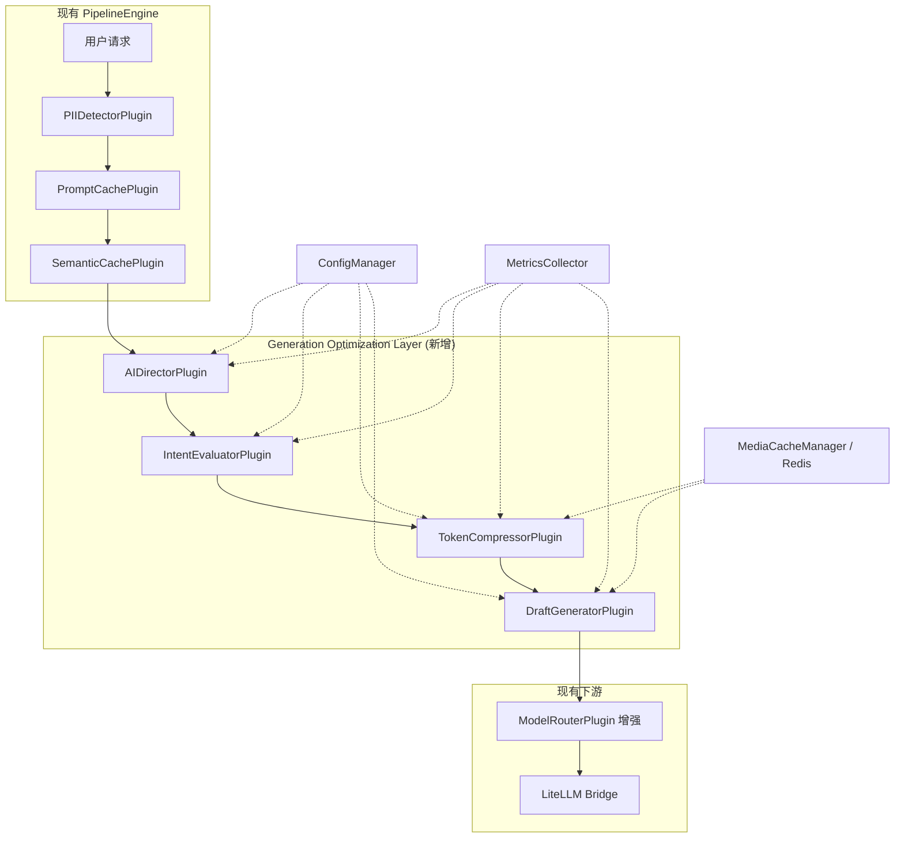
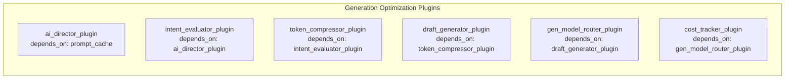
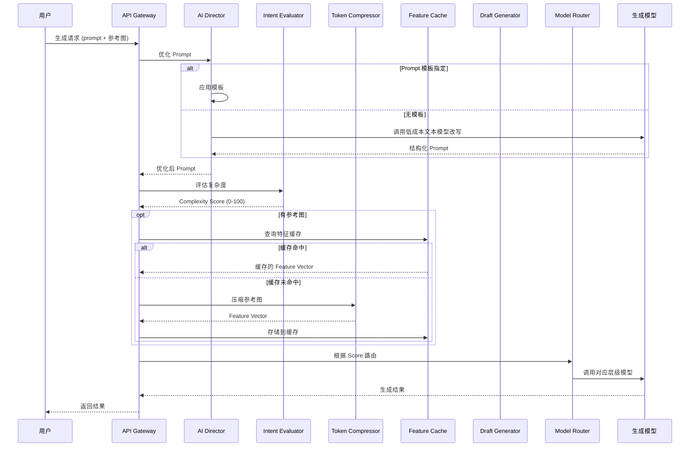
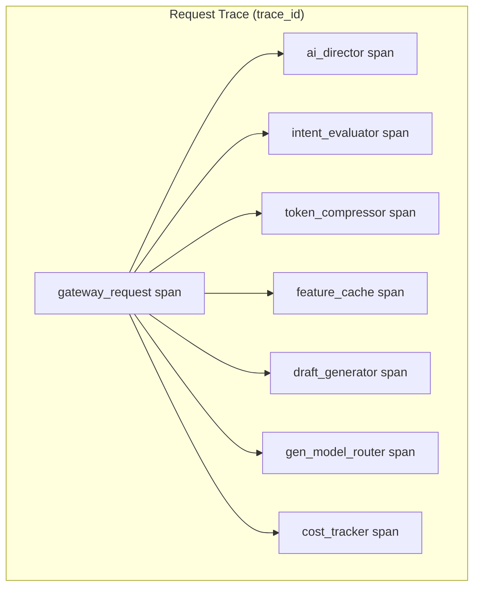

# Design Document: Generation Optimization Layer

## Overview

Generation Optimization Layer（生成优化层）是 AI Gateway 平台的核心成本优化组件，位于用户生成请求与昂贵生成模型之间。该层通过四大核心策略——AI 导演 Prompt 优化、智能模型路由、渐进式生成工作流（Draft-to-HiRes）、输入端视觉 Token 压缩与资产复用——在保证输出质量的前提下大幅降低生成式 AI 的调用成本。

### 设计目标

1. **成本降低**：通过 Prompt 优化提高一次性出片率，通过智能路由减少高端模型不必要调用，通过 Draft-to-HiRes 避免不满意结果的高清渲染浪费，通过 Token 压缩减少多模态输入成本
2. **无缝集成**：以插件形式集成到现有 PipelineEngine，复用 ConfigManager、MediaCacheManager、MetricsCollector 等基础设施
3. **灵活配置**：每个策略可独立启用/禁用，所有参数可通过 YAML + 环境变量热重载
4. **故障隔离**：任一策略失败不影响请求的正常处理，优雅降级到无优化路径

### 与现有系统的关系



## Architecture

### 插件管线集成架构

Generation Optimization Layer 以一组新插件的形式注册到现有 `PluginRegistry`，通过 `depends_on` 声明依赖关系，由 `PipelineEngine` 的拓扑排序自动确定执行顺序。



### 分层设计

| 层级 | 职责 | 模块 |
|------|------|------|
| 配置层 | 加载/验证/热重载优化策略配置 | `generation_optimization/config.py` |
| 策略层 | 各优化策略的核心逻辑 | `generation_optimization/strategies/` |
| 插件层 | 将策略封装为 PipelineEngine 插件 | `generation_optimization/plugins/` |
| 数据层 | 缓存、持久化（复用 Redis + 数据库） | 复用 `MediaCacheManager` |
| 指标层 | 成本追踪与 Prometheus 上报 | `generation_optimization/metrics.py` |

### 请求处理流程



## Components and Interfaces

### 1. GenerationOptimizationConfig

配置管理组件，扩展现有 `ConfigManager` 支持 `generation_optimization` 配置节。

```python
@dataclass
class GenerationOptimizationConfig:
    """生成优化层配置 — 映射 config.yaml 中的 generation_optimization 节."""
    
    # 全局开关
    enabled: bool = True
    
    # AI Director 配置
    ai_director: AIDirectorConfig = field(default_factory=AIDirectorConfig)
    
    # 模型路由配置
    model_router: ModelRouterConfig = field(default_factory=ModelRouterConfig)
    
    # Draft-to-HiRes 配置
    draft_workflow: DraftWorkflowConfig = field(default_factory=DraftWorkflowConfig)
    
    # Token 压缩配置
    token_compressor: TokenCompressorConfig = field(default_factory=TokenCompressorConfig)
    
    # 特征缓存配置
    feature_cache: FeatureCacheConfig = field(default_factory=FeatureCacheConfig)
    
    # 成本追踪配置
    cost_tracking: CostTrackingConfig = field(default_factory=CostTrackingConfig)
    
    # 提示词模板配置
    prompt_templates: PromptTemplateConfig = field(default_factory=PromptTemplateConfig)
```

### 2. AIDirectorStrategy

AI 导演策略核心逻辑。

```python
class AIDirectorStrategy:
    """AI 导演 — 将用户模糊提示词改写为结构化 Prompt."""
    
    async def optimize_prompt(
        self, 
        prompt: str, 
        reference_images: List[MediaContent],
        config: AIDirectorConfig,
        ctx: PipelineContext,
    ) -> PromptOptimizationResult:
        """优化用户提示词.
        
        Returns:
            PromptOptimizationResult 包含:
            - optimized_prompt: 优化后的 prompt
            - original_prompt: 原始 prompt
            - template_used: 是否使用了模板
            - model_used: 改写使用的模型
            - cost_usd: 改写调用成本
        """
        ...
    
    async def apply_template(
        self,
        template_name: str,
        variables: Dict[str, str],
        user_id: str,
    ) -> str:
        """应用提示词模板."""
        ...
```

### 3. IntentEvaluatorStrategy

意图评估策略，分析生成请求复杂度。

```python
class IntentEvaluatorStrategy:
    """意图评估器 — 根据多个维度为生成请求打分."""
    
    def evaluate(
        self,
        prompt: str,
        reference_images: List[MediaContent],
        generation_params: Dict[str, Any],
    ) -> ComplexityEvaluation:
        """评估生成请求复杂度.
        
        评估维度:
        - subject_count: 主体数量 (1=低, 2+=高)
        - interaction_type: 物理交互 (none/contact/dynamic)
        - camera_movement: 镜头运动 (static/pan/tracking)
        - target_resolution: 目标分辨率
        
        Returns:
            ComplexityEvaluation 包含:
            - score: 0-100 的复杂度分
            - factors: 各维度评分明细
            - recommended_model: 推荐的模型标识符
        """
        ...
```

### 4. ModelRouterStrategy

模型路由策略，基于复杂度评分和配置的模型列表动态选择最优模型。

```python
class ModelRouterStrategy:
    """模型路由器 — 从配置的 provider 模型列表中选择最优模型.
    
    路由逻辑:
    1. 根据任务类型按 Model_Modality 三大分类筛选模型:
       - 图片/视频/音频生成 → 仅选 "generative" 模型
       - AI Director 改写（含参考图）→ 优先选 "mllm" 模型
       - AI Director 改写（纯文本）→ 选 "llm" 模型
    2. 根据 Complexity_Score 确定所需的最低能力等级
    3. 在满足模态和能力要求的模型中选择价格最低的
    4. 支持 routing hint: "best quality" / "cheapest" / 具体模型名
    5. 模型不可用时按 fallback_models 列表降级
    """
    
    async def route(
        self,
        complexity_score: int,
        required_modality: str,  # "llm" | "mllm" | "generative"
        routing_hint: Optional[str],
        model_override: Optional[str],
        available_models: List[ModelConfig],
    ) -> RoutingDecision:
        """执行路由决策.
        
        Args:
            complexity_score: 复杂度评分 (0-100)
            required_modality: 所需模态类别 ("llm", "mllm", "generative")
            routing_hint: 用户路由提示
            model_override: 用户指定的模型覆盖
            available_models: 可用模型配置列表
        
        Returns:
            RoutingDecision 包含:
            - selected_model: 选中的模型标识符
            - selected_provider: 选中的 provider 名称
            - reason: 路由原因 (complexity/hint/override/fallback)
            - estimated_cost: 预估单次调用成本
        """
        ...
```

### 4. TokenCompressorStrategy

视觉 Token 压缩策略。

```python
class TokenCompressorStrategy:
    """视觉 Token 压缩器 — 对参考图进行语义级压缩."""
    
    async def compress(
        self,
        image: MediaContent,
        config: TokenCompressorConfig,
    ) -> CompressionResult:
        """压缩参考图.
        
        流程:
        1. 前景/背景分割
        2. 主体特征提取
        3. 输出 Feature Vector
        
        Returns:
            CompressionResult 包含:
            - feature_vector: List[float] 特征向量
            - original_token_count: 原始 Token 估算
            - compressed_token_count: 压缩后 Token 数
            - compression_ratio: 实际压缩比
        """
        ...
```

### 5. DraftGeneratorStrategy

渐进式生成工作流策略。

```python
class DraftGeneratorStrategy:
    """草图生成器 — 管理 Draft-to-HiRes 工作流."""
    
    async def generate_draft(
        self,
        request: GenerationRequest,
        config: DraftWorkflowConfig,
    ) -> DraftResult:
        """生成低分辨率草图/关键帧.
        
        Returns:
            DraftResult 包含:
            - draft_id: 唯一草图标识
            - previews: List[bytes] 预览图列表
            - generation_params: 生成参数快照
            - expires_at: 过期时间
        """
        ...
    
    async def confirm_draft(self, draft_id: str) -> UpscaleResult:
        """确认草图并执行高清放大."""
        ...
    
    async def reject_draft(self, draft_id: str) -> DraftResult:
        """拒绝草图并重新生成."""
        ...
```

### 6. FeatureCacheManager

特征向量缓存管理器，扩展现有 `MediaCacheManager`。

```python
class FeatureCacheManager:
    """特征缓存管理器 — 管理角色 Feature Vector 的存取和复用.
    
    复用现有 Redis 基础设施，Key 格式:
    aigateway:feature:{api_key_id}:{character_id}:{model_version}
    """
    
    KEY_PREFIX = "aigateway:feature"
    
    async def get_feature(
        self,
        api_key_id: str,
        character_id: str,
        model_version: str,
        timeout_ms: int = 500,
    ) -> Optional[List[float]]:
        """查询缓存的特征向量."""
        ...
    
    async def store_feature(
        self,
        api_key_id: str,
        character_id: str,
        model_version: str,
        vector: List[float],
        ttl_days: int = 30,
    ) -> None:
        """存储特征向量到缓存."""
        ...
    
    async def extend_ttl(
        self,
        api_key_id: str,
        character_id: str,
        model_version: str,
        ttl_days: int = 30,
    ) -> None:
        """续期缓存 TTL."""
        ...
```

### 7. GenerationCostTracker

成本追踪器，集成 Prometheus 指标。

```python
class GenerationCostTracker:
    """成本追踪器 — 记录各策略带来的成本节省并上报 Prometheus.
    
    复用现有 MetricsCollector，新增以下指标:
    - gen_opt_savings_usd_total (counter, labels: strategy, api_key_group)
    - gen_opt_invocations_total (counter, labels: strategy, api_key_group)  
    - gen_opt_net_savings_usd (gauge)
    - gen_opt_prompt_optimizations_total (counter)
    - gen_opt_director_cost_usd_total (counter, labels: model)
    """
    
    def record_model_routing_saving(
        self,
        premium_price: float,
        actual_price: float,
        request_id: str,
    ) -> float:
        """记录模型路由节省."""
        ...
    
    def record_token_compression_saving(
        self,
        original_tokens: int,
        compressed_tokens: int,
        per_token_price: float,
        request_id: str,
    ) -> float:
        """记录 Token 压缩节省."""
        ...
    
    def record_prompt_optimization_saving(
        self,
        retry_rate: float,
        generation_cost: float,
        director_cost: float,
        request_id: str,
    ) -> float:
        """记录 Prompt 优化净节省."""
        ...
```

### 8. PromptTemplateManager

提示词模板 CRUD 管理器。

```python
class PromptTemplateManager:
    """提示词模板管理器 — 提供模板的 CRUD 操作.
    
    模板存储在 Redis 中，Key 格式:
    aigateway:prompt_template:{api_key_id}:{template_name}
    """
    
    async def create(
        self, api_key_id: str, name: str, content: str, description: str = ""
    ) -> PromptTemplate:
        """创建模板."""
        ...
    
    async def get(self, api_key_id: str, name: str) -> Optional[PromptTemplate]:
        """获取模板."""
        ...
    
    async def list(
        self, api_key_id: str, page: int = 1, page_size: int = 20
    ) -> PaginatedResult[PromptTemplate]:
        """列出该 API Key 的所有模板."""
        ...
    
    async def update(
        self, api_key_id: str, name: str, content: str, description: str = ""
    ) -> PromptTemplate:
        """更新模板."""
        ...
    
    async def delete(self, api_key_id: str, name: str) -> bool:
        """删除模板."""
        ...
    
    def render(self, template: PromptTemplate, variables: Dict[str, str]) -> str:
        """渲染模板，替换 {{variable_name}} 占位符."""
        ...
```

### 插件接口

每个策略通过对应的 Plugin 包装注册到 PipelineEngine：

```python
class AIDirectorPlugin:
    name = "ai_director"
    enabled = True
    depends_on = ["prompt_cache"]
    
    async def execute(self, ctx: PipelineContext) -> PipelineContext:
        """执行 AI 导演优化，将结果写入 ctx.extra['generation_optimization']."""
        ...

class IntentEvaluatorPlugin:
    name = "intent_evaluator"
    enabled = True
    depends_on = ["ai_director"]
    
    async def execute(self, ctx: PipelineContext) -> PipelineContext:
        """执行意图评估，将 complexity_score 写入上下文."""
        ...

class TokenCompressorPlugin:
    name = "token_compressor"
    enabled = True
    depends_on = ["intent_evaluator"]
    
    async def execute(self, ctx: PipelineContext) -> PipelineContext:
        """执行 Token 压缩，将 feature_vector 写入上下文."""
        ...

class DraftGeneratorPlugin:
    name = "draft_generator"
    enabled = True
    depends_on = ["token_compressor"]
    
    async def execute(self, ctx: PipelineContext) -> PipelineContext:
        """执行 Draft 工作流逻辑."""
        ...

class GenModelRouterPlugin:
    name = "gen_model_router"
    enabled = True
    depends_on = ["draft_generator"]
    
    async def execute(self, ctx: PipelineContext) -> PipelineContext:
        """根据 complexity_score 执行模型路由决策."""
        ...

class CostTrackerPlugin:
    name = "cost_tracker"
    enabled = True
    depends_on = ["gen_model_router"]
    
    async def execute(self, ctx: PipelineContext) -> PipelineContext:
        """计算并记录成本节省."""
        ...
```

## Data Models

### 核心数据结构

```python
@dataclass
class GenerationRequest:
    """生成请求 — 包含优化所需的全部信息."""
    prompt: str
    reference_images: List[MediaContent] = field(default_factory=list)
    target_model: Optional[str] = None  # 模型覆盖
    routing_hint: Optional[str] = None  # 路由提示
    required_modality: str = "generative"  # 所需模态类别: "llm" | "mllm" | "generative"
    template_name: Optional[str] = None  # 模板名称
    template_variables: Dict[str, str] = field(default_factory=dict)
    character_id: Optional[str] = None  # 角色 ID（用于缓存查找）
    target_resolution: Tuple[int, int] = (1920, 1080)
    target_fps: int = 60
    injection_method: str = "ip-adapter"  # "ip-adapter" | "controlnet"
    api_key_id: str = ""  # API Key 标识符（用于资源隔离）
    request_id: str = field(default_factory=lambda: uuid.uuid4().hex)

@dataclass
class ComplexityEvaluation:
    """复杂度评估结果."""
    score: int  # 0-100
    factors: Dict[str, Any] = field(default_factory=dict)
    recommended_model: str = ""  # 推荐的模型标识符

@dataclass
class RoutingDecision:
    """路由决策结果."""
    selected_model: str
    selected_provider: str
    reason: str = "complexity"  # "complexity" | "hint" | "override" | "fallback"
    complexity_score: int = 0
    estimated_cost: float = 0.0

@dataclass
class PromptOptimizationResult:
    """Prompt 优化结果."""
    optimized_prompt: str
    original_prompt: str
    template_used: Optional[str] = None
    model_used: Optional[str] = None
    cost_usd: float = 0.0
    duration_ms: float = 0.0

@dataclass
class CompressionResult:
    """Token 压缩结果."""
    feature_vector: List[float]
    original_token_count: int
    compressed_token_count: int
    compression_ratio: float
    duration_ms: float = 0.0

@dataclass
class DraftResult:
    """草图生成结果."""
    draft_id: str
    previews: List[bytes]
    generation_params: Dict[str, Any]
    created_at: float
    expires_at: float
    attempt_number: int = 1
    max_attempts: int = 5
    status: str = "pending"  # "pending" | "confirmed" | "rejected" | "expired"

@dataclass
class UpscaleResult:
    """高清放大结果."""
    draft_id: str
    output_data: bytes
    target_resolution: Tuple[int, int]
    algorithm_used: str
    duration_ms: float = 0.0

@dataclass
class PromptTemplate:
    """提示词模板."""
    name: str  # 1-64 字符，允许字母数字、连字符、下划线
    content: str  # 最多 10000 字符
    description: str = ""  # 最多 500 字符
    api_key_id: str = ""  # 所属 API Key
    created_at: float = 0.0
    updated_at: float = 0.0
    
    @property
    def variables(self) -> List[str]:
        """提取模板中的占位符变量名."""
        import re
        return re.findall(r"\{\{(\w+)\}\}", self.content)

@dataclass
class CostSavingRecord:
    """单次请求的成本节省记录."""
    request_id: str
    model_routing_saving_usd: float = 0.0
    token_compression_saving_usd: float = 0.0
    prompt_optimization_saving_usd: float = 0.0
    total_saving_usd: float = 0.0
    timestamp: float = 0.0
```

### 配置数据结构

```python
@dataclass
class AIDirectorConfig:
    """AI 导演配置."""
    enabled: bool = True
    rewrite_model: str = "gpt-4o-mini"
    timeout_seconds: float = 10.0
    max_prompt_length: int = 2000
    min_prompt_length: int = 10
    prompt_confirmation_enabled: bool = True

@dataclass
class ModelRouterConfig:
    """模型路由配置."""
    enabled: bool = True
    default_model: str = "agnes-2.0-flash"  # 评估失败时的默认模型
    evaluation_timeout_seconds: float = 2.0
    # 模型能力映射: model_name -> capability_score (0-100)
    # 路由时选择 capability_score >= complexity_score 且价格最低的模型
    model_capabilities: Dict[str, int] = field(default_factory=dict)
    # 模型模态分类: model_name -> modality
    # 三大分类:
    #   "llm" — 纯文本语言模型（输入文本→输出文本，如 Chat、代码、翻译、RAG、Agent）
    #   "mllm" — 多模态理解模型（输入文本+图片/音频/视频→输出文本，如 VLM、OCR、图表分析、文档理解）
    #   "generative" — 生成模型（输入文本/图片/音频→输出图片/视频/音频/3D，如文生图、文生视频、TTS）
    model_modalities: Dict[str, str] = field(default_factory=dict)
    # 定价从 providers 配置中读取，无需重复配置

@dataclass
class DraftWorkflowConfig:
    """Draft-to-HiRes 工作流配置."""
    enabled: bool = True
    draft_resolution: Tuple[int, int] = (512, 512)
    default_target_resolution: Tuple[int, int] = (1920, 1080)
    max_target_resolution: Tuple[int, int] = (4096, 4096)
    max_regeneration_attempts: int = 5
    retention_period_hours: int = 24
    preview_video_duration_seconds: int = 30
    preview_keyframe_interval_seconds: int = 5  # 每隔 N 秒生成一张关键帧，最少 2 帧
    preview_video_fps: int = 8
    target_fps: int = 60
    target_fps_range: Tuple[int, int] = (24, 120)
    upscale_algorithm: str = "real-esrgan"

@dataclass
class TokenCompressorConfig:
    """Token 压缩配置."""
    enabled: bool = True
    target_compression_ratio: float = 0.5  # 50%
    min_compression_ratio: float = 0.2
    max_compression_ratio: float = 0.9
    max_vector_dimensions: int = 512
    timeout_seconds: float = 30.0
    supported_formats: List[str] = field(
        default_factory=lambda: ["image/png", "image/jpeg", "image/webp", "image/bmp"]
    )
    max_images_per_request: int = 10
    max_image_size_bytes: int = 20 * 1024 * 1024  # 20 MB

@dataclass
class FeatureCacheConfig:
    """特征缓存配置."""
    enabled: bool = True
    ttl_days: int = 30
    lookup_timeout_ms: int = 500
    extraction_model_version: str = "clip-vit-large-patch14"

@dataclass
class CostTrackingConfig:
    """成本追踪配置."""
    enabled: bool = True
    assumed_retry_rate: float = 0.3
    precision_decimal_places: int = 6

@dataclass
class PromptTemplateConfig:
    """提示词模板配置."""
    enabled: bool = True
    default_page_size: int = 20
    max_page_size: int = 100
    max_name_length: int = 64
    max_content_length: int = 10000
    max_description_length: int = 500
```

### Redis Key 格式

| 用途 | Key 格式 | TTL |
|------|----------|-----|
| 特征向量缓存 | `aigateway:feature:{api_key_id}:{character_id}:{model_version}` | 30 天（可配置） |
| 草图暂存 | `aigateway:draft:{draft_id}` | 24 小时（可配置） |
| 提示词模板 | `aigateway:prompt_template:{api_key_id}:{template_name}` | 永久（手动管理） |
| 模板列表索引 | `aigateway:prompt_template_index:{api_key_id}` | 永久 |

### YAML 配置示例

```yaml
generation_optimization:
  enabled: true
  
  ai_director:
    enabled: true
    rewrite_model: "gpt-4o-mini"
    timeout_seconds: 10
    max_prompt_length: 2000
    min_prompt_length: 10
    prompt_confirmation_enabled: true
  
  model_router:
    enabled: true
    default_model: "agnes-2.0-flash"
    evaluation_timeout_seconds: 2
    # 模型能力评分：路由时选择 capability >= complexity_score 且价格最低的模型
    model_capabilities:
      agnes-2.0-flash: 50
      agnes-image-2.1-flash: 70
      agnes-video-v2.0: 90
    # 模型模态标签：路由时按任务类型筛选对应模态的模型
    # "llm" = 纯文本(Chat/代码/翻译/RAG/Agent)
    # "mllm" = 多模态理解(VLM/OCR/图表分析/文档理解)
    # "generative" = 生成(文生图/文生视频/图生视频/TTS/音乐)
    model_modalities:
      agnes-2.0-flash: "llm"
      agnes-image-2.1-flash: "generative"
      agnes-video-v2.0: "generative"
      deepseek-v4-flash: "llm"
  
  draft_workflow:
    enabled: true
    draft_resolution: [512, 512]
    default_target_resolution: [1920, 1080]
    max_target_resolution: [4096, 4096]
    max_regeneration_attempts: 5
    retention_period_hours: 24
    preview_video_duration_seconds: 30
    preview_keyframe_interval_seconds: 5
    preview_video_fps: 8
    target_fps: 60
  
  token_compressor:
    enabled: true
    target_compression_ratio: 0.5
    max_vector_dimensions: 512
    timeout_seconds: 30
    max_images_per_request: 10
    max_image_size_bytes: 20971520
  
  feature_cache:
    enabled: true
    ttl_days: 30
    lookup_timeout_ms: 500
    extraction_model_version: "clip-vit-large-patch14"
  
  cost_tracking:
    enabled: true
    assumed_retry_rate: 0.3
  
  prompt_templates:
    enabled: true
    default_page_size: 20
    max_page_size: 100
```


## Correctness Properties

*A property is a characteristic or behavior that should hold true across all valid executions of a system—essentially, a formal statement about what the system should do. Properties serve as the bridge between human-readable specifications and machine-verifiable correctness guarantees.*

### Property 1: Prompt 优化输出长度约束

*For any* user prompt and any AI Director configuration, the optimized prompt output SHALL never exceed the configured `max_prompt_length`.

**Validates: Requirements 1.2**

### Property 2: 禁用策略透传不变性

*For any* generation request and any optimization strategy (AI Director, Token Compressor, Model Router, Draft Workflow), when that strategy is disabled via configuration, the request data relevant to that strategy SHALL pass through completely unmodified.

**Validates: Requirements 1.7, 4.7, 6.6**

### Property 3: AI Director 故障降级保留原始 Prompt

*For any* user prompt, when the AI Director model call fails or times out, the output prompt SHALL be identical to the original user prompt.

**Validates: Requirements 1.6**

### Property 4: 复杂度评分范围不变量

*For any* generation request, the Intent Evaluator SHALL produce a Complexity_Score within the closed interval [0, 100].

**Validates: Requirements 2.1**

### Property 5: 模型路由决策正确性

*For any* Complexity_Score and any configured model capability map, the Model Router SHALL select the model with the lowest price whose capability_score is greater than or equal to the Complexity_Score. If no model meets the capability threshold, the highest-capability model SHALL be selected.

**Validates: Requirements 2.2**

### Property 6: 模型覆盖绕过路由

*For any* generation request that specifies an explicit model override present in the configured provider model list, the Model Router SHALL select exactly that model, bypassing complexity scoring.

**Validates: Requirements 2.4**

### Property 7: 无效模型覆盖拒绝

*For any* generation request that specifies a model override NOT present in any configured provider's model list, the Model Router SHALL reject the request with an error.

**Validates: Requirements 2.5**

### Property 8: 路由提示优先

*For any* generation request containing a valid routing hint ("best quality" or "cheapest"), the Model Router SHALL route to the highest-capability or lowest-price model respectively, bypassing the complexity-based selection.

**Validates: Requirements 2.6**

### Property 9: 路由元数据完整性

*For any* completed model routing decision, the request metadata SHALL contain the routing decision reason, selected model identifier, selected provider name, and Complexity_Score.

**Validates: Requirements 2.7**

### Property 10: 意图评估失败回退到默认模型

*For any* generation request where the Intent Evaluator fails (timeout or error), the Model Router SHALL select the configured default_model.

**Validates: Requirements 2.8**

### Property 11: 视频草图关键帧数量下界不变量

*For any* video generation request entering the Draft-to-HiRes workflow, the Draft Generator SHALL produce at least 2 keyframe images (first and last frame), and the total count SHALL equal max(2, ceil(video_duration / keyframe_interval)) when no explicit count is specified.

**Validates: Requirements 3.2**

### Property 12: 重新生成次数上限

*For any* draft rejection sequence, the attempt counter SHALL increment by 1 per rejection and the Draft Generator SHALL refuse regeneration when the counter reaches the configured `max_regeneration_attempts`.

**Validates: Requirements 3.5, 3.9**

### Property 13: Token 压缩故障透传

*For any* reference image that has an unsupported format or whose compression times out, the Token Compressor SHALL output the original image unmodified.

**Validates: Requirements 4.5, 4.6**

### Property 14: Feature Vector 维度约束

*For any* successful Token Compressor output, the Feature_Vector dimensionality SHALL NOT exceed the configured `max_vector_dimensions`.

**Validates: Requirements 4.3**

### Property 15: Token 节省计算公式正确性

*For any* compression result, the recorded `original_token_count` SHALL equal `image_file_size_bytes / 4`, and the `compressed_token_count` SHALL equal the Feature_Vector dimension count.

**Validates: Requirements 4.4**

### Property 16: 特征缓存存取一致性（Round-Trip）

*For any* Feature_Vector stored in the Feature_Cache with a given composite key (user_id, character_id, model_version), a subsequent cache lookup with the same composite key SHALL return a vector identical to the one originally stored.

**Validates: Requirements 5.1, 5.2**

### Property 17: 特征缓存 API Key 隔离

*For any* two distinct API Keys with the same character_id, the Feature_Cache SHALL return each API Key's own Feature_Vector independently, with no cross-key contamination.

**Validates: Requirements 5.7**

### Property 18: 缓存命中 TTL 续期

*For any* successful Feature_Cache lookup, the cache entry's TTL SHALL be extended by the configured TTL duration.

**Validates: Requirements 5.4**

### Property 19: 配置环境变量优先级

*For any* configuration key that is set in both the YAML file and an environment variable, the environment variable value SHALL take precedence.

**Validates: Requirements 6.2**

### Property 20: 无效配置保留旧值

*For any* configuration value that is invalid (wrong type or out of permitted range), the system SHALL retain the previous valid configuration value for that item.

**Validates: Requirements 6.4**

### Property 21: 模型路由成本节省计算

*For any* routing decision where the selected model price is less than the premium model price, the recorded cost saving SHALL equal (premium_model_price - actual_model_price).

**Validates: Requirements 7.4**

### Property 22: 成本计算失败安全记录

*For any* cost savings calculation failure, the system SHALL record zero savings for the affected strategy and continue processing.

**Validates: Requirements 7.5**

### Property 23: 模板占位符完整替换

*For any* Prompt_Template with N placeholder variables `{{var_name}}` and a complete set of N matching variable values, the rendered output SHALL contain zero unreplaced `{{...}}` placeholders and each placeholder SHALL be replaced by its corresponding value.

**Validates: Requirements 8.4**

### Property 24: 缺失模板变量检测

*For any* Prompt_Template with placeholder variables where the provided variable set is a strict subset, the system SHALL return a validation error listing exactly the missing variable names.

**Validates: Requirements 8.6**

### Property 25: 模板名称 API Key 内唯一性

*For any* API Key, creating a Prompt_Template with a name identical to an existing template owned by the same API Key SHALL be rejected; creating a template with the same name for a different API Key SHALL succeed.

**Validates: Requirements 8.7**

### Property 26: 跨 API Key 模板访问控制

*For any* Prompt_Template owned by API Key A, any update or delete attempt by API Key B (where B ≠ A) SHALL be rejected with an authorization error, leaving the template unchanged.

**Validates: Requirements 8.8**

## Error Handling

### 故障隔离策略

生成优化层遵循"任一策略失败不阻断请求"的原则，每个插件独立处理错误：

| 组件 | 故障场景 | 降级行为 |
|------|---------|---------|
| AI Director | 模型调用超时/失败 | 使用原始 prompt 继续 |
| Intent Evaluator | 评估超时/内部错误 | 默认 mid-tier 路由 |
| Model Router | 目标模型不可用 | 同层或上一层模型回退 |
| Token Compressor | 压缩超时/格式不支持 | 透传原始图像 |
| Feature Cache | Redis 不可用/超时 | 从原始图像重新提取 |
| Draft Generator | 重试次数耗尽 | 返回错误，保留最后草图 |
| Upscaler | 放大算法失败 | 返回错误，保留草图供重试 |
| Cost Tracker | 计算失败 | 记录零节省，继续处理 |

### 错误分类

```python
class GenerationOptimizationError(Exception):
    """生成优化层基础异常."""
    pass

class PromptOptimizationError(GenerationOptimizationError):
    """Prompt 优化失败（AI Director 超时/模型错误）."""
    pass

class ModelRoutingError(GenerationOptimizationError):
    """模型路由失败（所有候选模型不可用）."""
    pass

class TokenCompressionError(GenerationOptimizationError):
    """Token 压缩失败（超时/格式错误）."""
    pass

class DraftWorkflowError(GenerationOptimizationError):
    """Draft 工作流错误（重试耗尽/草图过期）."""
    pass

class FeatureCacheError(GenerationOptimizationError):
    """特征缓存错误（Redis 不可用 + 原图不可用）."""
    pass

class TemplateValidationError(GenerationOptimizationError):
    """模板验证错误（名称重复/变量缺失/权限不足）."""
    pass

class ConfigValidationError(GenerationOptimizationError):
    """配置验证错误（值无效/类型错误）."""
    pass
```

### 日志规范

所有错误和降级行为使用结构化日志记录，并携带 trace_id：

```python
logger.warning(
    "generation_optimization.fallback",
    extra={
        "strategy": "ai_director",
        "reason": "timeout",
        "fallback_action": "use_original_prompt",
        "request_id": ctx.request_id,
        "trace_id": ctx.trace_id,
        "duration_ms": elapsed_ms,
    }
)
```

### 全链路追踪集成

生成优化层复用现有 `TracingManager` 和 `PipelineContext.trace_id`，为每个优化策略创建子 span：



每个插件在 `execute()` 方法中：
1. 从 `ctx.trace_id` 获取当前 trace_id
2. 通过 `TracingManager.create_plugin_span()` 创建子 span
3. 在子 span 中记录策略特定属性（如 complexity_score、compression_ratio、routing_decision）
4. 异常时调用 `TracingManager.mark_span_error()` 标记错误

```python
class AIDirectorPlugin:
    async def execute(self, ctx: PipelineContext) -> PipelineContext:
        tracing = get_tracing_manager()
        span_ctx = tracing.create_plugin_span(
            span_context={"trace_id": ctx.trace_id},
            plugin_name="ai_director",
            request_id=ctx.request_id,
        )
        try:
            # ... 执行优化逻辑 ...
            tracing.set_span_attribute(span, "ai_director.model_used", config.rewrite_model)
            tracing.set_span_attribute(span, "ai_director.prompt_length", len(optimized))
        except Exception as exc:
            tracing.mark_span_error(span, exc)
            # 降级处理
        return ctx
```

所有下游 LLM 调用通过 `TracingManager.inject_trace_context()` 将 trace_id 注入 HTTP 请求头，实现跨服务追踪传播。

## Testing Strategy

### 测试分层

| 层级 | 目标 | 工具 |
|------|------|------|
| Property-Based Tests | 验证核心正确性属性（26 个属性） | Hypothesis (Python) |
| Unit Tests | 验证具体示例、边界条件、错误路径 | pytest |
| Integration Tests | 验证组件间交互、Redis 连接、API 端点 | pytest + httpx + testcontainers |
| Performance Tests | 验证超时限制和延迟要求 | pytest-benchmark |

### Property-Based Testing 配置

- **库**: [Hypothesis](https://hypothesis.readthedocs.io/)
- **每个属性最少迭代**: 100 次
- **标签格式**: `# Feature: generation-optimization-layer, Property {number}: {title}`

### 关键测试点

**Property Tests（高优先级）:**
- 模型路由决策正确性（Property 5）
- 特征缓存存取一致性（Property 16）
- 模板占位符替换完整性（Property 23）
- 配置环境变量优先级（Property 19）
- Token 压缩故障透传（Property 13）
- 禁用策略透传（Property 2）
- 用户隔离（Properties 17, 25, 26）

**Unit Tests（补充）:**
- AI Director 结构化输出格式验证
- 复杂度评估各维度权重计算
- Draft 工作流状态机转换
- 成本计算精度（6 位小数）
- 模板名称格式验证（正则匹配）

**Integration Tests:**
- Redis 缓存读写完整流程
- PipelineEngine 中插件拓扑排序验证
- API 端点 CRUD 操作
- Prometheus 指标正确上报
- 配置热重载 5 秒内生效

### Mock 策略

| 外部依赖 | Mock 方式 |
|----------|----------|
| LLM 模型调用 (AI Director) | unittest.mock.AsyncMock |
| Redis (Feature Cache / Draft Store) | fakeredis |
| 图像处理 (Token Compressor) | 预生成的小型测试图像 |
| Prometheus | 直接检查 Counter/Gauge 值 |
| 文件系统 (Config Watchdog) | tmp_path fixture |

### 测试目录结构

```
tests/
├── unit/
│   ├── test_ai_director.py
│   ├── test_intent_evaluator.py
│   ├── test_model_router.py
│   ├── test_token_compressor.py
│   ├── test_draft_generator.py
│   ├── test_feature_cache.py
│   ├── test_cost_tracker.py
│   └── test_prompt_template.py
├── property/
│   ├── test_routing_properties.py      # Properties 4-10
│   ├── test_compression_properties.py  # Properties 13-15
│   ├── test_cache_properties.py        # Properties 16-18
│   ├── test_config_properties.py       # Properties 19-20
│   ├── test_template_properties.py     # Properties 23-26
│   ├── test_cost_properties.py         # Properties 21-22
│   └── test_bypass_properties.py       # Properties 1-3
├── integration/
│   ├── test_pipeline_integration.py
│   ├── test_redis_integration.py
│   └── test_api_endpoints.py
└── conftest.py
```
