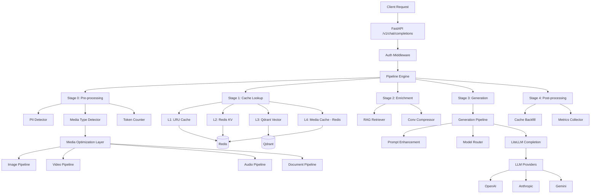
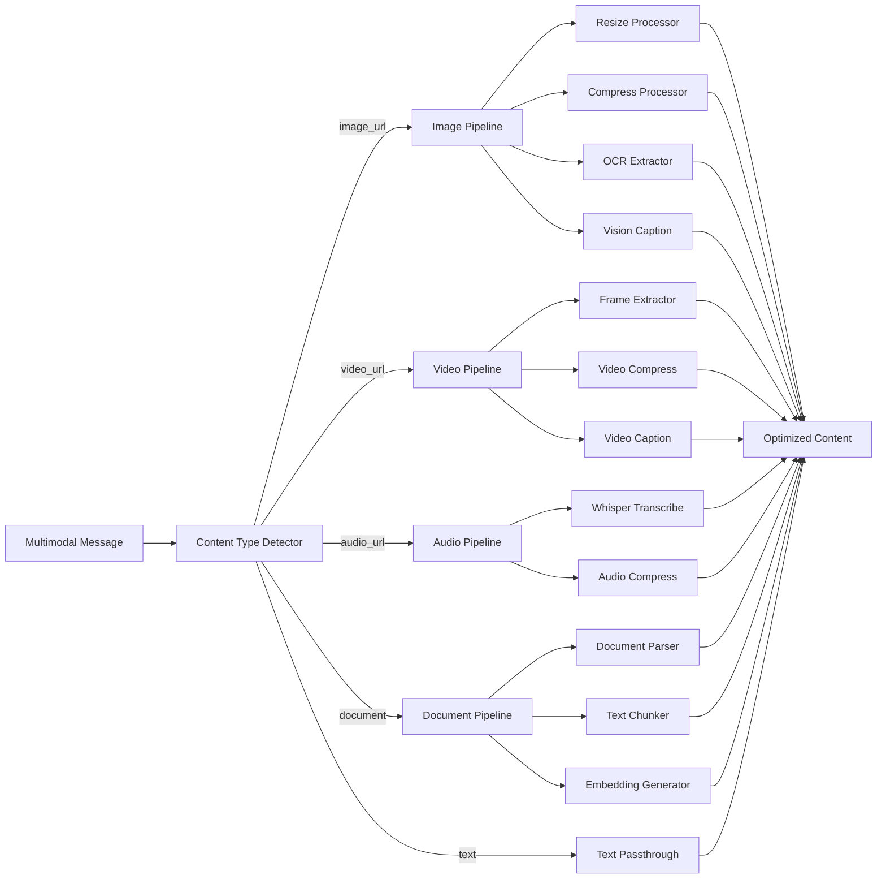
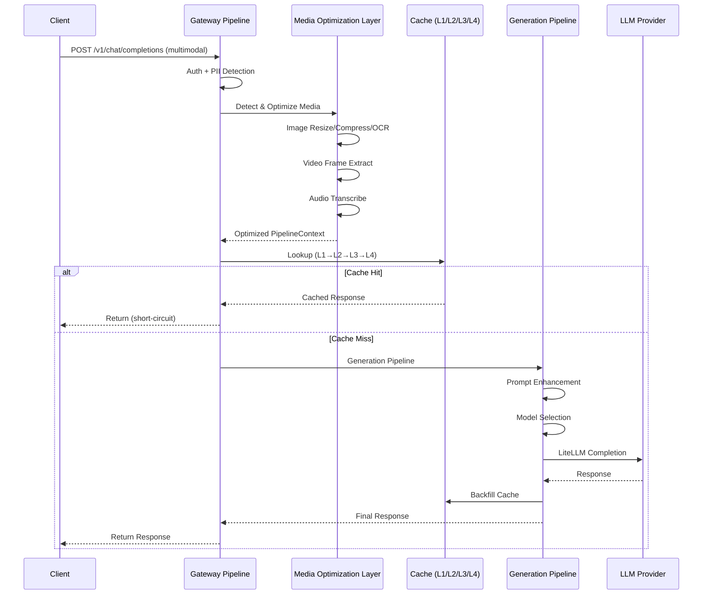

# Design Document: Enterprise Multimodal AI Gateway V2.0

## Overview

本文档定义 AI Gateway Framework 从 Text-Only Gateway 向 Enterprise Multimodal AI Gateway 的升级设计。V2.0 在现有 Text Pipeline（Prompt Compress → Cache → LLM）基础上，新增 Media Optimization Layer，支持 Image、Video、Audio、Document 四大媒体类型的智能处理，实现多模态内容的统一接入、优化和缓存。

核心设计目标：
1. **统一接口** — 保持 OpenAI API 兼容性，透明处理多模态内容
2. **智能优化** — 自动识别媒体类型，执行压缩/转码/提取/缓存
3. **Token 节约** — 通过 Media Optimization 减少多模态请求的 token 消耗
4. **可扩展架构** — Plugin-based Pipeline 支持新增媒体类型和处理器

## Architecture

### 系统全景图



### Media Optimization Layer 架构



### Generation Pipeline 流程



## Components and Interfaces

### 1. Media Optimization Layer (MOL)

**Purpose**: 统一入口，检测消息中的多模态内容并分发到对应 Pipeline 处理。

```python
from abc import ABC, abstractmethod
from dataclasses import dataclass, field
from enum import Enum
from typing import Any, Dict, List, Optional, Union


class MediaType(Enum):
    """支持的媒体类型枚举。"""
    TEXT = "text"
    IMAGE = "image"
    VIDEO = "video"
    AUDIO = "audio"
    DOCUMENT = "document"


class ProcessorPhase(Enum):
    """Processor 分类（决定执行阶段）。"""
    PRE_LLM = "pre_llm"      # LLM 调用前执行（压缩、提取）
    POST_LLM = "post_llm"    # LLM 调用后执行（格式化）
    PARALLEL = "parallel"     # 可并行执行（独立处理）


@dataclass
class MediaContent:
    """媒体内容的统一抽象。"""
    media_type: MediaType
    source_url: Optional[str] = None
    raw_data: Optional[bytes] = None
    mime_type: Optional[str] = None
    size_bytes: int = 0
    metadata: Dict[str, Any] = field(default_factory=dict)
    # 处理后产出
    extracted_text: Optional[str] = None
    optimized_data: Optional[bytes] = None
    embedding_vector: Optional[List[float]] = None
    token_savings: int = 0


@dataclass
class ProcessorResult:
    """单个 Processor 的处理结果。"""
    success: bool
    processor_name: str
    duration_ms: float
    output: Optional[Any] = None
    error: Optional[str] = None
    token_savings: int = 0
```


```python
class MediaProcessor(ABC):
    """媒体处理器基类 — 所有 Pipeline 中的处理单元实现此接口。"""
    
    name: str
    phase: ProcessorPhase
    supported_types: List[MediaType]
    
    @abstractmethod
    async def process(self, content: MediaContent, ctx: "PipelineContext") -> ProcessorResult:
        """处理媒体内容。
        
        Args:
            content: 待处理的媒体内容。
            ctx: Pipeline 上下文（可读取配置、写入结果）。
        
        Returns:
            处理结果，包含成功/失败状态和输出。
        """
        ...
    
    @abstractmethod
    def supports(self, content: MediaContent) -> bool:
        """判断此 Processor 是否支持给定媒体内容。"""
        ...


class MediaPipeline(ABC):
    """媒体处理管线基类 — 每种媒体类型有一个 Pipeline。"""
    
    media_type: MediaType
    processors: List[MediaProcessor]
    
    @abstractmethod
    async def execute(self, content: MediaContent, ctx: "PipelineContext") -> MediaContent:
        """执行该媒体类型的完整处理流程。
        
        Args:
            content: 原始媒体内容。
            ctx: Pipeline 上下文。
        
        Returns:
            处理后的媒体内容（含提取文本、优化数据等）。
        """
        ...
```


```python
class MediaOptimizationLayer:
    """Media Optimization Layer — 多模态处理入口。
    
    职责：
    1. 检测消息中的媒体类型
    2. 分发到对应 MediaPipeline
    3. 聚合处理结果回 PipelineContext
    """
    
    def __init__(self, pipelines: Dict[MediaType, MediaPipeline]):
        self._pipelines = pipelines
        self._detector = ContentTypeDetector()
    
    async def process_message(
        self, 
        message: Dict[str, Any], 
        ctx: "PipelineContext"
    ) -> Dict[str, Any]:
        """处理单条消息中的所有媒体内容。
        
        Args:
            message: OpenAI 格式消息（可能包含 content array）。
            ctx: Pipeline 上下文。
        
        Returns:
            优化后的消息（媒体已处理/替换）。
        """
        content = message.get("content", "")
        
        if isinstance(content, str):
            # 纯文本消息，直接返回
            return message
        
        if isinstance(content, list):
            # 多模态消息：content 是 ContentPart array
            optimized_parts = []
            for part in content:
                media_content = self._detector.detect(part)
                if media_content.media_type == MediaType.TEXT:
                    optimized_parts.append(part)
                else:
                    pipeline = self._pipelines.get(media_content.media_type)
                    if pipeline:
                        processed = await pipeline.execute(media_content, ctx)
                        optimized_parts.append(
                            self._to_content_part(processed)
                        )
                    else:
                        optimized_parts.append(part)  # 不支持的类型透传
            
            return {**message, "content": optimized_parts}
        
        return message
    
    def _to_content_part(self, content: MediaContent) -> Dict[str, Any]:
        """将处理后的 MediaContent 转换回 OpenAI ContentPart 格式。"""
        if content.extracted_text:
            return {"type": "text", "text": content.extracted_text}
        if content.optimized_data and content.source_url:
            return {
                "type": "image_url",
                "image_url": {"url": content.source_url}
            }
        return {"type": "text", "text": ""}
```

### 2. Image Pipeline

**Purpose**: 图像内容的智能处理 — 压缩、OCR 文字提取、Vision Caption 生成。

```python
class ImagePipeline(MediaPipeline):
    """图像处理管线。
    
    处理器链:
    1. ImageResizeProcessor — 缩放到目标分辨率
    2. ImageCompressProcessor — 质量压缩（WebP/JPEG）
    3. OCRExtractor — 文字提取（Tesseract/PaddleOCR）
    4. VisionCaptionProcessor — 使用 Vision Model 生成描述
    
    策略选择:
    - 纯文字图片 → OCR 提取文本替代原图
    - 纯视觉图片 → Caption 生成描述
    - 混合图片 → OCR + Caption 组合
    """
    
    media_type = MediaType.IMAGE
    
    def __init__(self, config: "ImagePipelineConfig"):
        self.resize_processor = ImageResizeProcessor(
            max_width=config.max_width,
            max_height=config.max_height,
        )
        self.compress_processor = ImageCompressProcessor(
            quality=config.quality,
            format=config.output_format,
        )
        self.ocr_extractor = OCRExtractor(
            backend=config.ocr_backend,  # "tesseract" | "paddleocr"
            languages=config.ocr_languages,
        )
        self.caption_processor = VisionCaptionProcessor(
            model=config.caption_model,
        )
        self.processors = [
            self.resize_processor,
            self.compress_processor,
            self.ocr_extractor,
            self.caption_processor,
        ]
    
    async def execute(self, content: MediaContent, ctx: "PipelineContext") -> MediaContent:
        """执行图像处理管线。"""
        # Step 1: Resize
        resized = await self.resize_processor.process(content, ctx)
        if resized.success:
            content.optimized_data = resized.output
        
        # Step 2: Compress
        compressed = await self.compress_processor.process(content, ctx)
        if compressed.success:
            content.optimized_data = compressed.output
            content.token_savings += compressed.token_savings
        
        # Step 3: OCR (如果图片包含文字)
        ocr_result = await self.ocr_extractor.process(content, ctx)
        if ocr_result.success and ocr_result.output:
            content.extracted_text = ocr_result.output
        
        # Step 4: Caption (如果图片是纯视觉内容)
        if not content.extracted_text:
            caption_result = await self.caption_processor.process(content, ctx)
            if caption_result.success:
                content.extracted_text = caption_result.output
        
        return content
```

### 3. Video Pipeline

**Purpose**: 视频内容处理 — 关键帧提取、时间切片、字幕生成。

```python
class VideoPipeline(MediaPipeline):
    """视频处理管线。
    
    处理器链:
    1. VideoFrameExtractor — 抽取关键帧（场景切换检测）
    2. VideoCompressProcessor — 降分辨率/帧率压缩
    3. VideoTranscriber — 音轨转文字（Whisper）
    4. VideoCaptionProcessor — 关键帧 Caption 生成
    
    长视频策略:
    - max_duration: 300s (超过截取或分段)
    - frame_interval: 每 N 秒抽一帧
    - scene_detection: 使用场景切换算法选择关键帧
    """
    
    media_type = MediaType.VIDEO
    
    def __init__(self, config: "VideoPipelineConfig"):
        self.frame_extractor = VideoFrameExtractor(
            max_frames=config.max_frames,
            frame_interval_sec=config.frame_interval_sec,
            scene_detection=config.scene_detection,
        )
        self.compress_processor = VideoCompressProcessor(
            target_resolution=config.target_resolution,
            max_duration_sec=config.max_duration_sec,
        )
        self.transcriber = VideoTranscriber(
            model=config.whisper_model,  # "whisper-1" | "faster-whisper"
            language=config.language,
        )
        self.caption_processor = VideoCaptionProcessor(
            model=config.caption_model,
        )
        self.processors = [
            self.frame_extractor,
            self.compress_processor,
            self.transcriber,
            self.caption_processor,
        ]
    
    async def execute(self, content: MediaContent, ctx: "PipelineContext") -> MediaContent:
        """执行视频处理管线。"""
        # Step 1: 关键帧提取
        frames_result = await self.frame_extractor.process(content, ctx)
        extracted_frames: List[bytes] = frames_result.output or []
        
        # Step 2: 音轨转文字
        transcript_result = await self.transcriber.process(content, ctx)
        transcript: str = transcript_result.output or ""
        
        # Step 3: 关键帧 Caption
        captions: List[str] = []
        for frame_data in extracted_frames[:5]:  # 最多 5 帧
            frame_content = MediaContent(
                media_type=MediaType.IMAGE,
                raw_data=frame_data,
                mime_type="image/jpeg",
            )
            cap_result = await self.caption_processor.process(frame_content, ctx)
            if cap_result.success:
                captions.append(cap_result.output)
        
        # 组合输出
        combined_text = self._compose_output(transcript, captions)
        content.extracted_text = combined_text
        content.token_savings = self._estimate_savings(content, combined_text)
        
        return content
    
    def _compose_output(self, transcript: str, captions: List[str]) -> str:
        """组合视频摘要输出。"""
        parts = []
        if transcript:
            parts.append(f"[视频音轨转录]: {transcript}")
        if captions:
            parts.append("[视频关键帧描述]:")
            for i, cap in enumerate(captions):
                parts.append(f"  帧{i+1}: {cap}")
        return "\n".join(parts)
    
    def _estimate_savings(self, original: MediaContent, text: str) -> int:
        """估算 token 节约量。"""
        # 视频直接传给 Vision Model 通常消耗大量 token
        # 转为文本摘要后显著减少
        original_tokens = original.size_bytes // 4  # 粗略估算
        text_tokens = len(text) // 4
        return max(0, original_tokens - text_tokens)
```

### 4. Audio Pipeline

**Purpose**: 音频内容处理 — 语音转文字、音频压缩、Speaker Diarization。

```python
class AudioPipeline(MediaPipeline):
    """音频处理管线。
    
    处理器链:
    1. AudioCompressProcessor — 格式转换/降采样
    2. AudioTranscriber — 语音转文字（Whisper）
    3. SpeakerDiarizer — 说话人分离（可选）
    
    输出策略:
    - 短音频 (< 60s): 全文转录
    - 长音频 (60s-600s): 分段转录 + 摘要
    - 超长音频 (> 600s): 截取前 600s 或拒绝
    """
    
    media_type = MediaType.AUDIO
    
    def __init__(self, config: "AudioPipelineConfig"):
        self.compress_processor = AudioCompressProcessor(
            target_format=config.target_format,  # "opus" | "mp3" | "wav"
            sample_rate=config.sample_rate,
            bitrate=config.bitrate,
        )
        self.transcriber = AudioTranscriber(
            model=config.whisper_model,
            language=config.language,
            max_duration_sec=config.max_duration_sec,
        )
        self.diarizer = SpeakerDiarizer(
            enabled=config.diarization_enabled,
        )
        self.processors = [
            self.compress_processor,
            self.transcriber,
            self.diarizer,
        ]
    
    async def execute(self, content: MediaContent, ctx: "PipelineContext") -> MediaContent:
        """执行音频处理管线。"""
        # Step 1: 压缩/格式转换
        compressed = await self.compress_processor.process(content, ctx)
        if compressed.success:
            content.optimized_data = compressed.output
        
        # Step 2: 语音转文字
        transcript = await self.transcriber.process(content, ctx)
        if transcript.success:
            content.extracted_text = transcript.output
        
        # Step 3: 说话人分离（如启用）
        if self.diarizer.enabled and transcript.success:
            diarized = await self.diarizer.process(content, ctx)
            if diarized.success:
                content.extracted_text = diarized.output
                content.metadata["speakers"] = diarized.output
        
        return content
```

### 5. Document Pipeline

**Purpose**: 文档内容处理 — 解析、分块、嵌入向量生成。

```python
class DocumentPipeline(MediaPipeline):
    """文档处理管线。
    
    支持格式: PDF, DOCX, XLSX, PPTX, Markdown, HTML, CSV
    
    处理器链:
    1. DocumentParser — 格式解析为纯文本
    2. TextChunker — 智能分块（按语义边界）
    3. EmbeddingGenerator — 块级嵌入向量
    4. DocumentSummarizer — 长文档摘要
    """
    
    media_type = MediaType.DOCUMENT
    
    def __init__(self, config: "DocumentPipelineConfig"):
        self.parser = DocumentParser(
            supported_formats=config.supported_formats,
            ocr_fallback=config.ocr_fallback,
        )
        self.chunker = TextChunker(
            chunk_size=config.chunk_size,
            chunk_overlap=config.chunk_overlap,
            strategy=config.chunking_strategy,  # "semantic" | "token" | "sentence"
        )
        self.embedding_generator = EmbeddingGenerator(
            model=config.embedding_model,
            vector_dim=config.vector_dim,
        )
        self.summarizer = DocumentSummarizer(
            max_length=config.summary_max_length,
        )
        self.processors = [
            self.parser,
            self.chunker,
            self.embedding_generator,
            self.summarizer,
        ]
    
    async def execute(self, content: MediaContent, ctx: "PipelineContext") -> MediaContent:
        """执行文档处理管线。"""
        # Step 1: 解析文档为纯文本
        parsed = await self.parser.process(content, ctx)
        if not parsed.success:
            return content
        full_text: str = parsed.output
        
        # Step 2: 智能分块
        chunk_content = MediaContent(
            media_type=MediaType.DOCUMENT,
            extracted_text=full_text,
            metadata=content.metadata,
        )
        chunks_result = await self.chunker.process(chunk_content, ctx)
        chunks: List[str] = chunks_result.output or [full_text]
        
        # Step 3: 生成嵌入向量（用于 RAG 索引）
        for chunk in chunks:
            embed_content = MediaContent(
                media_type=MediaType.DOCUMENT,
                extracted_text=chunk,
            )
            embed_result = await self.embedding_generator.process(embed_content, ctx)
            if embed_result.success:
                # 存储到 Qdrant rag_documents collection
                await self._store_chunk_vector(chunk, embed_result.output, ctx)
        
        # Step 4: 生成摘要（长文档时）
        if len(full_text) > 5000:
            summary_content = MediaContent(
                media_type=MediaType.DOCUMENT,
                extracted_text=full_text,
            )
            summary = await self.summarizer.process(summary_content, ctx)
            content.extracted_text = summary.output if summary.success else full_text[:2000]
        else:
            content.extracted_text = full_text
        
        content.metadata["chunks_count"] = len(chunks)
        content.metadata["total_chars"] = len(full_text)
        return content
    
    async def _store_chunk_vector(
        self, chunk: str, vector: List[float], ctx: "PipelineContext"
    ) -> None:
        """将文档块及其向量存储到 Qdrant。"""
        # 通过 ctx 获取 qdrant_client
        qdrant = ctx.extra.get("_qdrant_client")
        if qdrant:
            await qdrant.store_embedding(
                collection="rag_documents",
                payload={
                    "text": chunk,
                    "user_id": ctx.user_id,
                    "source": ctx.extra.get("document_source", "upload"),
                },
                vector=vector,
            )
```

### 6. PipelineContext V2 扩展

**Purpose**: 扩展现有 PipelineContext 以支持多模态元数据和 Media Pipeline 状态。

```python
@dataclass
class PipelineContext:
    """V2 Pipeline Context — 新增多模态支持字段。
    
    在 V1 基础上扩展:
    - media_contents: 检测到的媒体内容列表
    - media_optimization: MOL 处理结果命名空间
    - generation_pipeline: Generation Pipeline 结果命名空间
    - total_token_savings: 跨所有媒体类型的总 token 节约
    """
    
    # === V1 字段（保持不变）===
    request: Dict[str, Any]
    response: Optional[str] = None
    should_stop: bool = False
    should_stream: bool = False
    trace_id: str = field(default_factory=lambda: uuid.uuid4().hex)
    request_id: str = field(default_factory=lambda: uuid.uuid4().hex)
    user_id: Optional[str] = None
    extra: Dict[str, Any] = field(default_factory=dict)
    
    # === V2 新增字段 ===
    media_contents: List[MediaContent] = field(default_factory=list)
    is_multimodal: bool = False
    total_token_savings: int = 0
    
    # === V2 命名空间 ===
    
    # media_optimization namespace
    NS_MEDIA_OPTIMIZATION = "media_optimization"
    
    @property
    def media_optimization(self) -> Dict[str, Any]:
        """获取 media_optimization 命名空间。"""
        if self.NS_MEDIA_OPTIMIZATION not in self.extra:
            self.extra[self.NS_MEDIA_OPTIMIZATION] = {
                "detected_types": [],
                "processors_executed": [],
                "total_savings": 0,
                "per_media_results": [],
            }
        return self.extra[self.NS_MEDIA_OPTIMIZATION]
    
    @media_optimization.setter
    def media_optimization(self, value: Dict[str, Any]) -> None:
        self.extra[self.NS_MEDIA_OPTIMIZATION] = value
    
    # generation_pipeline namespace
    NS_GENERATION = "generation_pipeline"
    
    @property
    def generation_pipeline(self) -> Dict[str, Any]:
        """获取 generation_pipeline 命名空间。"""
        if self.NS_GENERATION not in self.extra:
            self.extra[self.NS_GENERATION] = {
                "prompt_enhanced": False,
                "enhancement_level": "off",
                "selected_model": "",
                "completion_tokens": 0,
                "prompt_tokens": 0,
            }
        return self.extra[self.NS_GENERATION]
    
    @generation_pipeline.setter
    def generation_pipeline(self, value: Dict[str, Any]) -> None:
        self.extra[self.NS_GENERATION] = value
```

### 7. Generation Pipeline

**Purpose**: 封装 LLM 调用前的 Prompt Enhancement 和调用后的响应处理。

```python
class GenerationPipeline:
    """Generation Pipeline — 负责 LLM 调用前后的完整流程。
    
    职责:
    1. Prompt Enhancement — 增强用户 prompt（可配置级别）
    2. Model Selection — 基于内容类型选择最优模型
    3. LLM Completion — 通过 LiteLLM 调用 LLM
    4. Response Processing — 格式化、长度限制
    """
    
    def __init__(
        self,
        litellm_bridge: Any,
        config: "GenerationConfig",
    ):
        self._litellm = litellm_bridge
        self._config = config
        self._prompt_enhancer = PromptEnhancer(
            level=config.enhancement_level,
        )
    
    async def generate(self, ctx: "PipelineContext") -> str:
        """执行 Generation Pipeline。
        
        Args:
            ctx: 经过 Media Optimization 后的 Pipeline Context。
        
        Returns:
            LLM 响应文本。
        """
        # Step 1: Prompt Enhancement
        enhanced_request = await self._prompt_enhancer.enhance(
            ctx.request, ctx
        )
        
        # Step 2: Model Selection（基于内容类型）
        model = self._select_model(ctx)
        enhanced_request["model"] = model
        
        # Step 3: LLM Completion
        response = await self._litellm.completion(
            messages=enhanced_request["messages"],
            model=model,
            stream=ctx.should_stream,
            **self._extract_params(enhanced_request),
        )
        
        # Step 4: 记录到 context
        ctx.generation_pipeline["selected_model"] = model
        ctx.generation_pipeline["prompt_enhanced"] = True
        
        return response
    
    def _select_model(self, ctx: "PipelineContext") -> str:
        """基于多模态内容类型选择最优模型。"""
        if ctx.is_multimodal:
            # 多模态请求 → 使用 Vision Model
            return self._config.vision_model or "gpt-4o"
        return ctx.request.get("model", "gpt-4o")
    
    def _extract_params(self, request: Dict[str, Any]) -> Dict[str, Any]:
        """提取 LLM 调用参数。"""
        return {
            k: v for k, v in request.items()
            if k in ("temperature", "max_tokens", "top_p", "frequency_penalty")
        }


class PromptEnhancer:
    """Prompt Enhancement — 增强用户输入以提高响应质量。
    
    级别:
    - off: 不增强，原样透传
    - light: 添加格式化指令（JSON 输出、语言指定等）
    - aggressive: 完整重写 prompt（CoT、Few-shot 注入）
    """
    
    def __init__(self, level: str = "off"):
        self.level = level  # "off" | "light" | "aggressive"
    
    async def enhance(
        self, request: Dict[str, Any], ctx: "PipelineContext"
    ) -> Dict[str, Any]:
        """增强请求。"""
        if self.level == "off":
            return request
        
        messages = request.get("messages", [])
        if not messages:
            return request
        
        if self.level == "light":
            # 添加系统提示（如果没有）
            if not any(m.get("role") == "system" for m in messages):
                messages.insert(0, {
                    "role": "system",
                    "content": "Provide clear, structured responses."
                })
        
        elif self.level == "aggressive":
            # 注入 Chain-of-Thought 提示
            last_user_msg = next(
                (m for m in reversed(messages) if m["role"] == "user"),
                None,
            )
            if last_user_msg:
                content = last_user_msg.get("content", "")
                if isinstance(content, str):
                    last_user_msg["content"] = (
                        f"{content}\n\nPlease think step by step."
                    )
        
        ctx.generation_pipeline["enhancement_level"] = self.level
        return {**request, "messages": messages}
```

### 8. Plugin Classification System

**Purpose**: 对现有和新增 Plugin 进行分类，决定执行阶段和并行策略。

```python
class PluginClassification(Enum):
    """插件分类 — 决定在 Pipeline 中的执行位置。"""
    
    # Pre-LLM: 在 LLM 调用前执行
    SECURITY = "security"           # PII, Auth, Content Moderation
    OPTIMIZATION = "optimization"   # Compress, Cache, Media Optimize
    ENRICHMENT = "enrichment"       # RAG, Context Injection, Conv Summary
    
    # LLM Execution
    ROUTING = "routing"             # Model Router, Load Balancer
    EXECUTION = "execution"         # LiteLLM Completion
    
    # Post-LLM: 在 LLM 调用后执行
    FORMATTING = "formatting"       # Response Format, Length Limit
    CACHING = "caching"             # Cache Backfill
    OBSERVABILITY = "observability" # Metrics, Tracing, Logging


# V2 Plugin Registry with Classification
PLUGIN_CLASSIFICATION_MAP = {
    # Security (Stage 0, parallel)
    "pii_detector": PluginClassification.SECURITY,
    "content_moderator": PluginClassification.SECURITY,
    
    # Optimization (Stage 0-1, parallel)
    "prompt_compress": PluginClassification.OPTIMIZATION,
    "media_optimizer": PluginClassification.OPTIMIZATION,
    "prompt_cache": PluginClassification.OPTIMIZATION,
    "semantic_cache": PluginClassification.OPTIMIZATION,
    "media_cache": PluginClassification.OPTIMIZATION,
    
    # Enrichment (Stage 2, parallel)
    "rag_retriever": PluginClassification.ENRICHMENT,
    "conv_compressor": PluginClassification.ENRICHMENT,
    "context_injector": PluginClassification.ENRICHMENT,
    
    # Routing (Stage 3, serial)
    "model_router": PluginClassification.ROUTING,
    
    # Execution (Stage 3, serial)
    "litellm_completion": PluginClassification.EXECUTION,
    "generation_pipeline": PluginClassification.EXECUTION,
    
    # Post-processing (Stage 4, parallel)
    "response_formatter": PluginClassification.FORMATTING,
    "cache_backfill": PluginClassification.CACHING,
    "metrics_collector": PluginClassification.OBSERVABILITY,
}
```

### 9. Redis 升级 — Media Cache (L4)

**Purpose**: 扩展 Redis 用途，增加媒体处理结果缓存层。

```python
class MediaCacheManager:
    """媒体缓存管理器 — 缓存 MOL 处理结果，避免重复处理。
    
    缓存策略:
    - Key: media_hash(url + mime_type + pipeline_config_hash)
    - Value: 处理后的 MediaContent 序列化（MessagePack 压缩）
    - TTL: 可配置，默认 7 天（媒体内容不常变化）
    
    Redis Key 格式:
    - aigateway:media:image:{hash} — 图片处理结果
    - aigateway:media:video:{hash} — 视频处理结果
    - aigateway:media:audio:{hash} — 音频处理结果
    - aigateway:media:doc:{hash} — 文档处理结果
    """
    
    KEY_PREFIX = "aigateway:media"
    DEFAULT_TTL = 604800  # 7 days
    
    def __init__(self, redis_client: "RedisClientManager"):
        self._redis = redis_client
    
    async def get(self, media_type: MediaType, content_hash: str) -> Optional[MediaContent]:
        """查询媒体缓存。"""
        key = f"{self.KEY_PREFIX}:{media_type.value}:{content_hash}"
        raw = await self._redis.redis.get(key)
        if raw is None:
            return None
        return self._deserialize(raw)
    
    async def set(
        self,
        media_type: MediaType,
        content_hash: str,
        content: MediaContent,
        ttl: Optional[int] = None,
    ) -> None:
        """写入媒体缓存。"""
        key = f"{self.KEY_PREFIX}:{media_type.value}:{content_hash}"
        serialized = self._serialize(content)
        await self._redis.redis.set(key, serialized, ex=ttl or self.DEFAULT_TTL)
    
    @staticmethod
    def compute_hash(url: str, mime_type: str, config_hash: str) -> str:
        """计算媒体内容的缓存 key hash。"""
        import hashlib
        data = f"{url}|{mime_type}|{config_hash}"
        return hashlib.sha256(data.encode()).hexdigest()[:32]
    
    def _serialize(self, content: MediaContent) -> bytes:
        """序列化 MediaContent（使用 msgpack）。"""
        import msgpack
        return msgpack.packb({
            "media_type": content.media_type.value,
            "extracted_text": content.extracted_text,
            "token_savings": content.token_savings,
            "metadata": content.metadata,
        })
    
    def _deserialize(self, data: bytes) -> MediaContent:
        """反序列化 MediaContent。"""
        import msgpack
        obj = msgpack.unpackb(data, raw=False)
        return MediaContent(
            media_type=MediaType(obj["media_type"]),
            extracted_text=obj.get("extracted_text"),
            token_savings=obj.get("token_savings", 0),
            metadata=obj.get("metadata", {}),
        )
```

### 10. Qdrant 升级 — Multimodal Embeddings

**Purpose**: 扩展 Qdrant 以支持多模态向量存储和跨模态检索。

```python
# Qdrant Collection 升级方案

QDRANT_COLLECTIONS_V2 = {
    # 原有集合（保持不变）
    "semantic_cache": {
        "vector_size": 1024,
        "distance": "Cosine",
        "description": "文本语义缓存 (Qwen3-Embedding-0.6B)",
    },
    "rag_documents": {
        "vector_size": 1024,
        "distance": "Cosine",
        "description": "RAG 文档向量索引",
    },
    # V2 新增集合
    "media_embeddings": {
        "vector_size": 768,  # OpenCLIP ViT-B/32 输出维度
        "distance": "Cosine",
        "description": "多模态媒体内容嵌入（图片 Caption、视频摘要等）",
        "payload_schema": {
            "media_type": "keyword",     # image/video/audio/document
            "user_id": "keyword",
            "source_hash": "keyword",
            "extracted_text": "text",
            "created_at": "integer",
            "ttl": "integer",
        },
    },
    "audio_embeddings": {
        "vector_size": 512,  # CLAP 音频嵌入维度
        "distance": "Cosine",
        "description": "音频内容专用嵌入（CLAP model）",
        "payload_schema": {
            "user_id": "keyword",
            "duration_sec": "float",
            "transcript": "text",
            "created_at": "integer",
        },
    },
}
```

### 11. Content Type Detector

**Purpose**: 自动检测消息中 ContentPart 的媒体类型，路由到正确的 Pipeline。

```python
class ContentTypeDetector:
    """内容类型检测器 — 从 OpenAI ContentPart 推断媒体类型。
    
    检测逻辑:
    1. type == "text" → MediaType.TEXT
    2. type == "image_url" → MediaType.IMAGE
    3. type == "input_audio" → MediaType.AUDIO
    4. URL 后缀匹配 → VIDEO/AUDIO/DOCUMENT
    5. MIME type 匹配 → 精确分类
    """
    
    MIME_MAP = {
        # Image
        "image/jpeg": MediaType.IMAGE,
        "image/png": MediaType.IMAGE,
        "image/gif": MediaType.IMAGE,
        "image/webp": MediaType.IMAGE,
        "image/svg+xml": MediaType.IMAGE,
        # Video
        "video/mp4": MediaType.VIDEO,
        "video/webm": MediaType.VIDEO,
        "video/avi": MediaType.VIDEO,
        "video/quicktime": MediaType.VIDEO,
        # Audio
        "audio/mpeg": MediaType.AUDIO,
        "audio/wav": MediaType.AUDIO,
        "audio/ogg": MediaType.AUDIO,
        "audio/flac": MediaType.AUDIO,
        "audio/webm": MediaType.AUDIO,
        # Document
        "application/pdf": MediaType.DOCUMENT,
        "application/msword": MediaType.DOCUMENT,
        "application/vnd.openxmlformats-officedocument.wordprocessingml.document": MediaType.DOCUMENT,
        "text/csv": MediaType.DOCUMENT,
        "text/markdown": MediaType.DOCUMENT,
    }
    
    EXT_MAP = {
        # Video
        ".mp4": MediaType.VIDEO,
        ".webm": MediaType.VIDEO,
        ".avi": MediaType.VIDEO,
        ".mov": MediaType.VIDEO,
        ".mkv": MediaType.VIDEO,
        # Audio
        ".mp3": MediaType.AUDIO,
        ".wav": MediaType.AUDIO,
        ".ogg": MediaType.AUDIO,
        ".flac": MediaType.AUDIO,
        ".m4a": MediaType.AUDIO,
        # Document
        ".pdf": MediaType.DOCUMENT,
        ".docx": MediaType.DOCUMENT,
        ".xlsx": MediaType.DOCUMENT,
        ".pptx": MediaType.DOCUMENT,
        ".csv": MediaType.DOCUMENT,
        ".md": MediaType.DOCUMENT,
    }
    
    def detect(self, content_part: Dict[str, Any]) -> MediaContent:
        """从 ContentPart 检测媒体类型并构建 MediaContent。"""
        part_type = content_part.get("type", "text")
        
        if part_type == "text":
            return MediaContent(media_type=MediaType.TEXT)
        
        if part_type == "image_url":
            url = content_part.get("image_url", {}).get("url", "")
            return MediaContent(
                media_type=MediaType.IMAGE,
                source_url=url,
                mime_type=self._guess_mime(url),
            )
        
        if part_type == "input_audio":
            return MediaContent(
                media_type=MediaType.AUDIO,
                raw_data=content_part.get("input_audio", {}).get("data"),
                mime_type=content_part.get("input_audio", {}).get("format", "wav"),
            )
        
        # URL-based detection
        url = content_part.get("url", "")
        if url:
            media_type = self._detect_from_url(url)
            return MediaContent(
                media_type=media_type,
                source_url=url,
                mime_type=self._guess_mime(url),
            )
        
        return MediaContent(media_type=MediaType.TEXT)
    
    def _detect_from_url(self, url: str) -> MediaType:
        """从 URL 后缀推断媒体类型。"""
        from urllib.parse import urlparse
        path = urlparse(url).path.lower()
        for ext, media_type in self.EXT_MAP.items():
            if path.endswith(ext):
                return media_type
        return MediaType.IMAGE  # 默认假设为图片
    
    def _guess_mime(self, url: str) -> Optional[str]:
        """从 URL 猜测 MIME type。"""
        import mimetypes
        mime, _ = mimetypes.guess_type(url)
        return mime
```

## Data Models

### Configuration Models

```python
from dataclasses import dataclass, field
from typing import List, Optional


@dataclass
class ImagePipelineConfig:
    """图像管线配置。"""
    max_width: int = 1920
    max_height: int = 1080
    quality: int = 85              # JPEG/WebP 质量 (1-100)
    output_format: str = "webp"    # "webp" | "jpeg" | "png"
    ocr_backend: str = "paddleocr" # "tesseract" | "paddleocr"
    ocr_languages: List[str] = field(default_factory=lambda: ["ch_sim", "en"])
    caption_model: str = "gpt-4o"  # Vision model for captioning
    max_file_size_mb: float = 20.0


@dataclass
class VideoPipelineConfig:
    """视频管线配置。"""
    max_frames: int = 10
    frame_interval_sec: float = 5.0
    scene_detection: bool = True
    target_resolution: str = "720p"
    max_duration_sec: int = 300
    whisper_model: str = "faster-whisper"
    caption_model: str = "gpt-4o"
    language: str = "auto"
    max_file_size_mb: float = 100.0


@dataclass
class AudioPipelineConfig:
    """音频管线配置。"""
    target_format: str = "opus"
    sample_rate: int = 16000
    bitrate: str = "64k"
    whisper_model: str = "faster-whisper"
    language: str = "auto"
    max_duration_sec: int = 600
    diarization_enabled: bool = False
    max_file_size_mb: float = 50.0


@dataclass
class DocumentPipelineConfig:
    """文档管线配置。"""
    supported_formats: List[str] = field(
        default_factory=lambda: ["pdf", "docx", "xlsx", "pptx", "md", "csv", "html"]
    )
    ocr_fallback: bool = True
    chunk_size: int = 512
    chunk_overlap: int = 64
    chunking_strategy: str = "semantic"  # "semantic" | "token" | "sentence"
    embedding_model: str = "Qwen/Qwen3-Embedding-0.6B"
    vector_dim: int = 1024
    summary_max_length: int = 500
    max_file_size_mb: float = 50.0


@dataclass
class GenerationConfig:
    """Generation Pipeline 配置。"""
    enhancement_level: str = "off"     # "off" | "light" | "aggressive"
    vision_model: str = "gpt-4o"
    default_model: str = "gpt-4o"
    max_retries: int = 3
    retry_delay_ms: int = 1000


@dataclass
class MediaOptimizationConfig:
    """Media Optimization Layer 总配置。"""
    enabled: bool = True
    image: ImagePipelineConfig = field(default_factory=ImagePipelineConfig)
    video: VideoPipelineConfig = field(default_factory=VideoPipelineConfig)
    audio: AudioPipelineConfig = field(default_factory=AudioPipelineConfig)
    document: DocumentPipelineConfig = field(default_factory=DocumentPipelineConfig)
    generation: GenerationConfig = field(default_factory=GenerationConfig)
    media_cache_ttl: int = 604800      # 7 days
    max_concurrent_processors: int = 4
```

### YAML 配置示例

```yaml
# config.yaml — V2 Media Optimization 配置
media_optimization:
  enabled: true
  
  image:
    max_width: 1920
    max_height: 1080
    quality: 85
    output_format: webp
    ocr_backend: paddleocr
    ocr_languages: [ch_sim, en]
    caption_model: gpt-4o
    max_file_size_mb: 20.0
  
  video:
    max_frames: 10
    frame_interval_sec: 5.0
    scene_detection: true
    target_resolution: 720p
    max_duration_sec: 300
    whisper_model: faster-whisper
    language: auto
    max_file_size_mb: 100.0
  
  audio:
    target_format: opus
    sample_rate: 16000
    bitrate: 64k
    whisper_model: faster-whisper
    language: auto
    max_duration_sec: 600
    diarization_enabled: false
    max_file_size_mb: 50.0
  
  document:
    supported_formats: [pdf, docx, xlsx, pptx, md, csv, html]
    ocr_fallback: true
    chunk_size: 512
    chunk_overlap: 64
    chunking_strategy: semantic
    embedding_model: Qwen/Qwen3-Embedding-0.6B
    vector_dim: 1024
    summary_max_length: 500
    max_file_size_mb: 50.0
  
  generation:
    enhancement_level: "off"
    vision_model: gpt-4o
    default_model: gpt-4o
  
  media_cache_ttl: 604800
  max_concurrent_processors: 4
```

## Algorithmic Pseudocode

### Main Multimodal Processing Algorithm

```python
async def process_multimodal_request(request: Dict[str, Any], ctx: PipelineContext) -> Dict[str, Any]:
    """多模态请求的完整处理算法。
    
    Preconditions:
    - request 是合法的 OpenAI 格式请求
    - ctx 已经过 Auth 验证
    - Media Optimization Layer 已初始化
    
    Postconditions:
    - 返回标准 OpenAI 响应格式
    - 所有媒体内容已优化或转为文本
    - token_savings 已记录到 ctx.media_optimization
    
    Loop Invariants:
    - 每条消息独立处理，不影响其他消息
    - 已处理的消息保持 OpenAI ContentPart 格式
    """
    messages = request.get("messages", [])
    optimized_messages = []
    total_savings = 0
    
    for message in messages:
        content = message.get("content", "")
        
        if isinstance(content, str):
            # 纯文本消息，直接保留
            optimized_messages.append(message)
            continue
        
        if isinstance(content, list):
            # 多模态消息，逐个 ContentPart 处理
            optimized_parts = []
            
            for part in content:
                # Step 1: 检测媒体类型
                media_content = content_type_detector.detect(part)
                
                if media_content.media_type == MediaType.TEXT:
                    optimized_parts.append(part)
                    continue
                
                # Step 2: 检查媒体缓存
                cache_key = compute_media_hash(media_content)
                cached = await media_cache.get(media_content.media_type, cache_key)
                
                if cached is not None:
                    # 缓存命中，直接使用
                    optimized_parts.append(to_content_part(cached))
                    total_savings += cached.token_savings
                    continue
                
                # Step 3: 执行对应 Pipeline
                pipeline = get_pipeline(media_content.media_type)
                processed = await pipeline.execute(media_content, ctx)
                
                # Step 4: 缓存处理结果
                await media_cache.set(
                    media_content.media_type, cache_key, processed
                )
                
                # Step 5: 转换为 ContentPart
                optimized_parts.append(to_content_part(processed))
                total_savings += processed.token_savings
            
            optimized_messages.append({**message, "content": optimized_parts})
    
    # 更新 Context
    ctx.media_optimization["total_savings"] = total_savings
    ctx.is_multimodal = any(
        isinstance(m.get("content"), list) for m in messages
    )
    ctx.total_token_savings = total_savings
    
    return {**request, "messages": optimized_messages}
```

### Media Cache Lookup Algorithm

```python
async def media_cache_lookup(
    content: MediaContent,
    pipeline_config: Dict[str, Any],
    redis_client: "RedisClientManager",
) -> Optional[MediaContent]:
    """媒体缓存查询算法。
    
    Preconditions:
    - content.source_url 或 content.raw_data 至少一个非空
    - redis_client 已连接
    
    Postconditions:
    - 命中时返回完整 MediaContent（含 extracted_text）
    - 未命中返回 None
    - 不修改输入参数
    """
    # Step 1: 计算缓存 key
    if content.source_url:
        source_identifier = content.source_url
    elif content.raw_data:
        source_identifier = hashlib.md5(content.raw_data).hexdigest()
    else:
        return None
    
    config_hash = hashlib.sha256(
        json.dumps(pipeline_config, sort_keys=True).encode()
    ).hexdigest()[:16]
    
    cache_key = MediaCacheManager.compute_hash(
        url=source_identifier,
        mime_type=content.mime_type or "",
        config_hash=config_hash,
    )
    
    # Step 2: Redis 查询
    key = f"aigateway:media:{content.media_type.value}:{cache_key}"
    raw = await redis_client.redis.get(key)
    
    if raw is None:
        return None
    
    # Step 3: 反序列化
    return MediaCacheManager._deserialize(raw)
```

### Image Content Classification Algorithm

```python
async def classify_image_content(
    image_data: bytes,
    ocr_extractor: "OCRExtractor",
    threshold: float = 0.3,
) -> str:
    """图片内容分类算法 — 决定使用 OCR 还是 Caption。
    
    Preconditions:
    - image_data 是合法的图片字节流
    - ocr_extractor 已初始化
    
    Postconditions:
    - 返回 "text_heavy" | "visual_heavy" | "mixed"
    - text_heavy → 使用 OCR
    - visual_heavy → 使用 Caption
    - mixed → OCR + Caption
    """
    # Step 1: 快速 OCR 扫描
    ocr_result = await ocr_extractor.quick_scan(image_data)
    
    # Step 2: 计算文字覆盖率
    text_area_ratio = ocr_result.text_area / ocr_result.total_area
    char_count = len(ocr_result.extracted_text)
    
    # Step 3: 分类决策
    if text_area_ratio > 0.6 and char_count > 50:
        return "text_heavy"   # 纯文字截图、文档扫描件
    elif text_area_ratio < 0.1 or char_count < 10:
        return "visual_heavy" # 照片、插图、图表
    else:
        return "mixed"        # 带标注的图片、PPT 截图
```

### Video Chunking Algorithm

```python
async def chunk_long_video(
    video_path: str,
    max_chunk_duration_sec: int = 60,
    max_total_duration_sec: int = 300,
) -> List[Dict[str, Any]]:
    """长视频分段处理算法。
    
    Preconditions:
    - video_path 指向有效视频文件
    - max_chunk_duration_sec > 0
    - max_total_duration_sec >= max_chunk_duration_sec
    
    Postconditions:
    - 返回分段列表，每段 <= max_chunk_duration_sec
    - 总时长超过 max_total_duration_sec 时截断
    - 每段包含 start_time, end_time, frames, transcript
    
    Loop Invariants:
    - current_time 单调递增
    - 已处理的分段总时长 <= max_total_duration_sec
    """
    import ffmpeg
    
    # 获取视频时长
    probe = ffmpeg.probe(video_path)
    duration = float(probe["format"]["duration"])
    effective_duration = min(duration, max_total_duration_sec)
    
    chunks = []
    current_time = 0.0
    
    while current_time < effective_duration:
        chunk_end = min(current_time + max_chunk_duration_sec, effective_duration)
        
        chunk = {
            "start_time": current_time,
            "end_time": chunk_end,
            "duration": chunk_end - current_time,
            "frames": [],
            "transcript": "",
        }
        
        # 提取该段关键帧
        chunk["frames"] = await extract_frames_in_range(
            video_path, current_time, chunk_end
        )
        
        # 提取该段音轨转文字
        chunk["transcript"] = await transcribe_segment(
            video_path, current_time, chunk_end
        )
        
        chunks.append(chunk)
        current_time = chunk_end
    
    return chunks
```

## Example Usage

### 基本多模态请求处理

```python
# Example 1: 图片 + 文字请求
request = {
    "model": "gpt-4o",
    "messages": [
        {
            "role": "user",
            "content": [
                {"type": "text", "text": "这张图片里写了什么？"},
                {
                    "type": "image_url",
                    "image_url": {"url": "https://example.com/screenshot.png"}
                }
            ]
        }
    ]
}

# Gateway 处理流程:
# 1. Auth + PII Detection
# 2. Media Optimization Layer 检测到 image_url
# 3. Image Pipeline: Resize → Compress → OCR
# 4. OCR 提取文字 → 替换为 text ContentPart（节约 token）
# 5. Cache Lookup（L1→L2→L3→L4）
# 6. Generation Pipeline → LLM
# 7. 返回响应


# Example 2: 音频转文字请求
request = {
    "model": "gpt-4o-audio-preview",
    "messages": [
        {
            "role": "user",
            "content": [
                {"type": "text", "text": "总结这段会议录音的要点"},
                {
                    "type": "input_audio",
                    "input_audio": {
                        "data": "<base64_audio_data>",
                        "format": "wav"
                    }
                }
            ]
        }
    ]
}

# Gateway 处理流程:
# 1. Audio Pipeline: Compress → Whisper Transcribe
# 2. 音频转为文字后注入 message
# 3. 使用文本模型（更便宜）替代音频模型
# 4. Token 节约：音频直接传递 vs 文本摘要


# Example 3: 文档分析请求
request = {
    "model": "gpt-4o",
    "messages": [
        {
            "role": "user",
            "content": [
                {"type": "text", "text": "分析这份合同的关键条款"},
                {
                    "type": "file",
                    "file": {"url": "https://example.com/contract.pdf"}
                }
            ]
        }
    ]
}

# Gateway 处理流程:
# 1. Document Pipeline: Parse PDF → Chunk → Embed → Summarize
# 2. 长文档摘要注入 context
# 3. RAG 检索相关段落
# 4. Generation Pipeline 生成分析
```

### Pipeline 集成示例

```python
# 在 main.py lifespan 中初始化 Media Optimization Layer

async def initialize_media_optimization(app: FastAPI, config_manager: ConfigManager):
    """初始化 Media Optimization Layer。"""
    mol_config = config_manager.get("media_optimization", {})
    
    if not mol_config.get("enabled", False):
        return None
    
    # 构建各 Pipeline
    image_pipeline = ImagePipeline(
        config=ImagePipelineConfig(**mol_config.get("image", {}))
    )
    video_pipeline = VideoPipeline(
        config=VideoPipelineConfig(**mol_config.get("video", {}))
    )
    audio_pipeline = AudioPipeline(
        config=AudioPipelineConfig(**mol_config.get("audio", {}))
    )
    document_pipeline = DocumentPipeline(
        config=DocumentPipelineConfig(**mol_config.get("document", {}))
    )
    
    # 构建 MOL
    mol = MediaOptimizationLayer(
        pipelines={
            MediaType.IMAGE: image_pipeline,
            MediaType.VIDEO: video_pipeline,
            MediaType.AUDIO: audio_pipeline,
            MediaType.DOCUMENT: document_pipeline,
        }
    )
    
    # 初始化 Media Cache
    redis_mgr = app.state.redis_manager
    media_cache = MediaCacheManager(redis_client=redis_mgr)
    
    # 挂载到 app.state
    app.state.media_optimization_layer = mol
    app.state.media_cache = media_cache
    
    return mol
```

## Error Handling

### Error Scenario 1: Media Download Failure

**Condition**: 媒体 URL 不可达、超时或返回错误状态码
**Response**: 跳过该媒体的优化，原样透传给 LLM；记录 WARNING 日志
**Recovery**: 下次请求时重试；不写入缓存（避免缓存失败状态）

### Error Scenario 2: Processor Execution Failure

**Condition**: 单个 Processor（如 OCR、Whisper）执行异常
**Response**: 标记该 Processor 为 failed，跳过并继续执行后续 Processor
**Recovery**: Circuit Breaker per-processor；超过阈值后自动 bypass 该 Processor

### Error Scenario 3: Media File Too Large

**Condition**: 媒体文件超过配置的 max_file_size_mb
**Response**: 返回 413 Payload Too Large，附带建议的最大尺寸
**Recovery**: 客户端需压缩后重新提交

### Error Scenario 4: Unsupported Media Format

**Condition**: 检测到不支持的媒体格式（如 .3gp 视频）
**Response**: 日志 WARNING，原样透传该 ContentPart 给 LLM
**Recovery**: 后续版本添加格式支持；不中断请求流程

### Error Scenario 5: Qdrant/Redis Connection Lost

**Condition**: 向量数据库或缓存连接中断
**Response**: Media Cache 降级为 no-cache 模式，每次重新处理
**Recovery**: 连接恢复后自动重连；使用 Health Check 监控

### Error Scenario 6: LLM Provider Unavailable for Caption

**Condition**: Vision Model 不可用（用于 Image/Video Caption）
**Response**: 跳过 Caption 步骤，仅使用 OCR 结果或原图透传
**Recovery**: Circuit Breaker 触发后降级到纯 OCR 模式

## Testing Strategy

### Unit Testing Approach

- 每个 MediaProcessor 独立单测（mock 外部服务）
- ContentTypeDetector 覆盖所有 MIME type 和 URL extension 映射
- MediaCacheManager 序列化/反序列化往返测试
- PipelineContext V2 命名空间隔离测试

### Property-Based Testing Approach

**Property Test Library**: hypothesis (Python)

- **P1**: 对于任意合法 OpenAI 请求，处理后的消息仍符合 OpenAI ContentPart schema
- **P2**: MediaContent.token_savings >= 0（永不为负）
- **P3**: 缓存命中时返回结果与首次处理结果完全一致（缓存正确性）
- **P4**: 任意 Processor 失败时，Pipeline 仍能返回有效结果（降级正确性）
- **P5**: media_cache_key 对于相同输入是确定性的（幂等性）

### Integration Testing Approach

- 端到端测试：发送包含图片的多模态请求，验证响应正确
- Redis/Qdrant 集成测试：验证媒体缓存读写
- Pipeline Engine 集成测试：验证 Stage-based 执行顺序
- 降级测试：手动断开 Redis/Qdrant，验证 fail-open 行为

## Performance Considerations

### 延迟预算分配

| 处理阶段 | 目标延迟 | 说明 |
|---------|---------|------|
| Media Detection | < 1ms | 纯内存操作，无 I/O |
| Image Resize + Compress | < 50ms | Pillow/OpenCV，CPU-bound |
| OCR Extraction | < 200ms | PaddleOCR 本地推理 |
| Video Frame Extract | < 500ms | FFmpeg 解码 |
| Audio Transcribe (30s) | < 2000ms | Faster-Whisper 本地推理 |
| Media Cache Lookup | < 5ms | Redis GET |
| Qdrant Vector Query | < 50ms | 向量相似度搜索 |
| Generation (LLM) | 500-5000ms | 取决于模型和 token 数 |

### Token 节约预估

| 场景 | 原始 Token 消耗 | 优化后 Token 消耗 | 节约率 |
|------|----------------|------------------|--------|
| 截图 OCR → 文本 | ~1000 tokens (image) | ~200 tokens (text) | 80% |
| 5 分钟视频 → 摘要 | ~5000 tokens (video) | ~500 tokens (text) | 90% |
| 60s 音频 → 转录 | ~2000 tokens (audio) | ~300 tokens (text) | 85% |
| PDF 文档 → 摘要 | N/A (需全文传递) | ~500 tokens (summary) | 因文档而异 |

### 并发控制

- Media Pipeline 使用 `asyncio.Semaphore(max_concurrent_processors)` 限制并发
- CPU-intensive 操作（Resize, OCR, Whisper）通过 `run_in_executor` 在线程池执行
- 大文件处理使用 streaming 模式，避免一次性加载到内存

## Security Considerations

### 媒体内容安全

- **文件类型验证**: 使用 magic bytes 验证文件真实类型，防止伪装扩展名攻击
- **文件大小限制**: 每种媒体类型配置独立的 max_file_size_mb
- **URL 白名单**: 可配置允许下载媒体的域名白名单
- **临时文件清理**: 所有下载的媒体文件处理后立即删除，不留磁盘残留
- **内存限制**: 单次请求的总媒体大小上限（防止 OOM）

### PII 扩展到多模态

- OCR 提取的文本经过 PII Detection 流程
- Audio Transcription 输出经过 PII Detection
- Document 解析结果经过 PII Detection
- 原始媒体文件不存储到持久化层（仅缓存处理结果）

### 多租户隔离

- Media Cache key 包含 tenant_id/user_id 隔离
- Qdrant media_embeddings collection 使用 payload filter 隔离
- 不同租户的媒体处理结果互不可见

## Dependencies

### V2 新增依赖

```
# Media Processing
Pillow>=10.0              # 图片处理（Resize, Compress, Format Convert）
opencv-python>=4.8        # 视频帧提取、场景检测
ffmpeg-python>=0.2        # 视频/音频处理（FFmpeg 封装）
faster-whisper>=0.10      # 音频转文字（Whisper 本地推理）
paddleocr>=2.7            # OCR 文字提取
open-clip-torch>=2.24     # 多模态嵌入（OpenCLIP）

# Document Processing
pymupdf>=1.23             # PDF 解析
python-docx>=1.0          # DOCX 解析
openpyxl>=3.1             # XLSX 解析
python-pptx>=0.6          # PPTX 解析
beautifulsoup4>=4.12      # HTML 解析

# Serialization & Compression
msgpack>=1.0              # 媒体缓存序列化（比 JSON 更紧凑）
lz4>=4.3                  # 已有（L2 缓存压缩）

# Optional (v2+)
laion-clap>=1.0           # 音频嵌入（CLAP model）
pyannote.audio>=3.0       # Speaker Diarization
```

### 系统依赖

```
# Required system packages
ffmpeg                    # 视频/音频处理
tesseract-ocr             # OCR 备用后端
paddlepaddle              # PaddleOCR 运行时
```

## Future Considerations (v2+)

### 1. 异步/并行处理策略（Async/Parallel Processing）

#### 设计理念

媒体处理通常是 CPU-intensive 且耗时的操作。为保证 Gateway 的低延迟响应，需要将重型处理异步化。

#### Task Queue Architecture

```python
from dataclasses import dataclass
from enum import Enum
from typing import Any, Callable, Optional
import asyncio


class TaskPriority(Enum):
    """任务优先级。"""
    CRITICAL = 0    # 阻塞请求的处理（如 OCR for text-heavy image）
    HIGH = 1        # 影响响应质量的处理（如 Caption）
    NORMAL = 2      # 后台处理（如 Cache Backfill, Embedding）
    LOW = 3         # 可延迟处理（如 Document Indexing）


@dataclass
class MediaTask:
    """异步媒体处理任务。"""
    task_id: str
    media_type: MediaType
    processor_name: str
    priority: TaskPriority
    timeout_sec: float = 30.0
    content: Optional[MediaContent] = None
    callback: Optional[Callable] = None


class MediaTaskQueue:
    """媒体处理任务队列 — 管理异步和并行处理。
    
    策略:
    - CRITICAL/HIGH 任务: 同步等待结果（影响当前请求）
    - NORMAL/LOW 任务: 火烧后丢(fire-and-forget)，异步执行
    - 超时降级: 任务超时后返回降级结果（如跳过 Caption）
    """
    
    def __init__(self, max_workers: int = 4, max_queue_size: int = 100):
        self._semaphore = asyncio.Semaphore(max_workers)
        self._queue: asyncio.PriorityQueue = asyncio.PriorityQueue(
            maxsize=max_queue_size
        )
        self._active_tasks: dict[str, asyncio.Task] = {}
    
    async def submit_and_wait(
        self, task: MediaTask
    ) -> Optional[ProcessorResult]:
        """提交任务并等待结果（用于 CRITICAL/HIGH 任务）。
        
        带超时的等待，超时后返回 None（触发降级）。
        """
        async with self._semaphore:
            try:
                result = await asyncio.wait_for(
                    self._execute_task(task),
                    timeout=task.timeout_sec,
                )
                return result
            except asyncio.TimeoutError:
                return ProcessorResult(
                    success=False,
                    processor_name=task.processor_name,
                    duration_ms=task.timeout_sec * 1000,
                    error=f"Timeout after {task.timeout_sec}s",
                )
    
    async def submit_fire_and_forget(self, task: MediaTask) -> None:
        """提交任务不等待结果（用于 NORMAL/LOW 任务）。"""
        asyncio.create_task(self._background_execute(task))
    
    async def _execute_task(self, task: MediaTask) -> ProcessorResult:
        """执行单个任务。"""
        # 实际执行逻辑
        ...
    
    async def _background_execute(self, task: MediaTask) -> None:
        """后台执行，失败仅记录日志。"""
        try:
            await self._execute_task(task)
        except Exception as exc:
            logger.warning("Background task %s failed: %s", task.task_id, exc)
```

#### 超时降级链（Timeout Degradation Chain）

```python
DEGRADATION_CHAIN = {
    "image_pipeline": [
        # 优先级从高到低的处理步骤
        {"step": "ocr", "timeout": 5.0, "degradation": "skip_ocr"},
        {"step": "caption", "timeout": 10.0, "degradation": "skip_caption"},
        {"step": "compress", "timeout": 3.0, "degradation": "passthrough"},
    ],
    "video_pipeline": [
        {"step": "transcribe", "timeout": 30.0, "degradation": "skip_transcript"},
        {"step": "frame_extract", "timeout": 10.0, "degradation": "skip_frames"},
        {"step": "caption", "timeout": 15.0, "degradation": "skip_caption"},
    ],
    "audio_pipeline": [
        {"step": "transcribe", "timeout": 30.0, "degradation": "skip_transcript"},
        {"step": "diarize", "timeout": 20.0, "degradation": "skip_diarize"},
    ],
}
```

---

### 2. 可配置质量/成本权衡（Quality/Cost Tradeoff）

#### Quality Levels

```python
@dataclass
class QualityProfile:
    """质量/成本配置文件。"""
    name: str
    description: str
    
    # Image 参数
    image_max_resolution: int      # 最大分辨率
    image_quality: int             # 压缩质量
    image_ocr_enabled: bool        # 是否启用 OCR
    image_caption_enabled: bool    # 是否启用 Caption
    
    # Video 参数
    video_max_frames: int          # 最大帧数
    video_transcribe: bool         # 是否音轨转文字
    video_max_duration: int        # 最大处理时长
    
    # Audio 参数
    audio_model: str               # Whisper 模型大小
    audio_max_duration: int        # 最大处理时长
    
    # Generation 参数
    preferred_model: str           # 首选模型
    enhancement_level: str         # Prompt enhancement 级别


QUALITY_PROFILES = {
    "high": QualityProfile(
        name="high",
        description="最高质量，完整处理所有媒体",
        image_max_resolution=3840,
        image_quality=95,
        image_ocr_enabled=True,
        image_caption_enabled=True,
        video_max_frames=20,
        video_transcribe=True,
        video_max_duration=600,
        audio_model="large-v3",
        audio_max_duration=1800,
        preferred_model="gpt-4o",
        enhancement_level="aggressive",
    ),
    "balanced": QualityProfile(
        name="balanced",
        description="平衡质量和成本",
        image_max_resolution=1920,
        image_quality=85,
        image_ocr_enabled=True,
        image_caption_enabled=True,
        video_max_frames=10,
        video_transcribe=True,
        video_max_duration=300,
        audio_model="base",
        audio_max_duration=600,
        preferred_model="gpt-4o-mini",
        enhancement_level="light",
    ),
    "economy": QualityProfile(
        name="economy",
        description="最低成本，最小化处理",
        image_max_resolution=1024,
        image_quality=70,
        image_ocr_enabled=True,
        image_caption_enabled=False,  # 跳过 Caption（省 API 费）
        video_max_frames=5,
        video_transcribe=False,       # 仅帧提取，不转文字
        video_max_duration=120,
        audio_model="tiny",
        audio_max_duration=300,
        preferred_model="gpt-4o-mini",
        enhancement_level="off",
    ),
}
```

#### Per-Tenant 配置

```yaml
# config.yaml — 租户级质量策略
tenants:
  - user_id: "enterprise-customer-1"
    quality_profile: "high"
    custom_overrides:
      video_max_duration: 1800  # 企业客户允许更长视频
  
  - user_id: "free-tier-user"
    quality_profile: "economy"
    custom_overrides:
      image_caption_enabled: false
      audio_max_duration: 120

  default_profile: "balanced"
```

---

### 3. Image Content Type Classifier

#### 智能路由策略

```python
class ImageContentClassifier:
    """图片内容分类器 — 决定使用 OCR、Caption 还是两者兼用。
    
    分类逻辑:
    - text_heavy (文字覆盖率 > 60%): 仅 OCR → 提取文本替代图片
    - visual_heavy (文字覆盖率 < 10%): 仅 Caption → 生成视觉描述
    - mixed (10% - 60%): OCR + Caption → 组合结果
    
    应用场景:
    - text_heavy: 截图、扫描文档、代码截图、PPT 导出图
    - visual_heavy: 照片、艺术品、图表（无文字标注）
    - mixed: 带标注的图表、PPT 截图、UI 界面截图
    """
    
    def __init__(self, ocr_engine: "OCRExtractor"):
        self._ocr = ocr_engine
        # 文字覆盖率阈值
        self.text_heavy_threshold = 0.6
        self.visual_heavy_threshold = 0.1
        # 最小字符数（避免噪声误判）
        self.min_char_count = 10
    
    async def classify(self, image_data: bytes) -> str:
        """分类图片内容类型。
        
        Returns:
            "text_heavy" | "visual_heavy" | "mixed"
        """
        # 快速 OCR 扫描（不做精排，仅检测文字区域）
        scan_result = await self._ocr.quick_scan(image_data)
        
        text_ratio = scan_result.text_area_ratio
        char_count = len(scan_result.text.strip())
        
        if text_ratio > self.text_heavy_threshold and char_count > 50:
            return "text_heavy"
        elif text_ratio < self.visual_heavy_threshold or char_count < self.min_char_count:
            return "visual_heavy"
        else:
            return "mixed"
    
    def get_processing_strategy(self, classification: str) -> Dict[str, bool]:
        """根据分类返回处理策略。"""
        strategies = {
            "text_heavy": {"ocr": True, "caption": False, "compress": True},
            "visual_heavy": {"ocr": False, "caption": True, "compress": True},
            "mixed": {"ocr": True, "caption": True, "compress": True},
        }
        return strategies.get(classification, strategies["mixed"])
```

---

### 4. Video Pipeline 分段/Sharding 策略

#### Time-Window Sharding

```python
@dataclass
class VideoShardConfig:
    """视频分段配置。"""
    max_shard_duration_sec: int = 60      # 单段最大时长
    max_total_duration_sec: int = 300     # 最大总处理时长
    overlap_sec: float = 2.0             # 段间重叠（保证上下文连续）
    parallel_shards: int = 3             # 并行处理段数
    

class VideoShardingStrategy:
    """视频分段处理策略。
    
    对于长视频 (> max_shard_duration):
    1. 按时间窗口切分为多个 shard
    2. 每个 shard 独立处理（可并行）
    3. 合并各 shard 的处理结果
    
    对于超长视频 (> max_total_duration):
    - 方案 A: 截取前 N 分钟
    - 方案 B: 均匀采样关键段落
    - 方案 C: 拒绝处理，要求客户端裁剪
    """
    
    def __init__(self, config: VideoShardConfig):
        self._config = config
    
    def create_shards(self, duration_sec: float) -> List[Dict[str, float]]:
        """生成分段计划。"""
        effective_duration = min(duration_sec, self._config.max_total_duration_sec)
        shards = []
        current = 0.0
        
        while current < effective_duration:
            end = min(
                current + self._config.max_shard_duration_sec,
                effective_duration,
            )
            shards.append({
                "start": current,
                "end": end,
                "overlap_start": max(0, current - self._config.overlap_sec),
            })
            current = end
        
        return shards
    
    async def process_parallel(
        self,
        video_path: str,
        shards: List[Dict[str, float]],
        pipeline: "VideoPipeline",
        ctx: "PipelineContext",
    ) -> List[Dict[str, Any]]:
        """并行处理多个分段。"""
        semaphore = asyncio.Semaphore(self._config.parallel_shards)
        
        async def process_shard(shard):
            async with semaphore:
                return await pipeline.process_segment(
                    video_path, shard["start"], shard["end"], ctx
                )
        
        tasks = [process_shard(s) for s in shards]
        results = await asyncio.gather(*tasks, return_exceptions=True)
        
        return [r for r in results if not isinstance(r, Exception)]
```

---

### 5. Audio-Specific Embedding Model (CLAP)

#### 设计理念

通用的 OpenCLIP 模型对文本和图像表现良好，但对音频内容的语义理解不足。CLAP (Contrastive Language-Audio Pretraining) 模型专门针对音频设计，能更好地捕获音频语义。

```python
class AudioEmbeddingEngine:
    """音频嵌入引擎 — 使用 CLAP 模型生成音频语义向量。
    
    模型选择:
    - CLAP (laion/larger_clap_general): 音频 → 512 维向量
    - 用途: 音频语义缓存、相似音频检索
    
    vs OpenCLIP:
    - OpenCLIP: 通用多模态（文本+图像），512/768 维
    - CLAP: 音频专用，更好的音频语义理解
    
    应用场景:
    - 音频语义缓存: 相似问题的音频输入命中缓存
    - 音频检索: 基于内容的音频搜索
    - 音频分类: 音乐/语音/环境声分类
    """
    
    VECTOR_DIM = 512  # CLAP 输出维度
    
    def __init__(self, model_name: str = "laion/larger_clap_general"):
        self._model_name = model_name
        self._model = None
    
    def _ensure_model(self):
        """懒加载 CLAP 模型。"""
        if self._model is None:
            import laion_clap
            self._model = laion_clap.CLAP_Module(enable_fusion=False)
            self._model.load_ckpt()
    
    async def embed_audio(self, audio_data: bytes) -> List[float]:
        """计算音频嵌入向量。
        
        Args:
            audio_data: 音频字节流（支持 wav, mp3, flac）
        
        Returns:
            512 维归一化向量
        """
        self._ensure_model()
        loop = asyncio.get_event_loop()
        vector = await loop.run_in_executor(
            None, self._compute_embedding, audio_data
        )
        return vector
    
    def _compute_embedding(self, audio_data: bytes) -> List[float]:
        """同步计算嵌入。"""
        import tempfile, os
        # CLAP 需要文件路径
        with tempfile.NamedTemporaryFile(suffix=".wav", delete=False) as f:
            f.write(audio_data)
            temp_path = f.name
        try:
            embedding = self._model.get_audio_embedding_from_filelist(
                [temp_path], use_tensor=False
            )
            return embedding[0].tolist()
        finally:
            os.unlink(temp_path)
    
    async def embed_text_query(self, text: str) -> List[float]:
        """计算文本查询的嵌入向量（用于跨模态检索）。
        
        CLAP 支持 text→audio 的跨模态查询。
        """
        self._ensure_model()
        loop = asyncio.get_event_loop()
        embedding = await loop.run_in_executor(
            None,
            self._model.get_text_embedding,
            [text],
            False,
        )
        return embedding[0].tolist()
```

---

### 6. Error Handling and Degradation Chain

#### Processor-Level Circuit Breaker

```python
class ProcessorCircuitBreaker:
    """Per-Processor Circuit Breaker — 比 per-provider 更细粒度。
    
    每个 Processor 独立的熔断器:
    - OCR Processor: 连续 3 次失败 → OPEN → bypass OCR
    - Caption Processor: 连续 5 次失败 → OPEN → bypass Caption
    - Whisper Processor: 连续 3 次失败 → OPEN → bypass Transcribe
    
    Bypass 行为:
    - OPEN 状态时，该 Processor 被跳过
    - 请求直接进入下一个 Processor
    - 不影响 Pipeline 整体运行
    """
    
    def __init__(
        self,
        processor_name: str,
        failure_threshold: int = 3,
        recovery_timeout: int = 120,
    ):
        self.processor_name = processor_name
        self.failure_threshold = failure_threshold
        self.recovery_timeout = recovery_timeout
        self._breaker = CircuitBreaker(
            provider=f"processor:{processor_name}",
            failure_threshold=failure_threshold,
            recovery_timeout=recovery_timeout,
        )
    
    async def execute_with_bypass(
        self,
        processor: MediaProcessor,
        content: MediaContent,
        ctx: "PipelineContext",
    ) -> Optional[ProcessorResult]:
        """带 bypass 的 Processor 执行。
        
        熔断器 OPEN 时返回 None（表示 bypass）。
        """
        if not self._breaker.allow_request():
            logger.info(
                "Processor %s bypassed (circuit breaker OPEN)",
                self.processor_name,
            )
            return None  # Bypass
        
        try:
            result = await processor.process(content, ctx)
            if result.success:
                self._breaker.record_success()
            else:
                self._breaker.record_failure()
            return result
        except Exception as exc:
            self._breaker.record_failure()
            logger.warning(
                "Processor %s failed: %s", self.processor_name, exc
            )
            return ProcessorResult(
                success=False,
                processor_name=self.processor_name,
                duration_ms=0,
                error=str(exc),
            )
```

#### Degradation Chain 配置

```python
DEGRADATION_STRATEGIES = {
    "image_pipeline": {
        "full": ["resize", "compress", "ocr", "caption"],
        "degraded_no_caption": ["resize", "compress", "ocr"],
        "degraded_no_ocr": ["resize", "compress", "caption"],
        "minimal": ["resize", "compress"],
        "passthrough": [],  # 原图直接传递
    },
    "video_pipeline": {
        "full": ["frame_extract", "transcribe", "caption"],
        "degraded_no_caption": ["frame_extract", "transcribe"],
        "degraded_no_transcript": ["frame_extract", "caption"],
        "minimal": ["frame_extract"],
        "passthrough": [],
    },
    "audio_pipeline": {
        "full": ["compress", "transcribe", "diarize"],
        "degraded_no_diarize": ["compress", "transcribe"],
        "minimal": ["compress"],
        "passthrough": [],
    },
}


class DegradationManager:
    """降级管理器 — 根据 Processor 健康状态动态选择处理策略。"""
    
    def __init__(self, breakers: Dict[str, ProcessorCircuitBreaker]):
        self._breakers = breakers
    
    def get_effective_strategy(self, pipeline_name: str) -> List[str]:
        """获取当前有效的处理步骤列表。
        
        根据各 Processor 的 Circuit Breaker 状态，
        动态降级到可用的处理策略。
        """
        strategies = DEGRADATION_STRATEGIES[pipeline_name]
        
        # 检查哪些 Processor 可用
        available_processors = []
        for proc_name in strategies["full"]:
            breaker = self._breakers.get(proc_name)
            if breaker is None or breaker._breaker.allow_request():
                available_processors.append(proc_name)
        
        # 匹配最接近的策略
        for strategy_name, steps in strategies.items():
            if set(steps).issubset(set(available_processors)):
                return steps
        
        return []  # 所有 Processor 都不可用 → passthrough
```

---

### 7. Security and Compliance

#### Content Moderation

```python
class ContentModerationProcessor(MediaProcessor):
    """内容审核处理器 — 在媒体处理前检查内容安全性。
    
    审核维度:
    - 暴力/血腥内容
    - 色情/NSFW 内容
    - 仇恨言论/歧视
    - 违禁品/武器
    - 自残/自杀相关
    
    实现方案:
    - 本地模型: OpenAI Moderation API 兼容接口
    - 云服务: Azure Content Safety / AWS Rekognition
    - 自建: Fine-tuned CLIP classifier
    """
    
    name = "content_moderator"
    phase = ProcessorPhase.PRE_LLM
    supported_types = [MediaType.IMAGE, MediaType.VIDEO, MediaType.AUDIO]
    
    async def process(self, content: MediaContent, ctx: "PipelineContext") -> ProcessorResult:
        """审核媒体内容。"""
        # 根据媒体类型选择审核方式
        if content.media_type == MediaType.IMAGE:
            result = await self._moderate_image(content)
        elif content.media_type == MediaType.VIDEO:
            result = await self._moderate_video(content)
        elif content.media_type == MediaType.AUDIO:
            result = await self._moderate_audio(content)
        else:
            return ProcessorResult(success=True, processor_name=self.name, duration_ms=0)
        
        if not result["safe"]:
            # 不安全内容 → 阻断请求
            ctx.mark_stopped(reason=f"content_moderation_blocked: {result['categories']}")
            return ProcessorResult(
                success=False,
                processor_name=self.name,
                duration_ms=result.get("duration_ms", 0),
                error=f"Content blocked: {result['categories']}",
            )
        
        return ProcessorResult(
            success=True,
            processor_name=self.name,
            duration_ms=result.get("duration_ms", 0),
        )
```

#### GDPR and Data Retention

```python
@dataclass
class DataRetentionPolicy:
    """数据保留策略 — 符合 GDPR 等隐私法规。"""
    
    # 媒体缓存 TTL
    media_cache_ttl_sec: int = 604800          # 7 天（处理结果缓存）
    raw_media_retention_sec: int = 0           # 0 = 不保留原始媒体
    
    # 音频转录保留
    transcript_ttl_sec: int = 86400            # 24 小时
    
    # 向量嵌入保留
    embedding_ttl_sec: int = 2592000           # 30 天
    
    # 用户数据清理
    user_data_cleanup_on_delete: bool = True   # 用户删除时级联清理
    
    # 日志脱敏
    log_media_urls: bool = False               # 不记录媒体 URL 到日志
    log_transcripts: bool = False              # 不记录转录文本到日志


class GDPRComplianceManager:
    """GDPR 合规管理器。"""
    
    async def delete_user_data(self, user_id: str) -> Dict[str, int]:
        """删除用户的所有媒体相关数据（Right to Erasure）。
        
        Returns:
            各存储层删除的记录数。
        """
        deleted = {}
        
        # 1. 删除 Redis 媒体缓存
        deleted["media_cache"] = await self._delete_redis_media(user_id)
        
        # 2. 删除 Qdrant 向量
        deleted["embeddings"] = await self._delete_qdrant_vectors(user_id)
        
        # 3. 删除语义缓存中的用户数据
        deleted["semantic_cache"] = await self._delete_semantic_cache(user_id)
        
        return deleted
    
    async def apply_retention_policy(self, policy: DataRetentionPolicy) -> Dict[str, int]:
        """执行数据保留策略清理。"""
        cleaned = {}
        
        # 清理过期媒体缓存
        cleaned["expired_media"] = await self._cleanup_expired_media(
            policy.media_cache_ttl_sec
        )
        
        # 清理过期向量
        cleaned["expired_embeddings"] = await self._cleanup_expired_embeddings(
            policy.embedding_ttl_sec
        )
        
        return cleaned
```

#### Tenant Isolation

```python
class TenantIsolationConfig:
    """多租户隔离配置。"""
    
    # 存储隔离
    separate_qdrant_collections: bool = False  # 每个租户独立集合（企业版）
    redis_key_prefix_with_tenant: bool = True  # Redis key 包含 tenant_id
    
    # 处理隔离
    dedicated_processor_pool: bool = False     # 独立处理器池（企业版）
    resource_quota_per_tenant: bool = True     # 每租户资源配额
    
    # 数据隔离
    cross_tenant_cache_sharing: bool = False   # 禁止跨租户缓存共享
    audit_log_per_tenant: bool = True          # 独立审计日志
```

---

### 8. 监控指标扩展（Monitoring Metrics Expansion）

```python
class MultimodalMetrics:
    """多模态处理指标 — 扩展现有 Prometheus 指标。"""
    
    def __init__(self):
        from prometheus_client import Counter, Histogram, Gauge
        
        # === Per-Media-Type 延迟 ===
        self.media_processing_duration = Histogram(
            "aigateway_media_processing_seconds",
            "媒体处理延迟（秒）",
            labelnames=["media_type", "processor", "status"],
            buckets=[0.01, 0.05, 0.1, 0.5, 1.0, 2.0, 5.0, 10.0, 30.0],
        )
        
        # === 缓存命中率 ===
        self.media_cache_hits = Counter(
            "aigateway_media_cache_hits_total",
            "媒体缓存命中次数",
            labelnames=["media_type", "cache_tier"],
        )
        self.media_cache_misses = Counter(
            "aigateway_media_cache_misses_total",
            "媒体缓存未命中次数",
            labelnames=["media_type"],
        )
        
        # === Token 节约 ===
        self.token_savings = Counter(
            "aigateway_token_savings_total",
            "Token 节约总量",
            labelnames=["media_type", "processor"],
        )
        
        # === Processor 成功/失败率 ===
        self.processor_executions = Counter(
            "aigateway_processor_executions_total",
            "Processor 执行次数",
            labelnames=["processor", "status"],  # status: success/failure/timeout/bypass
        )
        
        # === 文件大小分布 ===
        self.media_file_size = Histogram(
            "aigateway_media_file_size_bytes",
            "媒体文件大小分布",
            labelnames=["media_type"],
            buckets=[1024, 10240, 102400, 1048576, 10485760, 104857600],
        )
        
        # === Circuit Breaker 状态 ===
        self.processor_circuit_breaker_state = Gauge(
            "aigateway_processor_circuit_breaker_state",
            "Processor 熔断器状态 (0=closed, 1=open, 2=half-open)",
            labelnames=["processor"],
        )
        
        # === 降级事件 ===
        self.degradation_events = Counter(
            "aigateway_degradation_events_total",
            "降级事件次数",
            labelnames=["pipeline", "from_strategy", "to_strategy"],
        )
    
    def record_processing(
        self,
        media_type: str,
        processor: str,
        duration_sec: float,
        status: str,
        token_savings: int = 0,
    ):
        """记录一次处理操作。"""
        self.media_processing_duration.labels(
            media_type=media_type,
            processor=processor,
            status=status,
        ).observe(duration_sec)
        
        self.processor_executions.labels(
            processor=processor,
            status=status,
        ).inc()
        
        if token_savings > 0:
            self.token_savings.labels(
                media_type=media_type,
                processor=processor,
            ).inc(token_savings)
```

---

### 9. Generation Pipeline Prompt Enhancement 可配置性

#### 设计

```python
@dataclass
class PromptEnhancementConfig:
    """Prompt Enhancement 可配置性。
    
    级别:
    - off: 完全不增强，原样透传用户输入
    - light: 轻量增强（添加格式化指令、语言标注）
    - aggressive: 深度增强（CoT 注入、Few-shot 示例、结构化约束）
    
    用户控制:
    - 用户可通过 HTTP Header 覆盖: X-Enhancement-Level: off
    - 每个 API Key 可配置默认级别
    - 控制面板可全局配置
    """
    
    # 全局默认级别
    default_level: str = "off"  # "off" | "light" | "aggressive"
    
    # 是否允许用户 opt-out
    user_opt_out_enabled: bool = True
    
    # Per-key 覆盖
    key_level_overrides: Dict[str, str] = field(default_factory=dict)
    
    # 增强策略细节
    light_config: Dict[str, Any] = field(default_factory=lambda: {
        "add_system_prompt": True,
        "format_hints": True,         # 添加格式提示
        "language_detection": True,    # 检测并标注语言
    })
    
    aggressive_config: Dict[str, Any] = field(default_factory=lambda: {
        "chain_of_thought": True,     # 注入 CoT 提示
        "few_shot_examples": False,   # 注入 Few-shot 示例（需配置）
        "structured_output": True,    # 要求结构化输出
        "reasoning_prefix": True,     # 添加推理前缀
    })


class ConfigurablePromptEnhancer:
    """可配置的 Prompt Enhancer。"""
    
    def __init__(self, config: PromptEnhancementConfig):
        self._config = config
    
    def resolve_level(self, ctx: "PipelineContext", request_headers: Dict[str, str]) -> str:
        """解析最终生效的增强级别。
        
        优先级: 用户 Header > API Key 配置 > 全局默认
        """
        # 1. 检查用户 opt-out header
        if self._config.user_opt_out_enabled:
            header_level = request_headers.get("x-enhancement-level", "").lower()
            if header_level in ("off", "light", "aggressive"):
                return header_level
        
        # 2. 检查 API Key 级别覆盖
        if ctx.user_id and ctx.user_id in self._config.key_level_overrides:
            return self._config.key_level_overrides[ctx.user_id]
        
        # 3. 全局默认
        return self._config.default_level
    
    async def enhance(
        self,
        request: Dict[str, Any],
        ctx: "PipelineContext",
        headers: Dict[str, str],
    ) -> Dict[str, Any]:
        """根据解析的级别执行增强。"""
        level = self.resolve_level(ctx, headers)
        
        if level == "off":
            return request
        elif level == "light":
            return self._apply_light(request, ctx)
        elif level == "aggressive":
            return self._apply_aggressive(request, ctx)
        
        return request
    
    def _apply_light(self, request: Dict[str, Any], ctx: "PipelineContext") -> Dict[str, Any]:
        """轻量增强。"""
        messages = list(request.get("messages", []))
        cfg = self._config.light_config
        
        if cfg.get("add_system_prompt"):
            if not any(m.get("role") == "system" for m in messages):
                messages.insert(0, {
                    "role": "system",
                    "content": "Provide clear, well-structured responses."
                })
        
        return {**request, "messages": messages}
    
    def _apply_aggressive(self, request: Dict[str, Any], ctx: "PipelineContext") -> Dict[str, Any]:
        """深度增强。"""
        messages = list(request.get("messages", []))
        cfg = self._config.aggressive_config
        
        if cfg.get("chain_of_thought"):
            # 在最后一条 user message 后追加 CoT 指令
            for i in range(len(messages) - 1, -1, -1):
                if messages[i].get("role") == "user":
                    content = messages[i].get("content", "")
                    if isinstance(content, str):
                        messages[i]["content"] = f"{content}\n\nThink step by step before providing your answer."
                    break
        
        if cfg.get("structured_output"):
            if not any(m.get("role") == "system" for m in messages):
                messages.insert(0, {
                    "role": "system",
                    "content": (
                        "You are a helpful assistant. Structure your responses clearly "
                        "with headings, bullet points, and code blocks where appropriate."
                    )
                })
        
        return {**request, "messages": messages}
```

---

### 实施路线图

| 阶段 | 范围 | 预估工期 | 优先级 |
|------|------|---------|--------|
| Phase 1 | Image Pipeline + Media Cache + Content Detector | 2-3 周 | P0 |
| Phase 2 | Audio Pipeline + Whisper 集成 | 1-2 周 | P0 |
| Phase 3 | Video Pipeline + Frame Extraction | 2-3 周 | P1 |
| Phase 4 | Document Pipeline + RAG 集成 | 1-2 周 | P1 |
| Phase 5 | Generation Pipeline + Prompt Enhancement | 1 周 | P1 |
| Phase 6 | Quality Profiles + Per-Tenant Config | 1 周 | P2 |
| Phase 7 | Async Task Queue + Degradation Chain | 2 周 | P2 |
| Phase 8 | CLAP Audio Embedding + Content Moderation | 1-2 周 | P2 |
| Phase 9 | GDPR Compliance + Monitoring Expansion | 1 周 | P2 |
| Phase 10 | Video Sharding + Image Classifier | 1-2 周 | P3 |

### 触发升级条件

从 V1 (Text-Only) 升级到 V2 (Multimodal) 的触发条件：

1. **用户需求**: 50%+ 请求包含多模态内容（图片、音频、文档）
2. **Token 浪费**: 未优化的媒体直传导致 token 消耗增加 > 30%
3. **竞品压力**: 主流 AI Gateway 产品已支持多模态优化
4. **基础设施就绪**: Whisper/PaddleOCR 本地推理环境已部署

## Correctness Properties

以下是系统正确性的核心不变量（以 universal quantification 形式表述）：

### Property 1: OpenAI API 兼容性

∀ request: 经过 Media Optimization Layer 处理后的消息仍符合 OpenAI API content 格式（不破坏兼容性）

### Property 2: Token 节约非负性

∀ media_content: `token_savings >= 0`（优化不增加 token 消耗）

### Property 3: 缓存键确定性

∀ cache_key, input1, input2: `compute_media_hash(input1) == compute_media_hash(input2)` 当且仅当 `input1` 与 `input2` 的内容和配置相同

### Property 4: 降级正确性

∀ processor, failure: Processor 执行失败时 Pipeline 仍返回有效响应（fail-open 保证）

### Property 5: 文本消息不变性

∀ message_before, message_after: 若 message_before 是纯文本（`content` 为 `str`），则 `message_after == message_before`

### Property 6: 多租户隔离

∀ user_a, user_b where user_a ≠ user_b: user_a 的媒体缓存对 user_b 不可见

### Property 7: 流式一致性

∀ request with should_stream=True: 缓存命中的响应仍以 SSE chunk 形式返回

### Property 8: 文件大小限制

∀ media_content with size > max_file_size: 返回 413 错误而非处理
