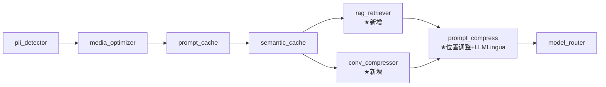
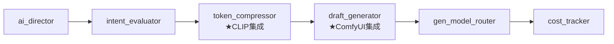
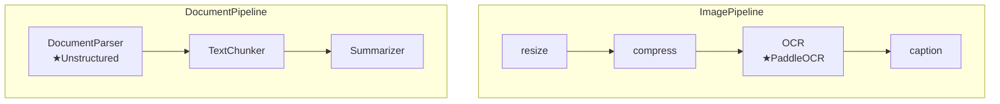

# 技术设计文档 — 开源工具集成

## Overview

本设计将 7 个开源 ML/NLP 工具集成到现有 AI Gateway 管道架构中，并调整 Prompt Compress 插件的执行位置。集成方案遵循以下核心原则：

1. **Fail-open（故障透传）**: 所有集成均为可选依赖，包不可用或运行时异常时回退到占位实现
2. **插件接口一致性**: 所有新组件实现 `async execute(ctx: PipelineContext) -> PipelineContext`
3. **配置驱动**: 通过 YAML dataclass + 环境变量覆盖 + 热重载，开箱即用
4. **延迟加载**: ML 模型在首次调用或插件初始化时加载，不阻塞启动

### 集成清单

| # | 开源工具 | 集成位置 | 替代对象 |
|---|---------|---------|---------|
| 1 | LLMLingua-2 | `PromptCompressPlugin` | TODO 占位 |
| 2 | CLIP (clip-ViT-L-14) | `TokenCompressorStrategy` | hash-based 占位 |
| 3 | ComfyUI API | `DraftGeneratorStrategy` | placeholder bytes |
| 4 | LlamaIndex + Qdrant | 新插件 `RAGRetrieverPlugin` | 无 |
| 5 | LangChain | 新插件 `ConvCompressorPlugin` | 无 |
| 6 | PaddleOCR | `OCRExtractor` | Tesseract 作为 fallback |
| 7 | Unstructured | `DocumentParser` | PyMuPDF + python-docx + BeautifulSoup |
| +1 | 管道位置调整 | `PromptCompressPlugin.depends_on` | 空依赖 |

## Architecture

### 理解型管道拓扑（调整后）



**调整说明**:
- `prompt_compress` 从无依赖调整为 `depends_on: ["rag_retriever", "conv_compressor"]`
- 初始阶段（RAG/Conv 未实现时）临时设为 `depends_on: ["semantic_cache"]`
- 拓扑排序引擎自动计算执行顺序

### 生成优化管道拓扑（不变）



### 媒体处理管线拓扑（OCR/文档增强）



### 依赖管理策略

所有新增开源包声明为 **optional dependencies**（extras）:

```toml
[project.optional-dependencies]
llmlingua = ["llmlingua>=0.2.0"]
clip = ["transformers>=4.30.0", "torch>=2.0.0", "Pillow>=9.0"]
comfyui = ["websockets>=11.0", "httpx>=0.24.0"]
llamaindex = ["llama-index>=0.10.0", "llama-index-vector-stores-qdrant>=0.2.0"]
langchain = ["langchain>=0.1.0", "langchain-openai>=0.0.5"]
paddleocr = ["paddleocr>=2.7.0", "paddlepaddle>=2.5.0"]
unstructured = ["unstructured[all-docs]>=0.12.0"]
all-integrations = ["aigateway-core[llmlingua,clip,comfyui,llamaindex,langchain,paddleocr,unstructured]"]
```

## Components and Interfaces

### 1. PromptCompressPlugin — LLMLingua-2 集成

```python
class PromptCompressPlugin:
    """Prompt 压缩插件 — LLMLingua-2 Token 级压缩。"""
    
    name: str = "prompt_compress"
    enabled: bool = True
    depends_on: list = ["rag_retriever", "conv_compressor"]

    def __init__(self, config: PromptCompressConfig) -> None: ...
    
    async def execute(self, ctx: PipelineContext) -> PipelineContext:
        """
        1. 从 ctx.request["messages"] 提取完整 prompt（含 system/history/user/RAG）
        2. 拼接为单一文本块
        3. 调用 LLMLingua-2 压缩
        4. 将压缩后文本写回 ctx.request["messages"]
        5. 记录 original_tokens / compressed_tokens / ratio 到 ctx.prompt_compress
        """
        ...

    def _build_prompt_text(self, messages: list[dict]) -> str:
        """将 messages 列表转换为单一压缩输入文本。"""
        ...

    def _rebuild_messages(self, compressed: str, original_messages: list[dict]) -> list[dict]:
        """将压缩结果重建为 messages 格式。"""
        ...
```

**LLMLingua-2 调用接口**:
```python
from llmlingua import PromptCompressor

compressor = PromptCompressor(
    model_name="microsoft/llmlingua-2-bert-base-multilingual-cased-meetingbank",
    use_llmlingua2=True,
)
result = compressor.compress_prompt(
    prompt_text,
    rate=self._config.compression_ratio,
    target_token=self._config.target_token,
    force_tokens=self._config.force_tokens,
)
compressed_text = result["compressed_prompt"]
```

### 2. TokenCompressorStrategy — CLIP 集成

```python
class TokenCompressorStrategy:
    """视觉 Token 压缩器 — CLIP 语义特征提取。"""

    def __init__(self, config: TokenCompressorConfig) -> None:
        self._config = config
        self._clip_model: Optional[CLIPModel] = None
        self._clip_processor: Optional[CLIPProcessor] = None
        self._device: str = config.clip_device
        self._load_clip_model()

    def _load_clip_model(self) -> None:
        """初始化时加载 CLIP 模型（一次性）。失败则标记为不可用。"""
        try:
            from transformers import CLIPModel, CLIPProcessor
            self._clip_model = CLIPModel.from_pretrained(self._config.clip_model_name)
            self._clip_processor = CLIPProcessor.from_pretrained(self._config.clip_model_name)
            self._clip_model.to(self._device)
            self._clip_model.eval()
        except Exception as exc:
            logger.warning("CLIP 模型加载失败，回退到 hash-based: %s", exc)
            self._clip_model = None

    async def _do_compress(self, image: MediaContent, config: TokenCompressorConfig) -> CompressionResult:
        """
        如果 CLIP 可用:
            1. PIL.Image 解码
            2. CLIPProcessor 预处理
            3. CLIPModel.get_image_features() 提取特征
            4. 截断/投影到 max_vector_dimensions
            5. 缓存到 Redis (Feature_Cache_Manager)
        否则:
            回退到 hash-based 确定性生成
        """
        ...
```

### 3. DraftGeneratorStrategy — ComfyUI 集成

```python
class DraftGeneratorStrategy:
    """草图生成器 — ComfyUI WebSocket/REST 集成。"""

    def __init__(self, config: DraftWorkflowConfig, redis_client: Any) -> None:
        self._config = config
        self._redis_client = redis_client
        self._comfyui_available: bool = False
        self._check_comfyui()

    async def _submit_workflow(self, workflow_json: dict) -> str:
        """
        POST /prompt 提交工作流到 ComfyUI。
        返回 prompt_id。
        """
        ...

    async def _poll_result(self, prompt_id: str) -> bytes:
        """
        通过 WebSocket 或轮询 /history/{prompt_id} 获取生成结果。
        """
        ...

    def _build_image_draft_workflow(self, request: GenerationRequest) -> dict:
        """构建 512x512 低分辨率图片生成工作流 JSON。"""
        ...

    def _build_upscale_workflow(self, draft_data: bytes, target_resolution: tuple) -> dict:
        """构建 Real-ESRGAN/SUPIR 放大工作流 JSON。"""
        ...

    def _build_video_draft_workflow(self, request: GenerationRequest) -> dict:
        """构建 AnimateDiff/LTX-Video 关键帧生成工作流 JSON。"""
        ...
```

### 4. RAGRetrieverPlugin — LlamaIndex + Qdrant

```python
class RAGRetrieverPlugin:
    """RAG 检索插件 — LlamaIndex VectorStoreIndex + Qdrant。"""
    
    name: str = "rag_retriever"
    enabled: bool = True
    depends_on: list = ["semantic_cache"]

    def __init__(self, config: RAGRetrieverConfig) -> None:
        self._config = config
        self._index: Optional[VectorStoreIndex] = None
        self._initialize_index()

    async def execute(self, ctx: PipelineContext) -> PipelineContext:
        """
        1. 从 ctx.request["messages"] 提取最新用户消息
        2. 使用 VectorStoreIndex.as_retriever() 检索 top_k 文档块
        3. 可选: rerank 步骤
        4. 将检索到的上下文注入 ctx.extra["rag_context"]
        5. 同时注入为 system message 前缀
        """
        ...

    async def ingest_documents(self, documents: list[Document]) -> None:
        """文档加载、分块、embedding 生成、索引 upsert。"""
        ...

    def _initialize_index(self) -> None:
        """
        初始化 LlamaIndex VectorStoreIndex:
        - QdrantVectorStore(collection_name="rag_documents", url=qdrant_url)
        - 使用现有 embedding 配置
        """
        ...
```

### 5. ConvCompressorPlugin — LangChain

```python
class ConvCompressorPlugin:
    """对话历史压缩插件 — LangChain ConversationSummaryBufferMemory。"""
    
    name: str = "conv_compressor"
    enabled: bool = True
    depends_on: list = ["semantic_cache"]

    def __init__(self, config: ConvCompressorConfig) -> None:
        self._config = config
        self._memory: Optional[ConversationSummaryBufferMemory] = None
        self._initialize_memory()

    async def execute(self, ctx: PipelineContext) -> PipelineContext:
        """
        1. 获取 ctx.request["messages"] 中的对话历史
        2. 如果消息数 > max_history:
           a. 将旧消息通过 ConversationSummaryBufferMemory 压缩为摘要
           b. 替换为: [system, summary_message, 最近N条消息, user_message]
        3. 记录压缩前后 token 数到 ctx.extra["conv_compressor"]
        """
        ...
```

### 6. OCRExtractor — PaddleOCR 升级

```python
class OCRExtractor(MediaProcessor):
    """OCR 文字提取 — 支持 PaddleOCR 和 Tesseract 双后端。"""

    def __init__(self, backend: str = "tesseract", languages: Optional[list[str]] = None) -> None:
        self.backend = backend
        self.languages = languages or ["eng"]
        self._paddleocr_engine: Optional[Any] = None
        if backend == "paddleocr":
            self._init_paddleocr()

    def _init_paddleocr(self) -> None:
        """初始化 PaddleOCR 引擎。失败则回退到 Tesseract。"""
        try:
            from paddleocr import PaddleOCR
            lang = self._map_language_code(self.languages)
            self._paddleocr_engine = PaddleOCR(
                use_angle_cls=True,
                lang=lang,
                show_log=False,
            )
        except ImportError:
            logger.warning("PaddleOCR 未安装，回退到 Tesseract")
            self.backend = "tesseract"

    def _extract(self, image_data: bytes) -> str:
        """根据 backend 选择 OCR 引擎执行提取。"""
        if self.backend == "paddleocr" and self._paddleocr_engine:
            return self._extract_paddleocr(image_data)
        return self._extract_tesseract(image_data)

    def _extract_paddleocr(self, image_data: bytes) -> str:
        """PaddleOCR 提取，保留表格布局信息。"""
        import numpy as np
        from PIL import Image
        img = Image.open(io.BytesIO(image_data))
        img_array = np.array(img)
        results = self._paddleocr_engine.ocr(img_array, cls=True)
        # 按位置排序，保留布局
        lines = []
        for line_result in results:
            if line_result:
                for box, (text, confidence) in line_result:
                    lines.append((box[0][1], text))  # (y_coord, text)
        lines.sort(key=lambda x: x[0])
        return "\n".join(text for _, text in lines)
```

### 7. DocumentParser — Unstructured 升级

```python
class DocumentParser(MediaProcessor):
    """文档解析 — 优先使用 Unstructured，回退到多库组合。"""

    def __init__(self, supported_formats: Optional[list[str]] = None, config: Optional[UnstructuredConfig] = None) -> None:
        self.supported_formats = supported_formats or ["pdf", "docx", "xlsx", "pptx", "md", "csv", "html"]
        self._config = config or UnstructuredConfig()
        self._unstructured_available = self._check_unstructured()

    def _check_unstructured(self) -> bool:
        try:
            from unstructured.partition.auto import partition
            return True
        except ImportError:
            logger.warning("Unstructured 未安装，回退到多库实现")
            return False

    def _parse(self, data: bytes, mime_type: str) -> str:
        if self._unstructured_available:
            return self._parse_with_unstructured(data, mime_type)
        return self._parse_legacy(data, mime_type)

    def _parse_with_unstructured(self, data: bytes, mime_type: str) -> str:
        """使用 Unstructured partition 统一解析。"""
        from unstructured.partition.auto import partition
        from io import BytesIO
        elements = partition(
            file=BytesIO(data),
            content_type=mime_type,
            strategy=self._config.strategy,
            languages=self._config.languages,
        )
        # 保留结构信息
        text_parts = []
        for element in elements:
            if hasattr(element, 'metadata') and element.metadata.get('text_as_html'):
                text_parts.append(element.metadata['text_as_html'])
            else:
                text_parts.append(str(element))
        return "\n\n".join(text_parts)
```

## Data Models

### 配置 Dataclass 定义

```python
@dataclass
class PromptCompressConfig:
    """LLMLingua-2 Prompt 压缩配置。"""
    enabled: bool = True
    compression_ratio: float = 0.5
    model_name: str = "microsoft/llmlingua-2-bert-base-multilingual-cased-meetingbank"
    target_token: int = -1  # -1 表示自动
    force_tokens: List[str] = field(default_factory=list)
    device: str = "cpu"


@dataclass
class CLIPConfig:
    """CLIP 视觉特征提取配置。"""
    model_name: str = "openai/clip-vit-large-patch14"
    device: str = "cpu"
    batch_size: int = 1


@dataclass
class ComfyUIConfig:
    """ComfyUI API 连接配置。"""
    server_url: str = "http://localhost:8188"
    connect_timeout: int = 10
    execution_timeout: int = 300
    ws_reconnect_attempts: int = 3


@dataclass
class RAGRetrieverConfig:
    """LlamaIndex RAG 检索配置。"""
    enabled: bool = True
    top_k: int = 5
    similarity_threshold: float = 0.7
    rerank_enabled: bool = False
    rerank_model: str = "cross-encoder/ms-marco-MiniLM-L-6-v2"
    chunk_size: int = 512
    chunk_overlap: int = 64
    collection_name: str = "rag_documents"


@dataclass
class ConvCompressorConfig:
    """对话历史压缩配置。"""
    enabled: bool = True
    max_history: int = 20
    summary_model: str = "gpt-4o-mini"
    max_token_limit: int = 4000
    summary_interval: int = 5  # 每隔 N 条消息触发一次摘要


@dataclass
class PaddleOCRConfig:
    """PaddleOCR 配置。"""
    lang: str = "ch"
    use_angle_cls: bool = True
    det_model_dir: Optional[str] = None  # None 使用内置模型
    rec_model_dir: Optional[str] = None


@dataclass
class UnstructuredConfig:
    """Unstructured 文档解析配置。"""
    strategy: str = "auto"  # "auto" | "fast" | "hi_res"
    languages: List[str] = field(default_factory=lambda: ["chi_sim", "eng"])
    extract_images: bool = False
```

### PipelineContext 扩展

新增命名空间常量和属性访问器:

```python
# 新增命名空间
NS_RAG_RETRIEVER = "rag_retriever"
NS_CONV_COMPRESSOR = "conv_compressor"

# PipelineContext 扩展属性
@property
def rag_context(self) -> list[str]:
    """RAG 检索到的文档块列表。"""
    return self.extra.get(NS_RAG_RETRIEVER, {}).get("retrieved_chunks", [])

@property
def conv_summary(self) -> str:
    """对话历史压缩摘要。"""
    return self.extra.get(NS_CONV_COMPRESSOR, {}).get("summary", "")
```

### YAML 配置映射

```yaml
plugins:
  - name: rag_retriever
    enabled: true
    depends_on: ["semantic_cache"]
    config:
      top_k: 5
      similarity_threshold: 0.7
      rerank_enabled: false
      chunk_size: 512
      chunk_overlap: 64

  - name: conv_compressor
    enabled: true
    depends_on: ["semantic_cache"]
    config:
      max_history: 20
      summary_model: gpt-4o-mini
      max_token_limit: 4000

  - name: prompt_compress
    enabled: true
    depends_on: ["rag_retriever", "conv_compressor"]
    config:
      compression_ratio: 0.5
      model_name: "microsoft/llmlingua-2-bert-base-multilingual-cased-meetingbank"
      target_token: -1

media_optimization:
  image:
    ocr_backend: paddleocr  # "paddleocr" | "tesseract"
    paddleocr:
      lang: ch
      use_angle_cls: true
  document:
    parser_backend: unstructured  # "unstructured" | "legacy"
    unstructured:
      strategy: auto
      languages: ["chi_sim", "eng"]

generation_optimization:
  token_compressor:
    clip:
      model_name: "openai/clip-vit-large-patch14"
      device: cpu
      batch_size: 1
  draft_workflow:
    comfyui:
      server_url: "http://localhost:8188"
      connect_timeout: 10
      execution_timeout: 300
```


## Correctness Properties

*属性（Property）是指在系统所有有效执行中都应保持为真的特征或行为——本质上是对系统应做什么的形式化陈述。属性充当人类可读规范与机器可验证正确性保证之间的桥梁。*

### Property 1: 管道执行顺序不变量

*For any* 包含 `prompt_compress`、`semantic_cache`、`rag_retriever`、`conv_compressor`、`model_router` 的有效插件 DAG 配置，拓扑排序引擎计算出的执行顺序中，`prompt_compress` 必须出现在 `semantic_cache`、`rag_retriever`、`conv_compressor` 之后，且出现在 `model_router` 之前。

**Validates: Requirements 1.3, 1.4**

### Property 2: Prompt 组装完整性

*For any* 包含 system 消息、对话历史消息、用户消息和 RAG 注入上下文的 messages 数组，`PromptCompressPlugin` 的文本组装函数输出应包含所有消息类型的内容（非空消息均不被遗漏）。

**Validates: Requirements 1.5, 2.4**

### Property 3: Fail-Open 透传不变量

*For any* 插件（PromptCompress、TokenCompressor、DraftGenerator、RAGRetriever、ConvCompressor、DocumentParser）在其依赖的开源库不可用或运行时抛出异常时，插件的 `execute()` 输出的 `PipelineContext` 中的核心请求数据应与输入完全相同（即无损透传），且不抛出未捕获异常。

**Validates: Requirements 2.5, 3.5, 4.6, 5.7, 6.6, 8.5**

### Property 4: 压缩指标记录不变量

*For any* 成功执行压缩的 `PromptCompressPlugin` 调用，`PipelineContext.prompt_compress` 命名空间中必须包含 `original_tokens > 0`、`compressed_tokens >= 0`、且 `compression_ratio = compressed_tokens / original_tokens`（浮点误差 < 0.01）。

**Validates: Requirements 2.7**

### Property 5: 特征向量维度约束

*For any* 有效图片输入和任意 `max_vector_dimensions` 配置值，`TokenCompressorStrategy` 输出的 feature vector 长度必须 ≤ `max_vector_dimensions`。

**Validates: Requirements 3.7**

### Property 6: 特征向量缓存一致性

*For any* 成功提取特征向量的图片，`Feature_Cache_Manager` 应收到一次 set 调用，其键基于图片内容哈希派生，值为提取的 feature vector；后续对相同图片的请求应优先从缓存读取而非重新计算。

**Validates: Requirements 3.4**

### Property 7: ComfyUI 工作流结构正确性

*For any* 有效的 `GenerationRequest`，`DraftGeneratorStrategy` 构建的工作流 JSON 必须满足：(a) 图片草图工作流包含 width=512, height=512 的节点参数；(b) 放大工作流包含 Real-ESRGAN 或 SUPIR 节点引用；(c) 视频草图工作流包含 AnimateDiff 或 LTX-Video 节点引用。

**Validates: Requirements 4.2, 4.3, 4.4**

### Property 8: RAG 检索结果数量约束

*For any* 用户查询和 `top_k` 配置值，`RAGRetrieverPlugin` 返回的文档块数量必须 ≤ `top_k`。

**Validates: Requirements 5.3**

### Property 9: RAG 上下文注入正确性

*For any* 非空检索结果集，`RAGRetrieverPlugin` 执行后 `PipelineContext.extra["rag_retriever"]["retrieved_chunks"]` 应包含所有检索到的文档块，且每个文档块内容非空。

**Validates: Requirements 5.6**

### Property 10: 对话压缩阈值与近期消息保留

*For any* 消息列表长度 > `max_history` 的 PipelineContext，`ConvCompressorPlugin` 执行后输出的 messages 中最后 `max_history` 条消息应与输入中的最后 `max_history` 条消息内容一致（近期消息不被修改）；若消息列表长度 ≤ `max_history`，则 messages 保持不变。

**Validates: Requirements 6.3, 6.5**

### Property 11: 文档解析格式分发

*For any* 支持的 MIME 类型（PDF、DOCX、PPTX、HTML、CSV、Markdown），当 Unstructured 可用时，`DocumentParser` 应通过 Unstructured 的 `partition` 接口处理所有格式。

**Validates: Requirements 8.2**

### Property 12: 文档解析输出与 TextChunker 兼容

*For any* `DocumentParser` 的输出字符串（无论使用 Unstructured 还是 legacy 后端），`TextChunker` 应能无异常地将其分块为非空块列表。

**Validates: Requirements 8.6**

### Property 13: 配置加载层级（YAML → 环境变量 → 默认值）

*For any* 配置参数同时出现在 YAML 字典和对应前缀的环境变量中，最终加载的配置值应等于环境变量的值（环境变量优先）；若两者均未指定，则使用 dataclass 默认值。

**Validates: Requirements 9.2, 9.3, 9.4**

### Property 14: 配置校验与旧值保留

*For any* 超出文档化范围的参数值（类型错误或数值越界），且存在有效的 previous 配置实例，配置加载后该字段的值应等于 previous 实例中的对应值（而非无效值或默认值）。

**Validates: Requirements 9.5**

### Property 15: 配置默认值与文档一致

*For any* 集成配置 dataclass（PromptCompressConfig、CLIPConfig、ComfyUIConfig、RAGRetrieverConfig、ConvCompressorConfig、PaddleOCRConfig、UnstructuredConfig），以无参数实例化时各字段值应与需求文档 9.7 中定义的默认值完全匹配。

**Validates: Requirements 9.7**

## Error Handling

### 统一 Fail-Open 策略

所有 7 个集成遵循相同的错误处理模式：

```python
async def execute(self, ctx: PipelineContext) -> PipelineContext:
    if not self._is_available:
        # 包未安装 → passthrough
        return ctx
    try:
        # 正常逻辑
        result = await self._do_work(ctx)
        return result
    except Exception as exc:
        logger.warning("%s 执行异常，降级为 passthrough: %s", self.name, exc)
        # 保持 ctx 不变，透传
        return ctx
```

### 分层错误处理

| 层级 | 错误类型 | 处理方式 |
|------|---------|---------|
| 导入层 | `ImportError` | 标记 `_is_available = False`，启动日志 WARNING |
| 初始化层 | 模型加载失败 | 标记为不可用，保留 fallback 实现 |
| 运行层 | 超时/异常 | 捕获并透传，Prometheus counter +1 |
| 外部服务层 | 连接失败 | 熔断器保护，自动恢复后重试 |

### 特定组件错误处理

| 组件 | 特殊处理 |
|------|---------|
| LLMLingua-2 | 压缩结果为空或比原文长 → 透传原文 |
| CLIP | GPU OOM → 自动切换到 CPU fallback |
| ComfyUI | WebSocket 断连 → 3次重连后 fallback |
| LlamaIndex | Qdrant 连接超时 → 跳过 RAG 注入 |
| LangChain | 摘要 LLM 调用失败 → 保留原始历史 |
| PaddleOCR | 模型文件损坏 → 回退 Tesseract |
| Unstructured | 解析异常 → 回退多库实现 |

### Prometheus 指标

```python
# 每个集成组件注册以下指标
integration_calls_total = Counter("integration_calls_total", labels=["component", "status"])
integration_fallbacks_total = Counter("integration_fallbacks_total", labels=["component", "reason"])
integration_latency_seconds = Histogram("integration_latency_seconds", labels=["component"])
```

## Testing Strategy

### 双重测试方法

本功能采用 **属性测试 + 单元测试** 双轨策略：

#### 属性测试 (Property-Based Testing)

- **框架**: `hypothesis` (Python)
- **最小迭代次数**: 每个 property 100 次
- **标签格式**: `# Feature: open-source-integration, Property {N}: {description}`
- **覆盖范围**: 上述 15 个正确性属性

适合 PBT 的核心场景:
- 管道拓扑排序（Property 1）
- Prompt 组装（Property 2）
- Fail-open 透传（Property 3）
- 配置加载/校验（Properties 13, 14, 15）
- 工作流 JSON 构建（Property 7）
- 对话压缩阈值逻辑（Property 10）

#### 单元测试 (Example-Based)

- 各 fallback 场景的具体 ImportError 模拟
- 静态配置检查（depends_on 值）
- 组件初始化行为
- 特定边界值

#### 集成测试

- CLIP 实际特征提取（需 GPU 或 CI 中 CPU 模式）
- ComfyUI API 交互（需 ComfyUI 服务可达）
- Qdrant 向量检索端到端
- PaddleOCR 中文识别精度基准

### 测试分层

```
tests/
├── unit/
│   ├── test_prompt_compress.py      # LLMLingua mock + passthrough
│   ├── test_token_compressor.py     # CLIP mock + hash fallback
│   ├── test_draft_generator.py      # ComfyUI workflow JSON 构建
│   ├── test_rag_retriever.py        # 检索逻辑 + fallback
│   ├── test_conv_compressor.py      # 阈值逻辑 + fallback
│   ├── test_ocr_extractor.py        # 后端分发 + fallback
│   ├── test_document_parser.py      # Unstructured + legacy fallback
│   └── test_config_loading.py       # 配置层级 + 校验 + 默认值
├── property/
│   ├── test_pipeline_ordering.py    # Property 1
│   ├── test_prompt_assembly.py      # Property 2
│   ├── test_failopen.py             # Property 3
│   ├── test_compression_metrics.py  # Property 4
│   ├── test_feature_vector.py       # Properties 5, 6
│   ├── test_comfyui_workflow.py     # Property 7
│   ├── test_rag_bounds.py           # Properties 8, 9
│   ├── test_conv_threshold.py       # Property 10
│   ├── test_document_compat.py      # Properties 11, 12
│   └── test_config_properties.py    # Properties 13, 14, 15
└── integration/
    ├── test_clip_integration.py
    ├── test_comfyui_integration.py
    ├── test_llamaindex_integration.py
    ├── test_paddleocr_integration.py
    └── test_unstructured_integration.py
```

### Mock 策略

所有属性测试通过 mock 隔离外部依赖：
- ML 模型调用 → mock 返回固定维度 tensor
- Redis 操作 → `fakeredis` 
- Qdrant → `unittest.mock.AsyncMock`
- ComfyUI API → `httpx.MockTransport`
- LLM 调用（LangChain summarization） → mock 返回固定摘要字符串
